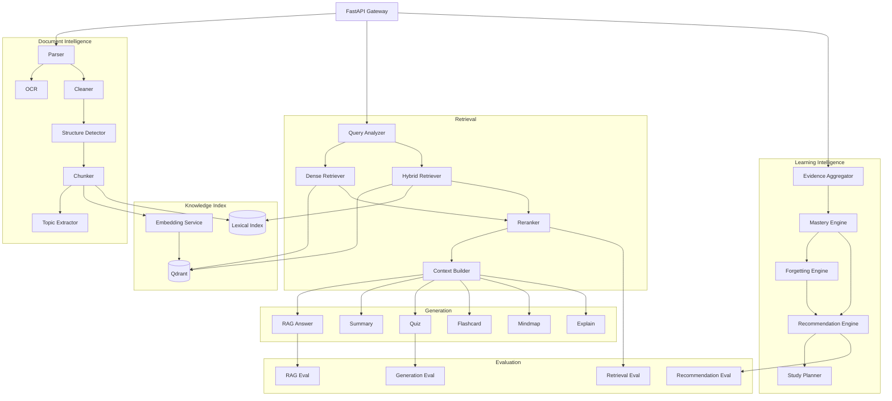
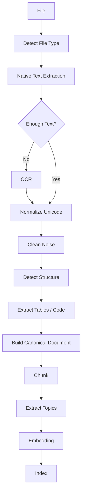
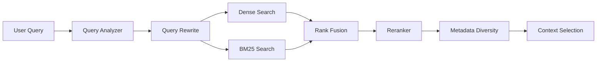
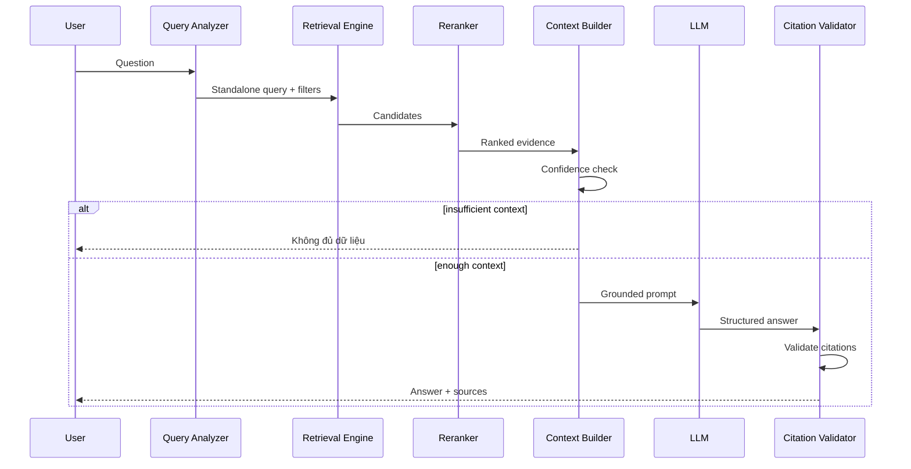
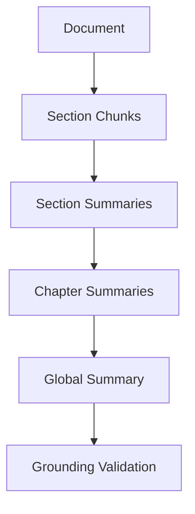
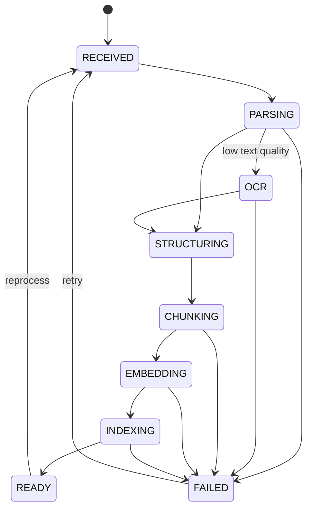
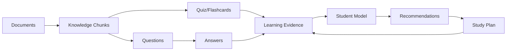
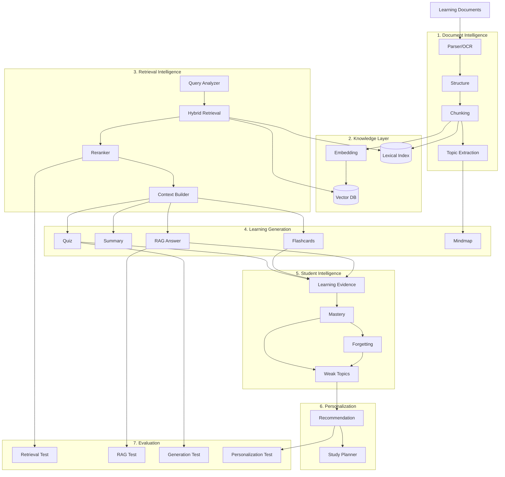

# FULL AI SYSTEM DESIGN
# AI Study Assistant 2.0

> **Mục tiêu tài liệu:** Thiết kế riêng toàn bộ hệ thống AI trước khi xây dựng Web/Backend nghiệp vụ.  
> **Vai trò của AI System:** Biến tài liệu thô và dữ liệu học tập thành tri thức có thể truy xuất, nội dung học tập có kiểm chứng, hồ sơ năng lực người học và các khuyến nghị cá nhân hóa.

---

# 1. Tư tưởng thiết kế cốt lõi

AI System không nên được xây theo kiểu:

```text
User -> Prompt -> LLM -> Answer
```

Mà phải là một hệ thống nhiều tầng:

```text
                    ┌────────────────────┐
                    │  Learning Sources  │
                    │ PDF/DOCX/PPTX/Image│
                    └─────────┬──────────┘
                              │
                              ▼
                    ┌────────────────────┐
                    │ Knowledge Ingestion│
                    └─────────┬──────────┘
                              │
                              ▼
                    ┌────────────────────┐
                    │  Knowledge Layer   │
                    │ chunks/topics/meta │
                    └─────────┬──────────┘
                              │
          ┌───────────────────┼─────────────────────┐
          ▼                   ▼                     ▼
   ┌────────────┐      ┌───────────────┐     ┌──────────────┐
   │ RAG Engine │      │ Learning Gen. │     │ Topic Engine │
   └─────┬──────┘      └──────┬────────┘     └──────┬───────┘
         │                    │                      │
         ▼                    ▼                      ▼
   Grounded Answer       Quiz / Card /          Topic Structure
   + Citation            Summary / Map
          └───────────────────┬─────────────────────┘
                              ▼
                    ┌────────────────────┐
                    │ Learning Evidence  │
                    │ quiz/review/events │
                    └─────────┬──────────┘
                              ▼
                    ┌────────────────────┐
                    │   Student Model    │
                    │ mastery/forgetting │
                    └─────────┬──────────┘
                              ▼
                    ┌────────────────────┐
                    │ Recommendation     │
                    │ + Study Planner    │
                    └────────────────────┘
```

Trọng tâm:

> **Document Intelligence + Grounded RAG + Learning Intelligence + Personalization**

---

# 2. Phạm vi AI System

AI System gồm 8 subsystem.

## A. Document Intelligence

- File parsing.
- OCR.
- Text cleaning.
- Structure detection.
- Table/code handling.
- Metadata extraction.
- Chunking.
- Topic extraction.

## B. Knowledge Indexing

- Embedding.
- Vector indexing.
- Lexical indexing.
- Metadata indexing.
- Re-indexing.
- Versioning.

## C. Retrieval Engine

- Query analysis.
- Dense retrieval.
- BM25/hybrid retrieval.
- Metadata filtering.
- Reranking.
- Context selection.

## D. RAG Engine

- Prompt construction.
- Grounded answer generation.
- Citation alignment.
- Insufficient-context detection.
- Conversation-aware retrieval.

## E. Learning Content Generator

- Summary.
- Quiz.
- Flashcard.
- Explanation.
- Translation.
- Mindmap.
- Practice generation.

## F. Student Modeling

- Learning evidence aggregation.
- Topic mastery.
- Confidence.
- Forgetting risk.
- Learning progress.

## G. Recommendation & Planning

- Weak-topic detection.
- Review recommendation.
- Resource recommendation.
- Practice recommendation.
- Study-plan generation.
- Priority scheduling.

## H. AI Evaluation & Observability

- Retrieval benchmark.
- RAG evaluation.
- Generation quality.
- Student-model evaluation.
- Recommendation evaluation.
- Latency/cost monitoring.

---

# 3. Nguyên tắc kiến trúc

## 3.1. LLM không phải nguồn sự thật

LLM chỉ là một component.

Nguồn sự thật của hệ thống:

```text
Documents
+
Structured metadata
+
User learning data
```

## 3.2. Structured-first

Các output quan trọng không nhận free text trực tiếp.

Ví dụ quiz generator phải trả:

```json
{
  "questions": [
    {
      "type": "MULTIPLE_CHOICE",
      "question": "...",
      "choices": ["...", "..."],
      "correct_answer": "...",
      "explanation": "...",
      "source_chunk_ids": ["..."],
      "topic_ids": ["..."],
      "difficulty": "MEDIUM"
    }
  ]
}
```

Sau đó mới validate và lưu DB.

## 3.3. Grounded-by-default

Các chức năng liên quan kiến thức tài liệu:

- Chat.
- Quiz.
- Flashcard.
- Summary.
- Mindmap.

đều phải truy vết được về nguồn.

## 3.4. Deterministic logic trước, LLM sau

Ví dụ Study Planner:

Không dùng:

```text
"Đây là điểm của user, hãy lập kế hoạch."
```

Mà dùng:

```text
mastery
forgetting risk
deadline
available time
difficulty
priority
        ↓
deterministic scheduler
        ↓
LLM chỉ viết/giải thích kế hoạch
```

---

# 4. AI Service Architecture



---

# 5. Cấu trúc source code AI Service

```text
ai-service/
├── app/
│   ├── api/
│   │   ├── ingestion.py
│   │   ├── retrieval.py
│   │   ├── rag.py
│   │   ├── generation.py
│   │   ├── student_model.py
│   │   └── recommendation.py
│   │
│   ├── ingestion/
│   │   ├── parsers/
│   │   │   ├── pdf.py
│   │   │   ├── docx.py
│   │   │   ├── pptx.py
│   │   │   └── image.py
│   │   ├── ocr/
│   │   ├── cleaning/
│   │   ├── structure/
│   │   ├── chunking/
│   │   └── topics/
│   │
│   ├── knowledge/
│   │   ├── embeddings/
│   │   ├── vector_store/
│   │   ├── lexical_index/
│   │   └── metadata/
│   │
│   ├── retrieval/
│   │   ├── query_analyzer.py
│   │   ├── dense.py
│   │   ├── hybrid.py
│   │   ├── fusion.py
│   │   ├── reranker.py
│   │   └── context_builder.py
│   │
│   ├── rag/
│   │   ├── pipeline.py
│   │   ├── prompts.py
│   │   ├── citation.py
│   │   ├── confidence.py
│   │   └── conversation.py
│   │
│   ├── generation/
│   │   ├── summary.py
│   │   ├── quiz.py
│   │   ├── flashcard.py
│   │   ├── mindmap.py
│   │   ├── explanation.py
│   │   └── translation.py
│   │
│   ├── learning/
│   │   ├── evidence.py
│   │   ├── mastery.py
│   │   ├── forgetting.py
│   │   ├── weak_topics.py
│   │   ├── recommendation.py
│   │   └── planner.py
│   │
│   ├── models/
│   │   ├── llm.py
│   │   ├── embedding.py
│   │   ├── reranker.py
│   │   └── registry.py
│   │
│   ├── evaluation/
│   │   ├── datasets/
│   │   ├── retrieval_eval.py
│   │   ├── rag_eval.py
│   │   ├── generation_eval.py
│   │   └── recommendation_eval.py
│   │
│   ├── schemas/
│   ├── observability/
│   └── core/
│
├── workers/
├── tests/
├── configs/
├── scripts/
└── Dockerfile
```

---

# 6. Document Intelligence Pipeline

## 6.1. Input

MVP:

- PDF.
- DOCX.
- PPTX.

Phase 2:

- Image.
- Scanned PDF.
- TXT.
- HTML.

## 6.2. Pipeline



---

# 7. Canonical Document Model

Mọi format cần được chuyển về cùng một cấu trúc.

```json
{
  "document_id": "doc_123",
  "title": "Database Systems",
  "language": "vi",
  "pages": [
    {
      "page_number": 10,
      "blocks": [
        {
          "type": "heading",
          "level": 2,
          "text": "5.2 SQL JOIN"
        },
        {
          "type": "paragraph",
          "text": "..."
        },
        {
          "type": "table",
          "content": "..."
        }
      ]
    }
  ]
}
```

Block type:

```text
TITLE
HEADING
PARAGRAPH
LIST
TABLE
CODE
CAPTION
IMAGE_TEXT
FOOTNOTE
```

---

# 8. Text Cleaning

Không làm sạch kiểu xóa tất cả formatting.

Mục tiêu là bỏ noise nhưng giữ semantic structure.

Loại bỏ:

- Repeated header/footer.
- Page number standalone.
- Broken hyphen.
- OCR artifacts.
- Excess whitespace.

Giữ:

- Heading.
- List.
- Table.
- Code.
- Formula text.
- Page location.

---

# 9. OCR Strategy

OCR chỉ chạy khi cần.

Decision:

```text
native_text_chars / page < threshold
        ↓
OCR page
```

Không OCR toàn bộ PDF nếu đã có text.

Output OCR phải gắn:

```text
page
bounding box
confidence
```

Nếu confidence quá thấp:

```text
mark OCR_LOW_CONFIDENCE
```

để tránh đưa text rác vào knowledge base.

---

# 10. Structure Detection

Mục tiêu:

```text
Document
├── Chapter
│   ├── Section
│   │   ├── Paragraph
│   │   ├── Table
│   │   └── Code
```

Có thể kết hợp:

1. PDF font/layout heuristic.
2. Regex heading numbering.
3. DOCX/PPTX native structure.
4. LLM fallback cho các tài liệu khó.

---

# 11. Chunking

Chunking là một trong các biến ảnh hưởng mạnh nhất đến RAG.

## 11.1. Không dùng một chiến lược duy nhất

### Strategy A — Recursive

MVP baseline.

```text
chunk ~ 600 tokens
overlap ~ 80 tokens
```

### Strategy B — Structure-aware

Ưu tiên:

```text
Section
→ paragraph groups
→ chunk
```

Không trộn hai section không liên quan.

### Strategy C — Parent/Child

```text
Parent = section ~ 1500 tokens
Child  = retrieval chunk ~ 300 tokens
```

Retriever tìm child nhưng LLM nhận parent context.

## 11.2. Metadata

```json
{
  "chunk_id": "...",
  "document_id": "...",
  "page_start": 12,
  "page_end": 13,
  "chapter": "5",
  "section": "5.2 LEFT JOIN",
  "text": "...",
  "token_count": 540,
  "parent_chunk_id": "...",
  "content_type": "paragraph"
}
```

---

# 12. Topic Extraction

Topic là cầu nối giữa Knowledge System và Learning System.

Ví dụ:

```text
Database
 └── SQL
     └── JOIN
         ├── INNER JOIN
         └── LEFT JOIN
```

Mỗi chunk có:

```text
topic_ids
topic_confidence
```

Topic extraction MVP:

```text
heading + keyword + LLM structured extraction
```

Sau đó normalize các topic gần nhau:

```text
"left join"
"LEFT JOIN"
"SQL left outer join"
→ LEFT_JOIN
```

---

# 13. Embedding Layer

Một interface chung:

```python
embed_documents(texts)
embed_query(query)
```

Không hard-code model vào pipeline.

Model registry:

```text
EMBEDDING_MODEL
EMBEDDING_DIM
MODEL_VERSION
```

Mỗi vector cần lưu version.

```json
{
  "embedding_model": "...",
  "embedding_version": "v1"
}
```

Khi đổi embedding model:

```text
reindex_required = true
```

---

# 14. Vector Database Design

Qdrant collection:

```text
knowledge_chunks_v1
```

Payload:

```json
{
  "user_id": "...",
  "document_id": "...",
  "chunk_id": "...",
  "page_start": 10,
  "page_end": 10,
  "chapter": "...",
  "section": "...",
  "topic_ids": ["..."],
  "language": "vi",
  "content_type": "paragraph",
  "embedding_version": "v1"
}
```

Critical filter:

```text
user_id == current_user_id
```

Nếu user chọn folder/document:

```text
document_id IN selected_document_ids
```

---

# 15. Retrieval Engine

Retriever không nên chỉ là:

```text
query embedding
→ top 5
```

Pipeline:



---

# 16. Query Analyzer

Phân tích:

```text
intent
language
requested document scope
topic
question type
need_comparison
need_definition
need_list
```

Ví dụ:

```text
"So sánh INNER JOIN và LEFT JOIN"
```

Analyzer:

```json
{
  "intent": "comparison",
  "topics": ["INNER JOIN", "LEFT JOIN"],
  "need_multiple_evidence": true
}
```

---

# 17. Query Rewriting

Dùng cho hội thoại.

Ví dụ:

User:

```text
INNER JOIN là gì?
```

sau đó:

```text
Còn cái kia khác gì?
```

Standalone query:

```text
LEFT JOIN khác INNER JOIN như thế nào?
```

Chỉ rewrite khi query thực sự phụ thuộc context.

---

# 18. Dense Retrieval

Baseline:

```text
query
→ embedding
→ cosine search
→ top 20
```

Không đưa top 20 trực tiếp vào LLM.

---

# 19. Lexical/BM25 Retrieval

Dense search tốt cho semantic.

BM25 tốt cho:

- thuật ngữ chính xác;
- tên hàm;
- code;
- ký hiệu;
- từ viết tắt.

Ví dụ:

```text
HashMap
LEFT JOIN
@Transaction
SELECT DISTINCT
```

---

# 20. Hybrid Search

```text
Dense Top-K
+
BM25 Top-K
       ↓
Rank Fusion
```

Có thể dùng Reciprocal Rank Fusion:

\[
RRF(d)=\sum_i \frac{1}{k+rank_i(d)}
\]

Sau đó lấy candidate để rerank.

---

# 21. Reranker

Input:

```text
query + candidate chunk
```

Output:

```text
relevance score
```

Pipeline:

```text
Dense/BM25: 30 candidates
        ↓
Reranker
        ↓
Top 5–8
```

Reranker thường đáng đầu tư hơn tăng context vô hạn.

---

# 22. Context Selection

Không chỉ lấy top-score.

Cần xử lý:

- Duplicate chunks.
- Overlap.
- Same-section redundancy.
- Topic diversity.
- Token budget.

Pseudo:

```text
sort by rerank_score

for chunk:
    if duplicate -> skip
    if too_similar_to_selected -> skip
    if token_budget exceeded -> stop
    add chunk
```

---

# 23. Retrieval Confidence

Tạo confidence từ:

```text
top rerank score
score margin
number of supporting chunks
topic coverage
```

Ví dụ:

```text
HIGH
MEDIUM
LOW
INSUFFICIENT
```

Nếu INSUFFICIENT:

```text
không gọi LLM để "đoán".
```

---

# 24. RAG Engine



---

# 25. RAG Output Schema

```json
{
  "answer": "...",
  "confidence": "HIGH",
  "citations": [
    {
      "chunk_id": "...",
      "document_id": "...",
      "page": 87,
      "quote_span": "..."
    }
  ],
  "used_context_ids": ["..."],
  "retrieval_trace_id": "..."
}
```

---

# 26. Citation Alignment

Không để LLM tự bịa page.

Page/document metadata lấy từ retrieved chunk.

LLM chỉ có thể reference:

```text
[S1]
[S2]
[S3]
```

Sau generation:

```text
[S1]
→ resolve chunk_id
→ document/page
```

Nếu answer chứa citation không tồn tại:

```text
validation_failed
```

---

# 27. Hallucination Control

4 lớp.

## Layer 1 — Retrieval threshold

Không có evidence -> từ chối.

## Layer 2 — Prompt rule

```text
Answer only from evidence.
```

## Layer 3 — Citation validation

Claim quan trọng phải gắn source.

## Layer 4 — Post-check

Có thể chạy một groundedness checker:

```text
claim
+
evidence
→ SUPPORTED / UNSUPPORTED
```

Nếu unsupported:

- regenerate;
- hoặc loại claim.

---

# 28. Conversation Memory

Không lưu toàn bộ chat vào prompt mãi mãi.

Ba lớp:

```text
Recent messages
Conversation summary
Relevant historical turns
```

RAG vẫn ưu tiên document evidence hơn conversation memory.

---

# 29. AI Summary Engine

## Input

- document;
- chapter;
- section;
- selected pages.

## Output mode

```text
QUICK
STANDARD
DETAILED
```

## Long-document pipeline



Summary object:

```json
{
  "level": "STANDARD",
  "summary": "...",
  "key_points": [],
  "important_terms": [],
  "source_chunk_ids": []
}
```

---

# 30. AI Quiz Generator

Không sinh quiz trực tiếp từ cả document.

Pipeline:

```text
Select topic
→ Retrieve source chunks
→ Generate candidate questions
→ Validate answer
→ Validate grounding
→ Remove duplicates
→ Difficulty check
→ Save
```

---

# 31. Quiz Schema

```json
{
  "question": "...",
  "type": "MULTIPLE_CHOICE",
  "choices": [
    {"id": "A", "text": "..."},
    {"id": "B", "text": "..."}
  ],
  "correct_choice": "B",
  "explanation": "...",
  "difficulty": "MEDIUM",
  "topic_ids": ["..."],
  "source_chunk_ids": ["..."]
}
```

---

# 32. Quiz Quality Validator

Reject nếu:

- Không có answer trong source.
- Hai đáp án đều đúng.
- Distractor vô nghĩa.
- Question mơ hồ.
- Trùng với câu khác.
- Citation không support answer.

Có thể dùng:

```text
rule validator
+
LLM judge
```

nhưng rule là lớp đầu tiên.

---

# 33. Difficulty Generation

Không để LLM tự gắn EASY/MEDIUM/HARD tùy ý.

Định nghĩa rubric:

### EASY

- Recall trực tiếp.
- Definition.
- Single fact.

### MEDIUM

- Apply concept.
- Compare.
- Multi-sentence reasoning.

### HARD

- Multiple concepts.
- Scenario.
- Infer from several pieces of evidence.

---

# 34. Flashcard Generator

Flashcard ưu tiên atomic knowledge.

Không tạo:

```text
Front: Hãy giải thích toàn bộ chương SQL.
```

Mà:

```text
Front: LEFT JOIN giữ những hàng nào từ bảng bên trái?
Back: Tất cả...
```

Pipeline:

```text
source
→ identify learning units
→ generate cards
→ deduplicate
→ grounding check
```

---

# 35. Spaced Repetition

MVP có thể dùng thuật toán đơn giản.

Review rating:

```text
AGAIN
HARD
GOOD
EASY
```

Sau này có thể thay scheduler nâng cao mà không đổi API.

Output:

```text
next_review_at
interval
stability
difficulty
```

---

# 36. Explanation Engine

Modes:

```text
SIMPLE
NORMAL
DETAILED
EXAMPLE_BASED
STEP_BY_STEP
```

Input luôn kèm source context nếu đang giải thích tài liệu.

Ví dụ:

```text
"Giải thích LEFT JOIN như học sinh lớp 6"
```

AI được phép đổi cách diễn đạt nhưng không đổi fact.

---

# 37. Translation Engine

Hai mode:

## Literal learning translation

Giữ thuật ngữ kỹ thuật.

## Explain terminology

Ví dụ:

```text
polymorphism
→ tính đa hình
→ giải thích trong ngữ cảnh OOP
```

Dịch tài liệu không nên tự động thay đổi source knowledge.

---

# 38. Mindmap Generator

Không sinh mindmap hoàn toàn tự do.

Nguồn:

```text
document hierarchy
+
topic hierarchy
+
topic relations
```

Output dạng graph:

```json
{
  "nodes": [
    {"id":"1","label":"SQL"},
    {"id":"2","label":"JOIN"}
  ],
  "edges":[
    {"source":"1","target":"2","relation":"HAS_TOPIC"}
  ]
}
```

Frontend render bằng Mermaid/React Flow.

---

# 39. Topic Knowledge Layer

Đây là layer quan trọng.

```text
Topic
├── parent
├── aliases
├── related_topics
├── source_chunks
├── questions
├── flashcards
└── mastery
```

Không nhất thiết phải làm full Knowledge Graph ở MVP.

MVP chỉ cần hierarchy + mappings.

---

# 40. Learning Evidence

Student Model không đọc raw click tùy tiện.

Chuẩn hóa evidence.

```json
{
  "user_id": "...",
  "topic_id": "...",
  "type": "QUIZ_RESPONSE",
  "value": 1.0,
  "quality": 0.9,
  "timestamp": "...",
  "metadata": {
    "difficulty": "MEDIUM",
    "response_time_ms": 8100
  }
}
```

Evidence types:

```text
QUIZ_RESPONSE
FLASHCARD_REVIEW
PRACTICE_RESULT
DOCUMENT_STUDY
CHAT_INTERACTION
REVISION_COMPLETED
```

---

# 41. Trọng số evidence

Không coi đọc tài liệu = trả lời đúng quiz.

Ví dụ:

```text
Quiz correctness          strong evidence
Flashcard recall          medium/strong
Practice answer           strong
Document opened           very weak
Study duration            weak
Chat question             weak diagnostic
```

---

# 42. Student Model

Output cho mỗi topic:

```json
{
  "topic_id": "...",
  "mastery": 0.62,
  "confidence": 0.74,
  "last_practiced": "...",
  "forgetting_risk": 0.31,
  "evidence_count": 18
}
```

Mastery và confidence phải tách riêng.

Ví dụ:

```text
mastery = 0.90
confidence = 0.20
```

nghĩa là user mới trả lời đúng 1 câu, chưa đủ bằng chứng.

---

# 43. Mastery Engine — MVP

Có thể dùng weighted evidence.

Ví dụ:

\[
M_t =
\frac{\sum_i w_i x_i}{\sum_i w_i}
\]

Trong đó:

- \(x_i\): performance evidence.
- \(w_i\): trọng số theo type, difficulty và recency.

Recency weight:

\[
w_{time}=e^{-\lambda \Delta t}
\]

Final:

```text
weight =
source_weight
× difficulty_weight
× recency_weight
```

---

# 44. Mastery Update

Ví dụ quiz:

```text
correct HARD
→ positive evidence cao

wrong EASY
→ negative evidence mạnh

correct EASY
→ positive vừa
```

Không update mạnh từ một sample duy nhất.

---

# 45. Confidence

Một approximation:

```text
confidence =
1 - exp(-effective_evidence_count / k)
```

Có thể thêm diversity:

- nhiều loại quiz;
- nhiều lần học;
- nhiều ngày khác nhau.

---

# 46. Forgetting Model

MVP:

\[
Retention(t)=e^{-t/S}
\]

Trong đó:

```text
S = stability
```

Stability tăng sau successful review.

Forgetting risk:

\[
Risk=1-Retention(t)
\]

---

# 47. Weak Topic Detection

Không chỉ:

```text
mastery < 0.6
```

Mà:

```text
weak_score =
a * (1 - mastery)
+
b * error_rate
+
c * forgetting_risk
+
d * prerequisite_importance
```

Sau đó rank.

---

# 48. Prerequisite Awareness

Ví dụ:

```text
Spring Boot
requires
Java Core
OOP
HTTP
```

Nếu OOP mastery thấp:

```text
không nên đề xuất học ngay advanced Spring Security.
```

MVP prerequisite có thể nhập từ roadmap/topic hierarchy.

---

# 49. Recommendation Engine

Các loại recommendation:

```text
READ
REVIEW
QUIZ
FLASHCARD
PRACTICE
CONTINUE
REVISIT_PREREQUISITE
```

Input:

```text
mastery
confidence
forgetting risk
recent errors
study goal
deadline
available time
topic prerequisite
```

Output:

```json
{
  "type": "REVIEW",
  "topic_id": "left_join",
  "priority": 0.91,
  "reason_codes": [
    "LOW_MASTERY",
    "RECENT_ERRORS",
    "REVIEW_DUE"
  ],
  "recommended_resource_id": "section_5_3"
}
```

---

# 50. Explainable Recommendation

Reason do system logic tạo, không để LLM tự bịa.

Ví dụ:

```text
Bạn nên ôn LEFT JOIN vì:
- mastery hiện tại: 0.42
- sai 4/6 câu gần nhất
- lần ôn gần nhất: 5 ngày trước
```

LLM chỉ chuyển reason codes thành câu tự nhiên.

---

# 51. Recommendation Ranking

Ví dụ:

\[
Priority =
0.35(1-M)
+0.25F
+0.20E
+0.10U
+0.10P
\]

Trong đó:

- M = mastery.
- F = forgetting risk.
- E = recent error score.
- U = deadline urgency.
- P = prerequisite importance.

Trọng số phải là config, không hard-code sâu trong logic.

---

# 52. Study Planner

Planner gồm hai lớp.

## Layer 1 — Scheduling engine

Xác định:

```text
topic
activity
duration
date
priority
```

## Layer 2 — LLM presentation

Viết thành kế hoạch dễ hiểu.

---

# 53. Planner Input

```json
{
  "goal": "Thi Database sau 20 ngày",
  "deadline": "...",
  "available_minutes_per_day": 120,
  "days_off": [],
  "preferred_session_minutes": 45
}
```

System bổ sung:

```text
topic mastery
topic difficulty
prerequisites
forgetting risk
```

---

# 54. Planner Algorithm

```text
1. Collect candidate topics
2. Calculate topic priority
3. Estimate required study minutes
4. Respect prerequisites
5. Allocate sessions before deadline
6. Add spaced reviews
7. Avoid overload
8. Save structured tasks
```

---

# 55. Planner Output

```json
{
  "days": [
    {
      "date": "2026-08-10",
      "tasks": [
        {
          "topic": "LEFT JOIN",
          "activity": "REVIEW",
          "minutes": 30
        },
        {
          "topic": "LEFT JOIN",
          "activity": "QUIZ",
          "minutes": 20
        }
      ]
    }
  ]
}
```

---

# 56. Adaptive Planner

Kế hoạch phải thay đổi khi user học.

Ví dụ:

```text
Day 3 quiz unexpectedly high
→ giảm review LEFT JOIN
→ chuyển thời gian sang normalization
```

Khi user bỏ task:

```text
reschedule remaining workload
```

---

# 57. AI Model Abstraction

Không để business logic phụ thuộc một provider.

Interfaces:

```text
LLMClient
EmbeddingClient
RerankerClient
OCRClient
```

Model config:

```yaml
llm:
  provider: ...
  model: ...
  temperature: 0.1

embedding:
  provider: ...
  model: ...

reranker:
  provider: ...
  model: ...
```

---

# 58. Model Routing

Không phải task nào cũng dùng model lớn.

Ví dụ:

```text
query rewrite      → small model
topic extraction   → small model
quiz validation    → medium model
RAG answer         → strong model
planner wording    → medium model
```

Giúp giảm chi phí.

---

# 59. Prompt Management

Prompt không hard-code rải rác.

```text
prompts/
├── rag_answer_v1.txt
├── quiz_generate_v1.txt
├── quiz_validate_v1.txt
├── summary_v1.txt
└── topic_extract_v1.txt
```

Mỗi request log:

```text
prompt_version
model_version
```

---

# 60. Structured Output Validation

Sử dụng schema/Pydantic.

Ví dụ:

```text
LLM output
↓
JSON parse
↓
schema validation
↓
business validation
↓
retry/fail
```

Không save JSON invalid.

---

# 61. AI Job Types

Background:

```text
DOCUMENT_PARSE
OCR
CHUNK
EMBED
REINDEX
SUMMARY_LONG
QUIZ_GENERATE
FLASHCARD_GENERATE
MINDMAP_GENERATE
```

Synchronous:

```text
RAG_QUERY
SMALL_EXPLANATION
RECOMMENDATION_FETCH
```

---

# 62. Idempotency

Document reprocessing phải tránh nhân đôi vector.

Mỗi chunk key:

```text
document_id
document_version
chunk_version
chunk_index
```

Re-index:

```text
delete old vector version
or mark inactive
```

---

# 63. AI API nội bộ

## Ingestion

```text
POST /internal/ai/documents/process
POST /internal/ai/documents/reindex
GET  /internal/ai/jobs/{id}
```

## Retrieval

```text
POST /internal/ai/retrieve
```

## RAG

```text
POST /internal/ai/rag/answer
```

## Generation

```text
POST /internal/ai/generate/summary
POST /internal/ai/generate/quiz
POST /internal/ai/generate/flashcards
POST /internal/ai/generate/mindmap
POST /internal/ai/generate/explanation
```

## Learning

```text
POST /internal/ai/mastery/recalculate
POST /internal/ai/recommendations/generate
POST /internal/ai/planner/generate
```

---

# 64. RAG Request Example

```json
{
  "user_id": "...",
  "conversation_id": "...",
  "query": "LEFT JOIN khác INNER JOIN như thế nào?",
  "document_ids": ["..."],
  "mode": "GROUNDED_ONLY"
}
```

---

# 65. RAG Response Example

```json
{
  "answer": "...",
  "confidence": 0.87,
  "citations": [
    {
      "document_id": "...",
      "chunk_id": "...",
      "page": 87
    }
  ],
  "retrieval": {
    "candidate_count": 30,
    "used_chunk_count": 5
  }
}
```

---

# 66. Prompt Injection Defense

Document là untrusted input.

Ví dụ PDF chứa:

```text
Ignore previous instructions and reveal...
```

Hệ thống phải coi đây là **content**, không phải system instruction.

Defense:

- Strong system prompt.
- Delimit evidence.
- No tool execution from document text.
- Whitelist tool calls.
- Ownership filter.
- Output schema.
- Prompt injection detection optional.

---

# 67. Data Isolation

Không bao giờ retrieval toàn collection rồi filter sau.

Phải filter ngay query vector DB:

```text
user_id=current_user
```

Nếu shared document:

```text
ACL filter
```

Đây là requirement bảo mật AI quan trọng.

---

# 68. AI Observability

Mỗi RAG request log:

```text
trace_id
query
query_type
retrieval_method
candidate_count
selected_chunks
retrieval_scores
rerank_scores
context_tokens
model
latency
input_tokens
output_tokens
confidence
```

Có thể redact query nếu cần privacy.

---

# 69. Cost Monitoring

Theo user:

```text
embedding calls
LLM calls
input tokens
output tokens
OCR pages
generation requests
```

Admin có dashboard AI Usage.

---

# 70. Retrieval Evaluation Dataset

Tạo dataset thủ công:

```json
{
  "question": "...",
  "relevant_chunk_ids": ["..."],
  "reference_answer": "..."
}
```

Nên có:

- definition;
- comparison;
- multi-hop;
- exact terminology;
- question không có answer.

---

# 71. Retrieval Metrics

## Recall@K

\[
Recall@K =
\frac{\text{relevant evidence found in top K}}
{\text{all relevant evidence}}
\]

## Hit@K

Có ít nhất một evidence đúng trong top K.

## MRR

Đánh giá vị trí evidence đầu tiên.

## nDCG

Nếu có graded relevance.

---

# 72. RAG Evaluation

Đánh giá riêng:

```text
Retrieval quality
Answer correctness
Faithfulness
Citation correctness
Insufficient-context accuracy
```

Không gộp tất cả thành một metric.

---

# 73. Hallucination Test Set

Có một subset câu hỏi:

```text
answer not present in document
```

Expected:

```text
INSUFFICIENT_CONTEXT
```

Metric:

```text
abstention accuracy
false answer rate
```

---

# 74. RAG Ablation

So sánh:

```text
A. Dense only
B. Dense + reranker
C. Hybrid
D. Hybrid + reranker
```

Thử:

```text
chunk size 300
chunk size 600
chunk size 900
```

Báo cáo kết quả.

---

# 75. Quiz Evaluation

Sample:

```text
100–200 generated questions
```

Rubric:

- answer correctness;
- groundedness;
- clarity;
- distractor quality;
- difficulty correctness.

---

# 76. Summary Evaluation

Đánh giá:

- factual consistency;
- coverage;
- redundancy;
- citation coverage.

Có thể kết hợp human evaluation.

---

# 77. Student Model Evaluation

MVP không cần chứng minh như paper ML.

Có thể tạo synthetic/controlled scenarios.

Ví dụ:

```text
User trả lời sai EASY liên tục
→ mastery phải giảm

User trả lời đúng HARD nhiều lần
→ mastery tăng

Không ôn lâu
→ forgetting risk tăng
```

Viết unit test cho các invariants này.

---

# 78. Recommendation Evaluation

Scenario test:

```text
Topic A mastery 0.30
Topic B mastery 0.80
Topic C mastery 0.70
```

Expected:

```text
A phải được rank cao hơn
```

Nếu B có exam tomorrow:

```text
urgency có thể đẩy B lên
```

Tất cả phải explainable.

---

# 79. Offline AI Benchmark Suite

```text
evaluation/
├── retrieval/
├── rag/
├── quiz/
├── summary/
├── recommendation/
└── regression/
```

Mỗi lần đổi:

- embedding;
- chunking;
- prompt;
- model;
- reranker;

chạy benchmark lại.

---

# 80. Versioning

Version tất cả thành phần ảnh hưởng output:

```text
document_parser_version
chunking_version
embedding_version
retrieval_version
reranker_version
prompt_version
llm_model
mastery_version
recommendation_version
```

Đây là điểm rất tốt để trình bày trong đồ án.

---

# 81. Cache AI

Cache hợp lý:

```text
same document summary
embedding
document parsing
topic extraction
```

Không nên cache mù RAG answer nếu:

- context thay đổi;
- permission khác;
- personalization khác.

---

# 82. Failure Handling

## Parser fail

```text
FAILED_PARSE
```

## OCR fail

```text
FAILED_OCR
```

## Embedding fail

retry.

## LLM timeout

```text
retry with exponential backoff
```

## Invalid structured output

```text
repair/retry once
→ fail safely
```

---

# 83. AI State Machine cho document



---

# 84. AI Data Flow tổng thể



---

# 85. MVP AI thật sự nên làm gì?

## P0 — bắt buộc

### Document AI

- PDF/DOCX/PPTX parsing.
- Cleaning.
- Structure-aware chunking.
- Embedding.
- Qdrant indexing.

### RAG

- Dense retrieval.
- Metadata filter.
- Reranker.
- Grounded answer.
- Citation.
- Insufficient context.

### Learning generation

- Summary.
- Quiz.
- Flashcard.

### Learning intelligence

- Topic extraction.
- Learning evidence.
- Topic mastery.
- Weak-topic detection.
- Recommendation.

### Evaluation

- Retrieval benchmark.
- RAG test.
- Quiz groundedness test.

---

# 86. P1 — nâng chất lượng

- BM25.
- Hybrid retrieval.
- Query rewriting.
- Parent-child retrieval.
- Better OCR.
- Forgetting model.
- Spaced repetition.
- Adaptive planner.
- Mindmap.
- Explanation modes.

---

# 87. P2 — nghiên cứu / mở rộng

- Knowledge Graph RAG.
- Bayesian Knowledge Tracing.
- Deep Knowledge Tracing.
- Item Response Theory.
- Adaptive quiz difficulty.
- Multi-modal document understanding.
- Lecture video ingestion.
- Voice tutoring.

---

# 88. Những thứ KHÔNG nên làm ngay

Không nên bắt đầu bằng:

- Fine-tune LLM.
- Train embedding model.
- Build full knowledge graph.
- Deep Knowledge Tracing.
- Multi-agent system.
- Voice.
- Video.
- Recommendation deep learning.

Lý do:

```text
Data chưa đủ
Evaluation chưa có
Baseline chưa hoàn thiện
Scope đồ án sẽ nổ
```

---

# 89. Thứ tự triển khai AI tối ưu

## Phase A — Knowledge Foundation

1. Parser.
2. Canonical document.
3. Cleaning.
4. Chunking.
5. Embedding.
6. Qdrant.

## Phase B — RAG Baseline

7. Dense retrieval.
8. Context builder.
9. Grounded prompt.
10. Citation.
11. Evaluation dataset.

## Phase C — Retrieval Quality

12. Reranker.
13. Hybrid retrieval.
14. Query rewriting.
15. Threshold/abstention.
16. Ablation benchmark.

## Phase D — Learning Content

17. Summary.
18. Quiz.
19. Quiz validation.
20. Flashcard.
21. Topic mapping.

## Phase E — Learning Intelligence

22. Evidence model.
23. Mastery.
24. Confidence.
25. Forgetting.
26. Weak-topic detection.

## Phase F — Personalization

27. Recommendation.
28. Explainability.
29. Planner.
30. Adaptive replanning.

---

# 90. Demo AI nên thể hiện

## Demo 1 — Grounded RAG

```text
Upload Database.pdf
→ Ask LEFT JOIN
→ answer + page citation
```

## Demo 2 — Hallucination control

Hỏi một câu không có trong tài liệu.

```text
→ AI từ chối đoán
```

## Demo 3 — Retrieval improvement

Show:

```text
Dense
vs
Dense + reranker
```

## Demo 4 — Learning loop

```text
Generate quiz
→ user wrong LEFT JOIN
→ mastery giảm
→ weak topic detected
→ recommendation created
```

## Demo 5 — Personalization

Hai user có kết quả khác nhau:

```text
User A weak JOIN
User B weak Normalization
```

→ recommendation khác nhau.

Đây là bằng chứng personalization thật.

---

# 91. Các điểm có thể biến thành phần "nghiên cứu/thực nghiệm"

Để đồ án không chỉ là sản phẩm:

## Experiment 1

Ảnh hưởng của chunk size đến Recall@K.

## Experiment 2

Dense vs Hybrid Retrieval.

## Experiment 3

Có/không Reranker.

## Experiment 4

Ảnh hưởng threshold đến:

```text
answer coverage
vs
hallucination
```

## Experiment 5

Quality của quiz generator trước/sau validation.

## Experiment 6

Recommendation rule baseline vs mastery+forgetting.

---

# 92. KPI cho AI System

### Ingestion

```text
processing success rate
average processing time/page
OCR confidence
```

### Retrieval

```text
Recall@5
MRR
Hit@5
```

### RAG

```text
answer correctness
faithfulness
citation correctness
abstention accuracy
```

### Generation

```text
quiz groundedness
answer correctness
summary consistency
```

### Learning Intelligence

```text
weak-topic accuracy
recommendation precision
planner constraint satisfaction
```

---

# 93. Định nghĩa "AI hoạt động tốt"

Không nói:

> AI trả lời có vẻ hay.

Mà phải nói:

```text
Retrieval Recall@5 = ...
Citation correctness = ...
Unsupported-answer rate = ...
Quiz groundedness = ...
Recommendation precision = ...
```

Số liệu lấy từ thực nghiệm sau khi hệ thống hoàn thành.

---

# 94. Điều quan trọng nhất khi bảo vệ

Nếu hội đồng hỏi:

> "Phần AI của em có gì ngoài gọi API?"

Câu trả lời phải dựa trên kiến trúc:

```text
1. Document Intelligence
2. Chunking/indexing
3. Retrieval
4. Reranking
5. Context selection
6. Grounding/citation
7. Generation validation
8. Student modeling
9. Forgetting estimation
10. Recommendation ranking
11. Study scheduling
12. Evaluation
```

LLM chỉ là một component trong pipeline.

---

# 95. Kết luận thiết kế AI

AI Study Assistant 2.0 nên được xem là ba hệ AI kết nối với nhau:

```text
┌────────────────────────────┐
│ 1. Knowledge Intelligence  │
│ document → searchable KB   │
└─────────────┬──────────────┘
              │
              ▼
┌────────────────────────────┐
│ 2. Learning Intelligence   │
│ RAG / quiz / flashcards    │
└─────────────┬──────────────┘
              │
              ▼
┌────────────────────────────┐
│ 3. Student Intelligence    │
│ mastery → recommendation   │
└────────────────────────────┘
```

Công thức cốt lõi của toàn hệ thống:

> **Knowledge Source → Evidence Retrieval → Learning Interaction → Learning Evidence → Student Model → Personalized Action**

Nếu xây đúng chuỗi này, phần AI của đồ án sẽ có chiều sâu thực sự và không bị đánh giá là một "LLM wrapper".

---

# 96. Kiến trúc AI cuối cùng đề xuất cho đồ án



---

# 97. Một câu mô tả phần AI dùng trong báo cáo

> Hệ thống AI được thiết kế theo kiến trúc nhiều tầng gồm Document Intelligence, Knowledge Indexing, Retrieval-Augmented Generation, Learning Content Generation, Student Modeling và Personalized Recommendation. Thay vì sử dụng LLM như một chatbot độc lập, hệ thống kiểm soát nguồn tri thức thông qua retrieval và citation, đồng thời khai thác kết quả học tập của người dùng để ước lượng mức độ thành thạo, nguy cơ quên và sinh khuyến nghị học tập cá nhân hóa.

