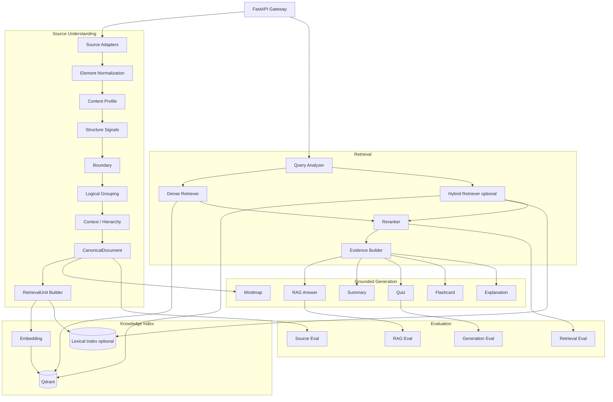
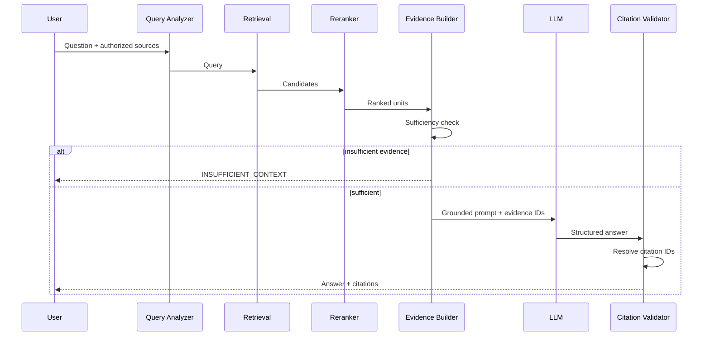
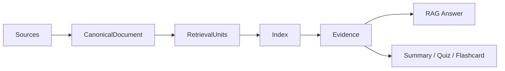
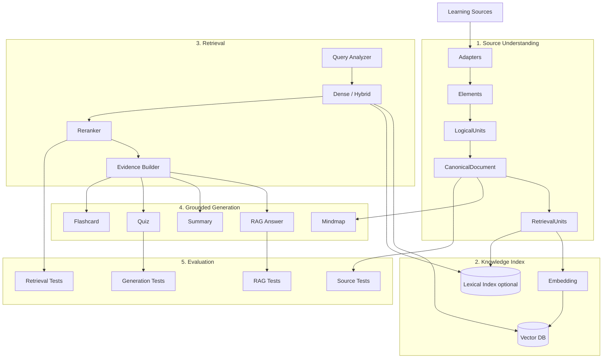

# FULL AI SYSTEM DESIGN
# AI Study Assistant 2.0

> **Mục tiêu tài liệu:** Thiết kế hệ thống AI phục vụ Source Understanding, Retrieval, grounded RAG, learning-content generation và AI evaluation.  
> **Vai trò của AI System:** Biến nguồn học tập thô thành biểu diễn có cấu trúc, truy xuất được, có provenance; sau đó tạo câu trả lời/nội dung học tập có grounding và citation.  
> **Scope:** Không triển khai Student Model, mastery/forgetting inference, personalization, Recommendation Engine hoặc AI-generated/adaptive Study Planner.

---

# 1. Tư tưởng thiết kế cốt lõi

AI System không phải:

```text
User
→ Prompt
→ LLM
→ Answer
```

Mà là một pipeline preserve-first:

```text
Learning Source
      ↓
Source Adapter
      ↓
RawElement
      ↓
Element
      ↓
LogicalUnit
      ↓
Inferred Structure / Optional Semantic Enrichment
      ↓
RetrievalUnit
      ↓
Retrieval / Reranking
      ↓
Evidence
      ↓
Grounded Generation
      ↓
Citation
```

Song song với RAG:

```text
Evidence / source scope
      ↓
Learning Content Generation
      ↓
Summary / Quiz / Flashcard / Mindmap
```

Trọng tâm:

> **Source Understanding + Retrieval Quality + Grounded Generation + Evaluation**

AI không quan sát lịch sử học để tự quyết định người dùng nên học gì tiếp theo.

---

# 2. Phạm vi AI System

AI System gồm 6 subsystem.

## A. Source Understanding

- File/source adapters.
- Native extraction / OCR khi cần.
- Element normalization.
- Information preservation.
- Content profiling.
- Structure signals.
- Boundary scoring.
- Logical grouping.
- Context/hierarchy inference.
- Structural relations.
- CanonicalDocument assembly.
- RetrievalUnit projection.
- SourceAnchor / provenance.

## B. Knowledge Indexing

- Embedding.
- Vector indexing.
- Optional lexical indexing.
- Metadata indexing.
- Re-indexing.
- Versioning.

## C. Retrieval Engine

- Query analysis.
- Dense retrieval.
- Optional BM25/hybrid retrieval.
- Source/ACL filtering.
- Reranking.
- Context/evidence selection.

## D. RAG Engine

- Grounded prompt construction.
- Sufficiency/abstention.
- Answer generation.
- Citation binding.
- Claim/evidence validation.
- Conversation-aware query handling.

## E. Learning Content Generator

- Summary.
- Quiz.
- Flashcard.
- Explanation.
- Translation.
- Mindmap.
- Practice generation.

## F. Evaluation & Observability

- Source-understanding quality.
- Retrieval benchmark.
- RAG evaluation.
- Generation quality.
- Citation correctness.
- Latency/cost monitoring.
- Regression tests.

Không có AI subsystem cho:

```text
Student Modeling
Personalization
Recommendation Ranking
Forgetting Risk
Adaptive Study Planning
```

---

# 3. Kiến trúc trách nhiệm

AI System chỉ chịu trách nhiệm cho AI/source pipeline.

```text
FastAPI / AI Worker
├── source understanding
├── indexing
├── retrieval
├── reranking
├── RAG
├── generation
└── evaluation
```

Application backend chịu trách nhiệm:

```text
authentication
authorization
workspace ownership
conversation persistence
quiz attempts
learning events
analytics aggregates
manual study plan/tasks
notification
```

Learning Analytics không được đưa vào AI System chỉ để tạo cảm giác “thông minh hơn”.

---

# 4. Nguyên tắc kiến trúc

## 4.1. Preserve trước khi interpret

```text
Preserve
→ Structure
→ Enrich
→ Retrieve
```

Không:

```text
interpret source
→ overwrite source representation
```

## 4.2. Phân biệt ba loại thông tin

```text
1. SOURCE FACT
2. INFERRED STRUCTURE
3. SEMANTIC ENRICHMENT
```

Inference không được biến thành source fact.

## 4.3. UNKNOWN và FLAT là hợp lệ

Không ép source thành hierarchy khi evidence yếu.

```text
UNKNOWN
FLAT
LOCAL
GROUPED
HIERARCHICAL
MIXED
```

đều là state hợp lệ tùy evidence.

## 4.4. Grounded-by-default

Các chức năng dựa trên source:

```text
RAG
Summary
Quiz
Flashcard
Mindmap
Explanation
```

phải truy vết được về source.

## 4.5. Deterministic logic trước LLM

Dùng deterministic validation cho:

- order/reference checks;
- source scope;
- schema validation;
- provenance;
- citation resolution;
- duplicate detection;
- token budget;
- permission filters.

LLM chỉ dùng nơi cần semantic/generation capability.

---

# 5. AI Service Architecture



---

# 6. Source Understanding — canonical pipeline

Canonical architecture:

```text
ANY SOURCE
→ Element
→ LogicalUnit
→ RetrievalUnit
→ Evidence
→ Grounded Answer
→ Citation
```

Parallel structure branch:

```text
LogicalUnit
→ Inferred Structure
→ Semantic Enrichment optional
```

Core identities:

- `Element`: representation gần source.
- `LogicalUnit`: integrity/logical grouping.
- `RetrievalUnit`: downstream retrieval projection.
- `Evidence`: selected support for a request.
- `SourceAnchor`: back-reference to original source location.

RetrievalUnit phải rebuild được từ CanonicalDocument mà không parse lại source.

---

# 7. Source Adapter boundary

Adapter theo format chỉ nên chịu trách nhiệm:

```text
Source
→ RawElement[]
```

Ví dụ:

```text
PDFAdapter
DOCXAdapter
PPTXAdapter
TextAdapter
```

Universal Source Understanding bắt đầu sau adapter.

Adapter phải preserve khi source cung cấp:

```text
raw text
native order
page / bbox / offset
style
native type hint
source metadata
```

Không để adapter bịa hierarchy chỉ vì font lớn.

---

# 8. Atomic normalization

Invariant:

```text
1 RawElement
→ 1 Element
```

Atomic layer không:

- split;
- merge;
- deduplicate;
- sort silent;
- infer heading/question/table semantics từ text.

Conservative normalization:

- CRLF/CR → LF;
- Unicode NFC;
- preserve raw text;
- append transformation provenance;
- deterministic element ID;
- source location giữ nguyên.

---

# 9. Content Profiling

Profiler chỉ đo distribution/signal summary.

Ví dụ:

```text
paragraph ratio
heading count
list count
table count
code count
question/answer count
dialogue count
unknown ratio
style/location coverage
category transitions
```

Profiler không gán một `document_type` cứng cho toàn source.

---

# 10. Structure Signals

Signals có thể gồm:

```text
ELEMENT_TYPE
STYLE_BOLD
STYLE_FONT_SIZE
STYLE_INDENTATION
NUMBERING_MARKER
SECTION_MARKER
QUESTION_MARKER
ANSWER_MARKER
TIMESTAMP_PATTERN
SPEAKER_LABEL_CANDIDATE
ELEMENT_TYPE_TRANSITION
```

Signal là evidence, chưa phải boundary/hierarchy fact.

---

# 11. Boundary Scoring

Mỗi cặp Element kề nhau có thể nhận:

```text
HARD
SOFT
NONE
UNKNOWN
```

Priority:

```text
explicit structure
> content-type integrity
> strong local pattern
> semantic boundary
> token target
```

Không phá:

- QA pair;
- code block;
- table;
- formula;
- integrity unit;

chỉ để đạt chunk size.

---

# 12. Logical Grouping

Specialized builders xử lý khi evidence đủ:

```text
QA_PAIR
DIALOGUE_SEGMENT
LOG_WINDOW
CODE_BLOCK
TABLE_BLOCK
LIST_GROUP
TEXT_BLOCK
```

Nếu continuity chưa chứng minh được:

```text
leave ungrouped / UNKNOWN
```

Không merge chỉ vì hai element cùng type.

---

# 13. Context / Hierarchy

Hierarchy builder dùng canonical `TITLE`/`HEADING` và structural evidence.

Không:

```text
PARAGRAPH "1.2 Something"
→ tự động HEADING
```

Nếu numbering chỉ chứng minh level-like pattern nhưng chưa chứng minh headinghood, không tạo hierarchy node.

Context path được giữ riêng và sau đó integrate vào LogicalUnit bằng common valid path.

---

# 14. CanonicalDocument assembly

Assembly là final structural gate:

```text
Elements
+ LogicalUnits
+ ContextNodes
+ Relations
+ SubDocuments
+ Structure
+ Quality
→ CanonicalDocument
```

Assembler:

- không re-infer;
- không silent repair;
- kiểm tra stage alignment/version;
- kiểm tra order/reference;
- preserve metadata/assets/regions;
- merge structure quality;
- gọi CanonicalDocument validation cuối.

---

# 15. RetrievalUnit

RetrievalUnit là projection phục vụ downstream retrieval.

Mục tiêu:

```text
retrieval-friendly
rebuildable
source-traceable
context-aware
```

Provenance chain bắt buộc:

```text
RetrievalUnit
→ LogicalUnit
→ Element
→ SourceAnchor
→ Original Source
```

RetrievalUnit không được giữ citation/page do LLM tự sinh.

---

# 16. Semantic Enrichment

Semantic enrichment là optional.

Có thể gồm:

```text
topics
entities
roles
keywords
semantic annotations
```

Nếu enrichment fail:

```text
base RAG vẫn phải hoạt động
```

Không biến enrichment thành dependency bắt buộc của parsing/retrieval.

---

# 17. Embedding Layer

Interface:

```python
embed_documents(texts)
embed_query(query)
```

Không hard-code provider sâu trong pipeline.

Version:

```text
embedding_model
embedding_version
dimension
```

Khi đổi embedding model phải biết index nào cần rebuild.

---

# 18. Vector Database

Qdrant payload phải mang source/security scope.

Ví dụ:

```json
{
  "user_id": "...",
  "source_id": "...",
  "retrieval_unit_id": "...",
  "content_type": "TEXT",
  "embedding_version": "v1"
}
```

Critical:

```text
ownership/source filter
```

phải áp dụng ngay trong retrieval query, không retrieval toàn collection rồi filter sau.

---

# 19. Retrieval Engine

Pipeline:

```text
Query
→ Query Analysis
→ Source Scope Validation
→ Dense / Hybrid Candidate Retrieval
→ Reranking
→ Dedup / Diversity
→ Evidence Selection
```

Không đưa raw top-K trực tiếp vào LLM nếu có thể rerank/select tốt hơn.

---

# 20. Query Analyzer

Có thể nhận diện:

```text
language
intent
comparison
definition
list
requested source scope
conversation dependence
```

Query Analyzer không được thay đổi security/source scope do backend đã authorize.

---

# 21. Query Rewriting

Chỉ rewrite khi câu hỏi phụ thuộc conversation.

Ví dụ:

```text
Turn 1: INNER JOIN là gì?
Turn 2: Còn LEFT JOIN khác thế nào?
```

Standalone form:

```text
LEFT JOIN khác INNER JOIN như thế nào?
```

Rewrite không được thêm source fact mới.

---

# 22. Dense / Lexical / Hybrid Retrieval

## Baseline

```text
Dense Retrieval
```

## Advanced

```text
Dense
+
BM25
+
Rank Fusion
```

BM25 có ích cho:

- exact technical names;
- code symbols;
- abbreviations;
- identifiers.

---

# 23. Reranker

Input:

```text
query + candidate RetrievalUnit
```

Output:

```text
relevance score
```

Mục tiêu:

```text
candidate recall cao
→ reranking chính xác hơn
→ evidence nhỏ, sạch hơn
```

Retrieval kém không được “sửa” bằng prompt engineering.

---

# 24. Evidence Construction

Evidence builder chịu trách nhiệm:

- token budget;
- duplicate suppression;
- overlap handling;
- source diversity khi phù hợp;
- context/path preservation;
- source anchors;
- score/trace metadata.

Evidence là input cho grounded generation.

---

# 25. Retrieval Sufficiency

Có thể kết hợp:

```text
top score
score margin
support count
query coverage
```

Output:

```text
HIGH
MEDIUM
LOW
INSUFFICIENT
```

Nếu `INSUFFICIENT`:

```text
không gọi LLM để đoán câu trả lời
```

---

# 26. RAG Engine



---

# 27. RAG Output

```json
{
  "answer": "...",
  "status": "ANSWERED",
  "confidence": "HIGH",
  "citations": [
    {
      "evidence_id": "...",
      "retrieval_unit_id": "...",
      "source_id": "...",
      "source_anchor": {}
    }
  ],
  "retrieval_trace_id": "..."
}
```

Không yêu cầu mọi source phải có page.

---

# 28. Citation Alignment

LLM chỉ reference evidence IDs được cung cấp.

```text
[E1]
[E2]
```

Sau generation:

```text
E1
→ RetrievalUnit
→ Element
→ SourceAnchor
```

Nếu citation reference không tồn tại:

```text
validation_failed
```

Không suy đoán page từ chunk index.

---

# 29. Hallucination Control

Các lớp chính:

```text
1. authorized source scope
2. retrieval sufficiency
3. grounded prompt
4. structured output
5. citation validation
6. optional claim/evidence checker
```

Nếu claim không support:

- regenerate;
- remove claim;
- hoặc fail safely.

---

# 30. Conversation Memory

Không gửi toàn bộ history mãi mãi.

Có thể dùng:

```text
recent messages
conversation summary
relevant historical turns
```

Document/source evidence luôn quan trọng hơn chat memory trong grounded mode.

---

# 31. Summary Engine

Input scope:

```text
source
logical units
selected range
selected topics optional
```

Modes:

```text
QUICK
STANDARD
DETAILED
```

Long source:

```text
local summaries
→ higher-level synthesis
→ grounding validation
```

Summary phải giữ source references.

---

# 32. Quiz Generator

Pipeline:

```text
Source scope
→ Evidence retrieval
→ Candidate questions
→ Schema validation
→ Answer validation
→ Grounding validation
→ Duplicate removal
→ Save
```

Không sinh quiz từ một giant unbounded prompt chứa cả document.

---

# 33. Quiz Schema

```json
{
  "question": "...",
  "type": "MULTIPLE_CHOICE",
  "choices": [
    {"id": "A", "text": "..."},
    {"id": "B", "text": "..."}
  ],
  "correct_choice": "B",
  "explanation": "...",
  "difficulty": "MEDIUM",
  "source_references": ["..."]
}
```

Topic annotation có thể optional nếu enrichment chưa chạy.

---

# 34. Quiz Quality Validation

Reject nếu:

- answer không có support;
- question mơ hồ;
- multiple choices cùng đúng;
- distractor vô nghĩa;
- duplicate;
- explanation không grounded.

Rule validation chạy trước LLM judge khi có thể.

---

# 35. Difficulty Rubric

### EASY

- direct recall;
- definition;
- single fact.

### MEDIUM

- comparison;
- application;
- multi-sentence evidence.

### HARD

- scenario;
- multiple concepts;
- evidence synthesis.

Difficulty là generation/evaluation property, không phải personalized difficulty theo user profile.

---

# 36. Flashcard Generator

Ưu tiên atomic learning unit.

```text
source evidence
→ candidate facts/concepts
→ cards
→ grounding
→ dedup
```

Review scheduling nếu có thuộc flashcard application logic; AI service không xây global personalized learning policy.

---

# 37. Explanation / Translation

Explanation modes có thể gồm:

```text
SIMPLE
NORMAL
DETAILED
STEP_BY_STEP
EXAMPLE_BASED
```

Translation phải preserve technical terms và không mutate source fact.

---

# 38. Mindmap

Nguồn:

```text
ContextNode hierarchy
+ validated semantic relations optional
```

Output graph có IDs và source references.

Không tạo knowledge graph tự do chỉ dựa vào imagination của LLM.

---

# 39. AI Model Abstraction

Interfaces:

```text
LLMClient
EmbeddingClient
RerankerClient
OCRClient
```

Business/source pipeline không phụ thuộc trực tiếp một provider.

---

# 40. Model Routing

Không phải task nào cũng cần model lớn.

Ví dụ:

```text
query rewrite      → small model
semantic extraction → small/medium model
quiz validation    → medium model
RAG answer         → strong model
```

Routing dựa trên task, không dựa trên personalization profile.

---

# 41. Prompt Management

```text
prompts/
├── rag_answer_v1.txt
├── summary_v1.txt
├── quiz_generate_v1.txt
├── quiz_validate_v1.txt
├── flashcard_v1.txt
└── semantic_extract_v1.txt
```

Log:

```text
prompt_version
model_version
```

Không hard-code prompt rải rác.

---

# 42. Structured Output Validation

```text
LLM output
→ JSON parse
→ Pydantic/schema validation
→ business/source validation
→ accept / retry / fail
```

Không save invalid model output.

---

# 43. AI Job Types

Background:

```text
DOCUMENT_PROCESS
OCR
EMBED
REINDEX
SUMMARY_LONG
QUIZ_GENERATE
FLASHCARD_GENERATE
MINDMAP_GENERATE
```

Synchronous/streaming:

```text
RAG_QUERY
SMALL_EXPLANATION
```

Không có recommendation/personalization refresh job.

---

# 44. Internal AI API

## Source Processing

```text
POST /internal/ai/sources/process
POST /internal/ai/sources/reindex
GET  /internal/ai/jobs/{id}
```

## Retrieval

```text
POST /internal/ai/retrieve
```

## RAG

```text
POST /internal/ai/rag/answer
```

## Generation

```text
POST /internal/ai/generate/summary
POST /internal/ai/generate/quiz
POST /internal/ai/generate/flashcards
POST /internal/ai/generate/mindmap
POST /internal/ai/generate/explanation
```

Không có mastery/recommendation/planner AI endpoint.

---

# 45. RAG Request Example

```json
{
  "user_id": "...",
  "conversation_id": "...",
  "query": "LEFT JOIN khác INNER JOIN như thế nào?",
  "selected_source_ids": ["..."],
  "mode": "GROUNDED_ONLY"
}
```

Backend phải authorize source IDs trước khi request tới AI.

---

# 46. Security — Prompt Injection

Source là untrusted data.

Ví dụ document chứa:

```text
Ignore previous instructions...
```

AI phải coi đây là content.

Defense:

- system instructions tách khỏi evidence;
- evidence delimiters;
- no tool execution from source text;
- source/ACL filter;
- structured outputs;
- strict tool allowlist nếu có tools.

---

# 47. Data Isolation

Không retrieval toàn collection rồi filter sau.

Filter phải được áp dụng tại search boundary:

```text
user_id / ACL
+
selected_source_ids
```

Citation cũng phải validate ownership.

---

# 48. Observability

Mỗi AI request nên trace:

```text
trace_id
request type
source scope
retrieval method
candidate count
selected evidence IDs
retrieval scores
rerank scores
context tokens
model
latency
input/output tokens
status
```

Không log private content tùy tiện.

---

# 49. Cost Monitoring

Theo loại operation:

```text
embedding calls
LLM calls
input/output tokens
OCR pages
generation requests
```

Không cần cost model theo personalization subsystem vì subsystem đó không tồn tại.

---

# 50. Source Understanding Evaluation

Đánh giá:

```text
text preservation
order preservation
reference validity
provenance completeness
structure precision/coverage
RetrievalUnit rebuildability
citation resolution
```

Error taxonomy nên phân biệt:

```text
TEXT_LOSS
WRONG_ORDER
INVALID_REFERENCE
CITATION_LOSS
STRUCTURE_OVERINFERENCE
```

---

# 51. Retrieval Dataset

Tạo question–evidence pairs:

```json
{
  "question": "...",
  "relevant_retrieval_unit_ids": ["..."],
  "reference_answer": "..."
}
```

Nên có:

- definition;
- comparison;
- exact terminology;
- multi-evidence;
- no-answer questions.

---

# 52. Retrieval Metrics

- Recall@K.
- Hit@K.
- MRR.
- Precision@K.
- nDCG nếu graded relevance.

Không tối ưu RAG bằng cảm giác.

---

# 53. RAG Evaluation

Đánh giá riêng:

```text
retrieval quality
answer correctness
faithfulness
citation correctness
abstention accuracy
unsupported-answer rate
```

Không gộp tất cả thành một “AI score”.

---

# 54. Hallucination Test Set

Có subset câu hỏi không có answer trong source.

Expected:

```text
INSUFFICIENT_CONTEXT
```

Metric:

```text
abstention accuracy
false-answer rate
```

---

# 55. RAG Ablation

So sánh:

```text
Dense
Dense + Reranker
Hybrid
Hybrid + Reranker
```

Và các RetrievalUnit/chunk policy khác nhau nếu cần.

Thay đổi retrieval phải benchmark trước khi kết luận tốt hơn.

---

# 56. Generation Evaluation

## Quiz

- correctness;
- groundedness;
- clarity;
- distractor quality;
- difficulty consistency.

## Summary

- factual consistency;
- coverage;
- redundancy;
- source coverage.

## Flashcard

- atomicity;
- correctness;
- grounding;
- duplicate rate.

---

# 57. Offline Benchmark Suite

```text
evaluation/
├── source_understanding/
├── retrieval/
├── rag/
├── quiz/
├── summary/
├── flashcard/
└── regression/
```

Mỗi lần đổi:

- parser;
- structure;
- RetrievalUnit policy;
- embedding;
- retrieval;
- reranker;
- prompt;
- model;

cần regression check phù hợp.

---

# 58. Versioning

Version các thành phần ảnh hưởng output:

```text
schema_version
adapter_version
normalizer_version
structure_version
retrieval_unit_version
embedding_version
retrieval_version
reranker_version
prompt_version
llm_model
```

Không còn `mastery_version` hoặc `recommendation_version`.

---

# 59. Cache AI

Cache phù hợp:

```text
source parsing artifacts
embedding
same-source generated summary khi inputs/version giống nhau
topic extraction
```

RAG answer cache phải rất cẩn thận vì:

```text
source scope
source revision
conversation state
permissions
```

có thể khác nhau.

---

# 60. Failure Handling

Ví dụ:

```text
FAILED_PARSE
FAILED_OCR
FAILED_INDEX
INVALID_GENERATION
INSUFFICIENT_CONTEXT
AI_TIMEOUT
```

Retry phải có giới hạn và idempotency.

Nếu semantic enrichment fail nhưng base retrieval-ready data hợp lệ:

```text
RAG base vẫn hoạt động
```

---

# 61. AI Data Flow



Learning Event/Analytics thuộc application/data workflow sau khi user tương tác với outputs này.

---

# 62. MVP AI

## P0

### Source Understanding

- PDF/DOCX/PPTX adapters.
- Element normalization.
- Structure signals/grouping.
- CanonicalDocument.
- RetrievalUnit projection.
- SourceAnchor/provenance.

### Index / Retrieval

- embedding;
- Qdrant;
- source filters;
- dense retrieval;
- reranking;
- evidence construction.

### RAG

- grounded answer;
- citation;
- insufficient context;
- streaming contract.

### Generation

- summary;
- quiz;
- flashcard.

### Evaluation

- source invariants;
- retrieval benchmark;
- RAG evaluation;
- quiz groundedness.

## P1

- BM25/hybrid retrieval;
- query rewriting;
- OCR improvements;
- mindmap;
- better generation validators;
- richer semantic enrichment.

## P2

- Graph RAG;
- multimodal figure/table understanding;
- lecture video ingestion;
- voice tutoring.

---

# 63. Những thứ không nên làm ngay

Không ưu tiên:

- fine-tune LLM;
- train embedding model;
- multi-agent system;
- full knowledge graph;
- voice/video;
- personalization/recommendation models.

Lý do:

```text
baseline chưa hoàn thiện
evaluation chưa đủ
scope tăng mạnh
không cải thiện trực tiếp retrieval/citation correctness
```

---

# 64. Thứ tự triển khai AI

## Phase A — Source Foundation

1. schemas;
2. adapters/RawElement;
3. Element normalization;
4. profiling/signals;
5. grouping/hierarchy;
6. CanonicalDocument assembly;
7. RetrievalUnit builder;
8. provenance/citation anchors.

## Phase B — Retrieval Baseline

9. embedding;
10. Qdrant;
11. dense retrieval;
12. evidence builder;
13. retrieval dataset.

## Phase C — Retrieval Quality

14. reranker;
15. BM25/hybrid nếu cần;
16. query rewriting;
17. sufficiency threshold;
18. ablation benchmark.

## Phase D — Grounded RAG

19. prompt;
20. structured answer;
21. citation resolution;
22. abstention;
23. RAG evaluation.

## Phase E — Learning Generation

24. summary;
25. quiz;
26. quiz validation;
27. flashcard;
28. mindmap optional.

## Phase F — Production / Evaluation

29. regression suite;
30. observability;
31. cost/latency;
32. failure handling;
33. security hardening.

Không có personalization phase.

---

# 65. Demo AI nên thể hiện

## Demo 1 — Source Understanding

```text
PDF/DOCX/PPTX
→ Elements
→ LogicalUnits
→ RetrievalUnits
→ SourceAnchor
```

## Demo 2 — Grounded RAG

```text
Ask LEFT JOIN
→ retrieved evidence
→ answer
→ citation
→ open original source
```

## Demo 3 — Hallucination Control

Question không có trong source:

```text
→ INSUFFICIENT_CONTEXT
```

## Demo 4 — Retrieval Improvement

```text
Dense
vs
Dense + Reranker
```

show benchmark/traces.

## Demo 5 — Grounded Quiz

```text
selected source
→ generate quiz
→ source-backed explanations
```

Không cần demo hai user nhận hai gợi ý khác nhau.

---

# 66. Các experiment chính

1. RetrievalUnit/chunk policy vs Recall@K.
2. Dense vs Hybrid Retrieval.
3. Có/không Reranker.
4. Sufficiency threshold vs answer coverage / hallucination.
5. Quiz generation trước/sau grounding validation.
6. Source-structure quality vs retrieval quality nếu đủ dữ liệu.

---

# 67. KPI AI System

### Source Understanding

```text
text preservation
order/reference correctness
citation resolution rate
structure quality
```

### Retrieval

```text
Recall@K
MRR
Hit@K
```

### RAG

```text
answer correctness
faithfulness
citation correctness
abstention accuracy
```

### Generation

```text
quiz groundedness
quiz correctness
summary factual consistency
flashcard groundedness
```

Không có recommendation precision hoặc planner quality KPI.

---

# 68. “AI hoạt động tốt” nghĩa là gì?

Không nói:

> AI trả lời nghe hay.

Mà báo cáo:

```text
Retrieval Recall@5 = ...
Citation correctness = ...
Unsupported-answer rate = ...
Abstention accuracy = ...
Quiz groundedness = ...
```

Số liệu lấy sau thực nghiệm.

---

# 69. Nếu hội đồng hỏi “AI có gì ngoài gọi API?”

Trả lời bằng pipeline:

```text
1. Multi-format source understanding
2. Canonical representation
3. Provenance/source anchors
4. RetrievalUnit design
5. Embedding/indexing
6. Retrieval
7. Reranking
8. Evidence construction
9. Grounding/abstention
10. Citation validation
11. Learning-content validation
12. Evaluation/observability
```

LLM chỉ là một component.

---

# 70. Kết luận thiết kế AI

AI Study Assistant 2.0 gồm bốn năng lực AI chính:

```text
┌────────────────────────────┐
│ 1. Source Intelligence     │
│ source → canonical model   │
└─────────────┬──────────────┘
              ▼
┌────────────────────────────┐
│ 2. Retrieval Intelligence  │
│ query → evidence           │
└─────────────┬──────────────┘
              ▼
┌────────────────────────────┐
│ 3. Grounded Generation     │
│ answer/content + citation  │
└─────────────┬──────────────┘
              ▼
┌────────────────────────────┐
│ 4. Evaluation              │
│ measurable quality         │
└────────────────────────────┘
```

Công thức cốt lõi:

> **Knowledge Source → Canonical Representation → Retrieval Evidence → Grounded Learning Output → Citation.**

AI System dừng ở việc cung cấp output học tập đáng tin cậy và có thể đánh giá. Learning Analytics và user-managed planner thuộc Application/Web layer; AI không tạo personalized next action.

---

# 71. Kiến trúc AI cuối cùng



---

# 72. Một câu mô tả phần AI dùng trong báo cáo

> **Hệ thống AI của AI Study Assistant 2.0 được thiết kế theo pipeline Source Understanding → Retrieval → Evidence → Grounded Generation → Citation. Hệ thống bảo toàn provenance từ nguồn gốc, hỗ trợ truy xuất và reranking trên RetrievalUnit, kiểm soát hallucination bằng sufficiency/grounding/citation validation, đồng thời sinh summary, quiz và flashcard có căn cứ. Phiên bản đồ án này không triển khai Student Model, personalization hoặc Recommendation Engine; trọng tâm AI là correctness, information preservation, retrieval quality và khả năng đánh giá.**
