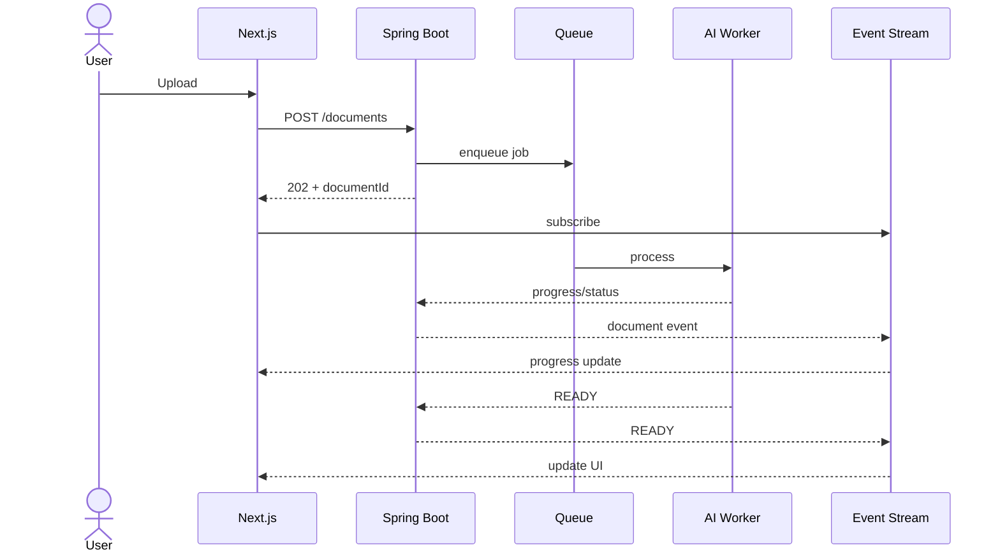
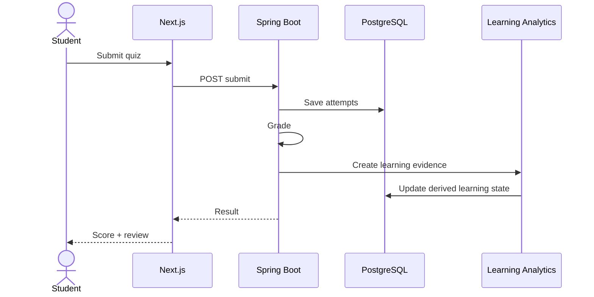
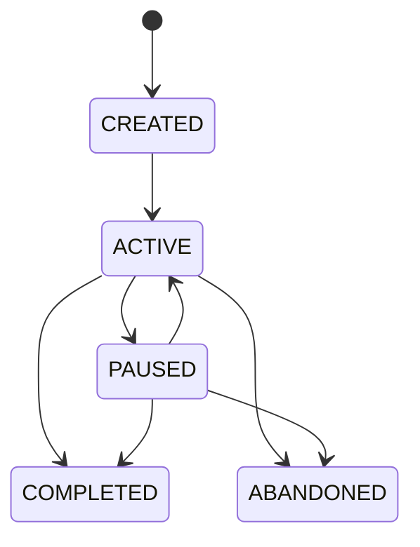
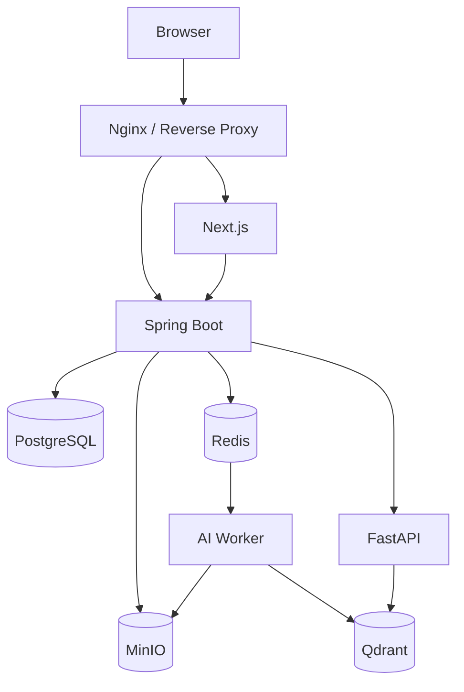
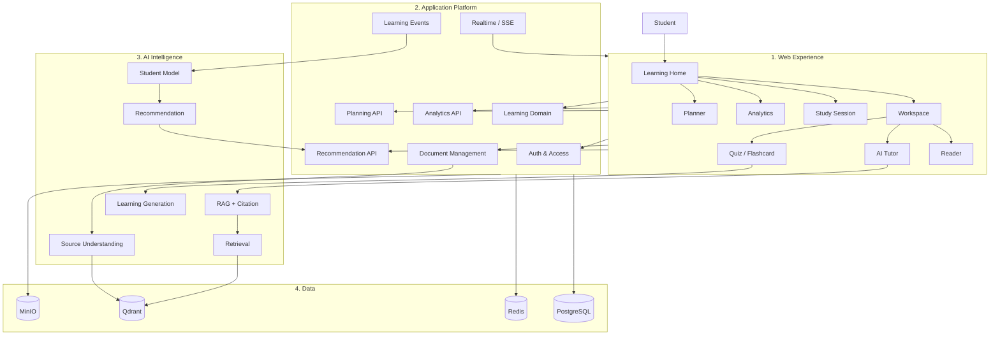

# FULL WEB SYSTEM DESIGN
# AI Study Assistant 2.0

> **Tên tài liệu:** Web Application & Platform System Design  
> **Vai trò:** Thiết kế chuyên sâu phần Web của đồ án AI Study Assistant 2.0  
> **Định hướng:** Web-first learning platform, AI-powered  
> **Mục tiêu:** Biến các subsystem AI, RAG, Learning Analytics và Personalization thành một sản phẩm Web hoàn chỉnh, có kiến trúc rõ ràng, trải nghiệm học tập liền mạch, realtime, an toàn, có thể kiểm thử và triển khai.
>
> **Quan hệ với các tài liệu hiện có:**
>
> - `AI_Study_Assistant_2.0_Full_Graduation_Project_Idea.md` — source of truth cho phạm vi sản phẩm, domain học tập, backend tổng thể, database và feature.
> - `AI_Study_Assistant_2.0_FULL_AI_SYSTEM_DESIGN.md` — source of truth cho AI pipeline, RAG, generation, student model, recommendation và planner.
> - `UNIVERSAL_SOURCE_UNDERSTANDING_RAG_PARSER_DESIGN.md` — source of truth cho source representation, `Element → LogicalUnit → RetrievalUnit → Evidence → Citation`, `SourceAnchor` và source scope.
>
> Tài liệu này **không thiết kế lại AI**. Nó thiết kế cách Web Application tổ chức, hiển thị, điều khiển và kết nối các capability đã có thành một learning platform hoàn chỉnh.

---

# 1. Tư tưởng thiết kế cốt lõi

AI Study Assistant 2.0 không nên được xây như:

```text
Login
→ Upload PDF
→ Chat
→ Logout
```

và cũng không nên tổ chức giao diện theo implementation detail:

```text
Embedding
Vector DB
Reranker
Mastery Engine
```

Web phải được xây quanh **learning workflow của người dùng**:

```text
ORGANIZE
   ↓
LEARN
   ↓
PRACTICE
   ↓
REFLECT
   ↓
PLAN
   ↓
CONTINUE
```

Kiến trúc trải nghiệm:

```text
Learning Sources
      ↓
Learning Workspace
      ↓
Read / Ask / Note / Practice
      ↓
Learning Events
      ↓
Progress & Mastery
      ↓
Personalized Recommendation
      ↓
Study Plan
      ↓
Next Learning Session
```

Triết lý:

> **AI tạo intelligence; Web biến intelligence thành hành động học tập.**

---

# 2. Vị trí của Web trong toàn hệ thống

Toàn hệ thống được nhìn theo ba lớp lớn:

```text
┌─────────────────────────────────────────────┐
│              PRODUCT EXPERIENCE             │
│                                             │
│ Next.js Web Application                     │
│ Workspace / Reader / Tutor / Quiz / Planner │
└────────────────────┬────────────────────────┘
                     │
                     ▼
┌─────────────────────────────────────────────┐
│             APPLICATION PLATFORM            │
│                                             │
│ Spring Boot                                 │
│ Auth / Business / Learning / Analytics      │
│ Documents / Planner / Admin                 │
└────────────────────┬────────────────────────┘
                     │
                     ▼
┌─────────────────────────────────────────────┐
│               AI INTELLIGENCE               │
│                                             │
│ Source Understanding / Retrieval / RAG      │
│ Generation / Student Model / Recommendation │
└─────────────────────────────────────────────┘
```

Web không gọi trực tiếp model provider.

```text
Browser
  ↓
Spring Boot
  ↓
FastAPI AI Service
  ↓
AI components
```

Spring Boot vẫn là application boundary chính.

---

# 3. Mục tiêu riêng của Web System

Web System phải chứng minh được năng lực ở năm nhóm.

## 3.1. Product Engineering

- Information architecture.
- Complex learning workspace.
- Multi-source interaction.
- Document reading experience.
- Practice experience.
- Planner.
- Analytics.
- Personalization UX.

## 3.2. Frontend Engineering

- Next.js + TypeScript.
- Routing.
- Server/client component boundaries.
- Server state.
- Local UI state.
- Forms.
- Streaming.
- Realtime updates.
- File upload.
- Rich document interaction.
- Data visualization.
- Error recovery.
- Accessibility.
- Responsive design.

## 3.3. Backend Web Engineering

- Spring Boot modular backend.
- REST API.
- Authentication.
- Authorization.
- Transactions.
- Async jobs.
- Event handling.
- Cache.
- Notification.
- Analytics aggregation.
- Object storage integration.

## 3.4. Distributed System Concerns

- Background processing.
- Idempotency.
- Retry.
- SSE.
- Job progress.
- Eventual consistency.
- Failure recovery.
- Observability.

## 3.5. Production Quality

- Security.
- Testing.
- Performance.
- Deployment.
- Logging.
- Monitoring.
- Data isolation.

---

# 4. Web System không chịu trách nhiệm cho những gì?

Để tránh boundary bị lẫn:

Web **không**:

```text
parse document structure
generate embeddings
rerank evidence
calculate groundedness
invent citations
calculate mastery bằng UI
decide recommendation bằng prompt
schedule plan bằng frontend heuristic
```

Những việc trên thuộc AI/Application layer.

Web chịu trách nhiệm:

```text
collect user intent
maintain interaction state
send valid requests
render structured outputs
show provenance
capture learning interaction
offer actions
handle loading/failure
```

---

# 5. Product Model — Learning Workspace

Bản gốc đã có document library, learning tools, planner và source-scoped RAG.

Để Web có một product boundary rõ ràng, đề xuất thêm:

```text
LearningWorkspace
```

Đây là **Web/Product extension**, không thay thế `source_id`.

Ví dụ:

```text
Database Final Exam
Machine Learning Semester
IELTS Preparation
Software Engineering Course
```

Một workspace gom:

```text
Sources
Conversations
Notes
Highlights
Quizzes
Flashcards
Topics
Study Sessions
Study Plan
Analytics
```

Nhưng mỗi source vẫn giữ identity riêng:

```text
Workspace
 ├── Source A
 ├── Source B
 └── Source C
```

Không:

```text
Workspace
→ merge all sources into one fake document
```

---

# 6. Workspace và source identity

Universal Source Understanding coi `source_id` là first-class boundary.

Web phải giữ invariant:

```text
Workspace membership
≠
Source identity
```

Ví dụ:

```text
Workspace W1
 ├ Source S1
 ├ Source S2
 └ Source S3
```

RAG query:

```text
workspace_id = W1

selected_source_ids = [S1, S3]
```

Retrieval phải chạy trên:

```text
S1 + S3
```

không tự động dùng S2.

---

# 7. User Roles

MVP:

```text
STUDENT
ADMIN
```

## STUDENT

Có thể:

- quản lý workspace;
- quản lý source;
- đọc tài liệu;
- hỏi AI;
- xem citation;
- tạo note/highlight/bookmark;
- tạo và làm quiz;
- học flashcard;
- chạy study session;
- xem analytics;
- nhận recommendation;
- quản lý planner.

## ADMIN

Có thể:

- quản lý user;
- theo dõi document jobs;
- theo dõi system health;
- theo dõi AI usage;
- kiểm tra failed jobs;
- xem storage;
- xem operational analytics.

---

# 8. Information Architecture

Navigation đề xuất:

```text
AI Study Assistant
│
├── Home
│
├── Workspaces
│   ├── Overview
│   ├── Sources
│   ├── Learn
│   ├── Practice
│   ├── Notes
│   └── Progress
│
├── Library
│
├── Practice
│   ├── Quizzes
│   └── Flashcards
│
├── Planner
│
├── Analytics
│
├── Notifications
│
├── Settings
│
└── Admin
```

Nguyên tắc:

```text
navigation theo user goal
```

không theo backend module.

---

# 9. Route Architecture

Ví dụ route tree:

```text
/
├── login
├── register
│
└── app
    ├── home
    │
    ├── workspaces
    │   ├── [workspaceId]
    │   │   ├── overview
    │   │   ├── sources
    │   │   ├── learn
    │   │   ├── practice
    │   │   ├── notes
    │   │   └── progress
    │
    ├── library
    │
    ├── documents
    │   └── [documentId]
    │
    ├── quizzes
    │   └── [quizId]
    │
    ├── flashcards
    │
    ├── planner
    ├── analytics
    ├── notifications
    ├── settings
    │
    └── admin
```

Các state có ý nghĩa navigation nên tồn tại trong URL.

Ví dụ:

```text
/documents/{id}?page=87&tab=notes
```

---

# 10. Global Home — Learning Command Center

Home không chỉ là dashboard thống kê.

Nó phải trả lời bốn câu:

```text
1. Tôi đang học gì?
2. Tôi nên làm gì hôm nay?
3. Tôi đang yếu ở đâu?
4. Tôi có gì sắp đến hạn?
```

Layout:

```text
┌────────────────────────────────────────────┐
│ Continue Learning                          │
├────────────────────────────────────────────┤
│ Today's Plan          │ Review Due         │
├───────────────────────┼────────────────────┤
│ Weak Topics           │ Weekly Progress    │
├───────────────────────┴────────────────────┤
│ Personalized Recommendations               │
└────────────────────────────────────────────┘
```

---

# 11. Continue Learning

User phải có thể quay lại đúng nơi đang học.

State tối thiểu:

```text
workspace_id
resource_id
resource_type
document_page optional
active_topic optional
last_activity_type
last_interacted_at
```

Ví dụ:

```text
Continue Database Systems

LEFT JOIN
Database Systems.pdf · page 87

Last studied yesterday

[Continue]
```

---

# 12. Workspace Overview

Workspace Overview:

```text
Database Final Exam

Deadline:
12 days

Progress:
68%

Sources:
7

Topics:
24

Today:
3 tasks

Weak:
LEFT JOIN
Transactions

Recent:
Database Systems.pdf
SQL Lecture 5.pptx
```

Actions:

```text
Continue Learning
Start Study Session
Add Source
Practice
View Plan
```

---

# 13. Library

Library là nơi quản lý source toàn hệ thống.

Views:

```text
All
Recent
Favorites
By Workspace
By Type
```

Filters:

```text
workspace
file_type
status
tag
created_at
```

Search:

```text
title
filename
tag
```

Semantic content search là feature khác, không trộn với metadata library search.

---

# 14. Document status model

Giữ các trạng thái gốc:

```text
UPLOADED
QUEUED
PROCESSING
READY
FAILED
```

Web có thể render chi tiết processing stage:

```text
UPLOADING
PARSING
STRUCTURING
ENRICHING
INDEXING
READY
```

Nhưng cần phân biệt:

- `DocumentStatus` là application state.
- `ProcessingStage` là progress detail.

Không tạo các status UI làm source truth mới nếu backend không lưu chúng.

---

# 15. Upload UX

Upload phải hỗ trợ:

```text
drag & drop
file picker
multiple files
```

Flow:

```text
Select
  ↓
Local validation
  ↓
Upload
  ↓
Backend validation
  ↓
Stored
  ↓
Background processing
  ↓
READY / FAILED
```

Frontend local validation chỉ để UX.

Backend vẫn phải validate lại.

---

# 16. File Upload Progress

Phân biệt hai loại progress:

## Upload Progress

```text
Browser → Backend/Object Storage
```

## Processing Progress

```text
Parser → Structure → Index
```

UI:

```text
Database Systems.pdf

Upload        100% ✓
Processing     72%
```

Không giả progress nếu worker không report được stage thực.

---

# 17. Realtime Processing Architecture

Đề xuất:



---

# 18. SSE trước WebSocket

MVP ưu tiên Server-Sent Events cho các luồng server → client:

```text
document progress
AI token streaming
long generation status
notifications
```

Lý do:

- đơn giản;
- HTTP-friendly;
- tự reconnect;
- phù hợp luồng một chiều.

WebSocket chỉ cần nếu sau này có:

```text
collaboration
presence
shared editing
live classroom
```

---

# 19. Learning Workspace — màn hình trung tâm

Đây nên là màn hình mạnh nhất của sản phẩm.

Desktop layout:

```text
┌───────────────────────────────────────────────────────────┐
│ Workspace / Database Final Exam                          │
├────────────┬──────────────────────────┬───────────────────┤
│ Sources    │                          │ AI Tutor          │
│            │     Document Reader      │                   │
│ Book.pdf   │                          │ Question          │
│ Slide.pptx │                          │ Answer            │
│ Notes.docx │                          │ Citations         │
│            │                          │                   │
├────────────┴──────────────────────────┴───────────────────┤
│ Notes | Summary | Quiz | Flashcards | Concepts | History │
└───────────────────────────────────────────────────────────┘
```

Mục tiêu:

```text
không bắt user chuyển 5 trang cho một learning flow
```

---

# 20. Reader Abstraction

Frontend có một `LearningReader`.

Renderer theo source type:

```text
PDFRenderer
DocxRenderer
PptxRenderer
TextRenderer
```

Reader không chịu trách nhiệm hiểu source.

Reader nhận:

```text
resource
location
anchors
annotations
```

và render.

---

# 21. Reader State

Reader UI state:

```text
current_location
zoom
scroll_position
selected_text
selection_anchor
active_highlight_id
active_citation_id
side_panel
```

Không đưa toàn bộ state này vào database.

Chỉ persist state có ích cho continuation:

```text
last_location
last_opened_at
```

---

# 22. SourceLocation và SourceAnchor

Web phải hỗ trợ location optional.

Nguồn có thể có:

```text
page + bbox
```

hoặc:

```text
start_char + end_char
```

hoặc location hạn chế hơn.

Do đó frontend không được giả định:

```text
mọi citation đều có page
```

Renderer phải có progressive capability:

```text
bbox available
→ precise highlight

page available
→ jump page

char range available
→ select text

only element/source available
→ open source context
```

---

# 23. Citation Navigation

Citation chain của hệ thống:

```text
Answer Claim
 ↓
Evidence
 ↓
RetrievalUnit
 ↓
Element
 ↓
SourceAnchor
 ↓
Original Source
```

Frontend nhận citation đã resolve.

Không để frontend tính:

```text
chunk 15 = page 87
```

UI action:

```text
click citation
 ↓
open correct source
 ↓
navigate SourceAnchor
 ↓
temporary source highlight
```

---

# 24. Citation UI

Ví dụ:

```text
LEFT JOIN giữ tất cả các hàng của bảng bên trái. [1]
```

Click `[1]`:

```text
Database Systems.pdf
Page 87
```

Hover/preview:

```text
┌────────────────────────────────┐
│ Database Systems.pdf           │
│                                │
│ "...LEFT JOIN returns..."      │
│                                │
│ [Open source]                  │
└────────────────────────────────┘
```

Nếu source không có page, không hiển thị page giả.

---

# 25. Source Selection UI

Universal Source Understanding yêu cầu source scope rõ ràng.

AI Tutor:

```text
Sources

☑ Database Systems.pdf
☑ Lecture 5.pptx
☐ My Notes.docx
```

Request:

```text
selected_source_ids
```

phải được gửi xuống backend.

Không:

```text
select sources chỉ ở frontend decoration
```

---

# 26. Contextual Selection Actions

Khi user select text:

```text
[Ask AI]
[Explain]
[Highlight]
[Add Note]
[Create Flashcard]
[Practice]
```

Selection request phải mang anchor nếu có:

```json
{
  "source_id": "...",
  "source_anchor": {},
  "selected_text": "..."
}
```

`selected_text` không được coi là provenance thay cho anchor.

---

# 27. AI Tutor

AI Tutor là UI của RAG Engine.

Modes có thể gồm:

```text
ASK
EXPLAIN
COMPARE
SUMMARIZE_SELECTION
PRACTICE_SELECTION
```

Nhưng backend contract nên dựa trên intent/request schema, không tạo endpoint cho mọi nút UI nếu logic giống nhau.

---

# 28. RAG Interaction State

Frontend state:

```text
IDLE
SUBMITTING
RETRIEVING
GENERATING
DONE
INSUFFICIENT_CONTEXT
FAILED
```

Có thể render:

```text
Searching selected sources...
```

sau đó:

```text
Generating answer...
```

Nhưng chỉ hiển thị stage nếu backend thực sự emit stage đó.

---

# 29. AI Answer Streaming

Luồng đề xuất:

```text
Question
  ↓
Backend accepts request
  ↓
AI retrieval
  ↓
Generation starts
  ↓
Token/event stream
  ↓
Frontend incremental rendering
  ↓
Final metadata + citations
```

Quan trọng:

```text
partial text ≠ final validated answer metadata
```

Frontend phải chờ final event để khóa:

```text
citations
confidence
trace id
status
```

---

# 30. Streaming Event Contract

Ví dụ:

```text
rag.started
rag.retrieval_completed
rag.delta
rag.completed
rag.failed
```

`rag.completed` có thể chứa:

```json
{
  "message_id": "...",
  "confidence": "HIGH",
  "citations": [],
  "retrieval_trace_id": "..."
}
```

Không cố decode citation từ text stream.

---

# 31. Insufficient Context UX

Nếu AI trả:

```text
INSUFFICIENT_CONTEXT
```

Web phải thể hiện rõ:

```text
Không tìm thấy đủ bằng chứng trong các nguồn đang chọn.
```

Actions:

```text
[Select more sources]
[Rephrase question]
```

Không biến abstention thành generic error.

---

# 32. Conversation Model

Conversation thuộc user và có thể gắn workspace.

```text
Workspace
 └── Conversation
      └── Messages
```

User có thể:

```text
new conversation
rename
archive/delete
search history
```

RAG source scope của mỗi message phải được lưu hoặc trace được.

---

# 33. Conversation Memory UX

AI System dùng:

```text
recent messages
conversation summary
relevant historical turns
```

Frontend không cần biết implementation chi tiết.

Nhưng UI phải:

- hiển thị conversation history;
- cho user tạo thread mới;
- không khiến user tưởng mọi chat ở mọi workspace đều chung context.

---

# 34. Notes

Note là first-class application entity.

Đề xuất:

```text
Note
- id
- user_id
- workspace_id
- title optional
- content
- source_id optional
- source_anchor optional
- created_at
- updated_at
```

Có thể map topic sau.

---

# 35. Note Editor

MVP:

```text
rich text hoặc markdown-compatible editor
```

Features:

```text
headings
lists
bold/italic
code
links
```

Không cần xây Notion clone.

AI actions optional:

```text
summarize note
generate quiz from note
generate flashcards from note
```

nhưng vẫn phải đi qua source/evidence policy phù hợp.

---

# 36. Highlight

Model giữ ý tưởng gốc:

```text
source/document id
SourceAnchor
selected_text snapshot
color
note optional
```

`selected_text` là snapshot phục vụ display/search.

Anchor mới là navigation reference.

---

# 37. Bookmark

Bookmark có thể trỏ tới:

```text
source location
quiz
flashcard
topic
```

Nên sử dụng generic resource reference ở application layer:

```text
resource_type
resource_id
```

và optional:

```text
source_anchor
```

---

# 38. Summary Experience

User có thể tạo:

```text
QUICK
STANDARD
DETAILED
```

Web phải thể hiện:

```text
generation status
source scope
created_at
source references
```

Long summary có thể là background job.

Không giữ HTTP request mở vô hạn nếu generation dài.

---

# 39. Quiz Generation UX

Flow:

```text
Select source/topic
 ↓
Configure
 ↓
Generate
 ↓
Validate on server
 ↓
Ready
 ↓
Attempt
```

Config:

```text
question_count
difficulty
question_types
source scope
topic scope
```

---

# 40. Quiz Attempt UI

Question page:

```text
Question 4 / 10

Which statement is correct?

○ A
○ B
● C
○ D

[Previous]                [Next]
```

Frontend có thể lưu draft answers locally/server-side tùy policy.

Final grading là server truth.

---

# 41. Quiz Submission

Sequence:



---

# 42. Quiz Review

Mỗi question:

```text
Your answer
Correct answer
Explanation
Difficulty
Topic
Source citation
```

Click source:

```text
Reader → SourceAnchor
```

Đây là điểm nối Learning Content với Source Understanding.

---

# 43. Flashcard Experience

Views:

```text
Due
New
Difficult
All
By Topic
By Workspace
```

Review:

```text
Front
 ↓
Reveal
 ↓
Again / Hard / Good / Easy
```

Backend quyết định schedule.

Frontend chỉ submit rating.

---

# 44. Study Session

Study Session nên là một feature trung tâm của Web thay vì chỉ một row analytics.

Start:

```text
Goal
Duration
Workspace
Optional sources/topics
```

Ví dụ:

```text
Goal:
Review SQL JOIN

Duration:
45 minutes
```

---

# 45. Focus Mode

Trong Study Session:

```text
┌───────────────────────────────────────────────┐
│ SQL JOIN                     31:42 remaining │
├───────────────────────────────────────────────┤
│                                               │
│               Learning Content                │
│                                               │
├───────────────────────────────────────────────┤
│ Note | Ask AI | Flashcards | Quiz | End      │
└───────────────────────────────────────────────┘
```

Giảm navigation noise.

---

# 46. Study Time không được tính ngây thơ

Không:

```text
study_time = tab_open_time
```

Cần kết hợp:

```text
session start
pause/resume
visibility state
activity heartbeat
manual end
inactivity rule
```

Mục tiêu:

```text
không tính 8 giờ nếu user bỏ tab mở qua đêm
```

---

# 47. StudySession State Machine



`ABANDONED` nên được xử lý rõ nếu browser đóng hoặc heartbeat mất lâu.

---

# 48. Study Session Summary

Kết thúc:

```text
Study Complete

Active study time: 43 min

Documents viewed: 2
Questions asked: 4
Flashcards reviewed: 12
Quiz score: 8/10

Topics practiced:
INNER JOIN
LEFT JOIN

Next:
Review LEFT JOIN tomorrow
```

Không claim mastery thay đổi nếu student model chưa update xong.

Nếu update async:

```text
Updating learning profile...
```

---

# 49. Learning Event Capture

Bản gốc có:

```text
DOCUMENT_OPEN
DOCUMENT_READ
CHAT_QUESTION
SUMMARY_VIEW
QUIZ_START
QUIZ_SUBMIT
QUESTION_ANSWER
FLASHCARD_REVIEW
NOTE_CREATE
BOOKMARK_CREATE
HIGHLIGHT_CREATE
PLAN_TASK_COMPLETE
```

Web là nguồn phát sinh nhiều interaction event.

Nhưng không nên:

```text
frontend gửi mọi mousemove/click thành LearningEvent
```

LearningEvent phải semantic.

---

# 50. Client Event vs Learning Evidence

Phân biệt:

```text
UI Telemetry
```

và:

```text
Learning Event
```

Ví dụ:

```text
button_clicked
```

không nhất thiết là learning event.

```text
QUIZ_SUBMIT
```

là learning event.

Student Model không được trực tiếp học từ raw frontend telemetry.

---

# 51. Planner

Planner Views:

```text
Today
Week
Calendar
Plan Overview
```

Task:

```text
topic
activity
resource
scheduled_at
estimated_minutes
status
```

---

# 52. Planner Interaction

Actions:

```text
complete
skip
reschedule
open resource
start task
```

Task status theo thiết kế gốc:

```text
TODO
IN_PROGRESS
COMPLETED
SKIPPED
```

Có thể thêm reschedule history ở application layer nhưng không phá state machine gốc.

---

# 53. Drag & Drop Calendar

Drag/drop:

```text
Monday 19:00
→
Wednesday 20:00
```

Frontend:

```text
optimistic visual move
```

Backend:

```text
validate ownership
validate plan constraints
persist
```

Nếu reject:

```text
rollback UI
show contextual error
```

---

# 54. Adaptive Planner UX

AI design cho phép replanning.

Web phải làm replanning minh bạch.

Không:

```text
system silently rewrites entire week
```

Đúng:

```text
You missed 2 tasks.

Suggested adjustment:
- Move LEFT JOIN review to Wednesday
- Shift Normalization quiz to Friday

[Apply changes]
[Keep current plan]
```

---

# 55. Recommendation UX

Recommendation phải actionable và explainable.

Card:

```text
Review LEFT JOIN

Priority: High
Estimated: 20 min

Why:
- mastery thấp
- recent errors cao
- review due

[Start]
[Schedule]
[Dismiss]
```

Reason codes do system logic tạo.

LLM chỉ có thể diễn đạt.

---

# 56. Recommendation Lifecycle

Đề xuất state:

```text
ACTIVE
COMPLETED
DISMISSED
EXPIRED
```

Nếu domain hiện tại chỉ lưu recommendation record, state có thể được thêm ở Web/Application extension khi implement.

Không xóa recommendation cũ để mất analytics/history nếu không cần.

---

# 57. Analytics Information Architecture

Analytics nên chia thành:

```text
OVERVIEW
CONSISTENCY
PERFORMANCE
KNOWLEDGE
ACTIVITY
```

---

# 58. Overview Analytics

Cards:

```text
Study time
Weekly goal
Quiz accuracy
Current streak
Reviews due
Weak topics
```

Dashboard phải ưu tiên actionable information hơn số liệu trang trí.

---

# 59. Consistency Analytics

Ví dụ:

```text
study time trend
daily heatmap
session count
streak
weekly goal
```

Không suy diễn “học hiệu quả” chỉ từ duration.

---

# 60. Performance Analytics

Ví dụ:

```text
quiz score trend
accuracy
accuracy by difficulty
response time
flashcard recall
```

Cần giải thích metric rõ trong UI.

---

# 61. Knowledge Analytics

Dùng student model:

```text
Topic
mastery
confidence
forgetting_risk
last_practiced
evidence_count
```

Quan trọng:

```text
mastery ≠ confidence
```

UI không được render cả hai như một giá trị duy nhất.

---

# 62. Topic Detail

Ví dụ:

```text
LEFT JOIN

Mastery          42%
Confidence       78%
Forgetting risk  31%

Recent quiz      2/6
Last practiced   5 days ago

Sources:
3

Recommendations:
2
```

Nếu confidence thấp:

```text
Not enough evidence
```

thay vì trình bày mastery như fact chắc chắn.

---

# 63. Learning Timeline

Timeline có thể tổng hợp:

```text
study sessions
document study
chat questions
quiz attempts
flashcard reviews
completed tasks
notes/highlights
```

Example:

```text
Today

19:12  Completed SQL Quiz — 7/10
18:54  Asked AI — LEFT JOIN vs INNER JOIN
18:41  Studied Database Systems — 16 min
18:32  Reviewed 12 flashcards
```

---

# 64. Mindmap / Concept Graph

AI System output graph từ:

```text
document structure
topic hierarchy
topic relations
```

Frontend có thể render bằng graph UI.

MVP:

```text
view + navigation
```

P1:

```text
interactive filtering
mastery overlay
source linking
```

Không cần full Knowledge Graph backend cho MVP.

---

# 65. Global Search

Phân biệt hai search mode.

## Product Search

Tìm:

```text
workspace
document title
note
conversation
quiz
flashcard
```

## Knowledge Search

Tìm semantic content trong selected sources.

Không trộn cả hai API chỉ vì cùng gọi là “search”.

---

# 66. Command Palette

P1 Web UX:

```text
Ctrl / Cmd + K
```

Có thể:

```text
Open workspace
Search document
Create note
Start study session
Go to planner
```

Đây là UX enhancement, không phải core MVP requirement.

---

# 67. Notifications

Các loại phù hợp:

```text
DOCUMENT_READY
DOCUMENT_FAILED
REVIEW_DUE
TASK_DUE
TASK_MISSED
PLAN_UPDATED
SYSTEM
```

Không tạo notification cho mọi event.

---

# 68. Notification Center

Notification:

```text
LEFT JOIN review is due.

Last practiced 5 days ago.

[Review now]
[Schedule]
```

Action phải dẫn trực tiếp tới workflow tương ứng.

---

# 69. Notification Preference

User có thể cấu hình:

```text
review reminder
study task reminder
document processing
system notice
```

P1 có thể thêm channel:

```text
in-app
email
web push
```

MVP chỉ cần in-app nếu scope hạn chế.

---

# 70. Admin Dashboard

Admin không nên chỉ CRUD user.

Views:

```text
Users
Documents
Processing Jobs
AI Usage
Storage
System Health
Errors
```

---

# 71. Processing Job UI

Ví dụ:

```text
Job              Stage        Status
DOC-821          EMBEDDING    RUNNING
DOC-822          OCR          FAILED
DOC-823          INDEXING     RUNNING
```

Actions:

```text
inspect
retry
open document
```

Retry phải gọi backend job API, không tự tạo duplicate job ở frontend.

---

# 72. AI Operational Dashboard

Có thể hiển thị:

```text
RAG requests
LLM token usage
embedding requests
average latency
failed requests
processing success rate
```

Từ observability data của AI System.

Không expose prompt/raw private content không cần thiết cho admin.

---

# 73. Internal Retrieval Debug UI

Universal Source Understanding đã đề xuất debug UI.

Đây là feature rất giá trị cho đồ án.

Input:

```text
query
source scope
```

Output:

```text
Top-K RetrievalUnits
retrieval scores
rerank scores
selected evidence
citations
answer
```

Chỉ admin/debug role.

---

# 74. Source Understanding Debug UI

Có thể hiển thị:

```text
Original Source
    ↓
Elements
    ↓
LogicalUnits
    ↓
RetrievalUnits
    ↓
SourceAnchors
```

Mục tiêu:

```text
traceability
evaluation
defense demo
```

Không đưa cho student bình thường.

---

# 75. Frontend Architecture

Đề xuất feature-first:

```text
frontend/
├── app/
│   ├── (auth)/
│   ├── (app)/
│   └── api/ optional
│
├── features/
│   ├── auth/
│   ├── workspace/
│   ├── library/
│   ├── documents/
│   ├── reader/
│   ├── tutor/
│   ├── notes/
│   ├── quiz/
│   ├── flashcards/
│   ├── study-session/
│   ├── planner/
│   ├── analytics/
│   ├── notifications/
│   └── admin/
│
├── components/
│   ├── ui/
│   ├── layout/
│   └── common/
│
├── lib/
│   ├── api/
│   ├── auth/
│   ├── query/
│   ├── streaming/
│   ├── validation/
│   └── utils/
│
├── hooks/
├── types/
└── styles/
```

---

# 76. Feature Boundary

Ví dụ `features/quiz/`:

```text
quiz/
├── api/
├── components/
├── hooks/
├── schemas/
├── types/
└── utils/
```

Không để:

```text
components/
```

thành một thư mục hàng trăm component không biết thuộc domain nào.

---

# 77. Shared UI Components

`components/ui` chỉ chứa primitive reusable:

```text
Button
Dialog
Tabs
Card
Input
Select
Popover
Tooltip
Progress
Skeleton
```

Domain component:

```text
MasteryCard
QuizQuestion
CitationPreview
DocumentStatusCard
```

phải nằm trong feature phù hợp.

---

# 78. Server State

Server state gồm:

```text
documents
workspaces
conversations
quiz attempts
flashcard reviews
study plans
analytics
recommendations
notifications
```

Đặc tính:

```text
remote
async
cacheable
stale
```

Nên quản lý bằng server-state/query layer.

Không copy tất cả response vào global client store.

---

# 79. Client State

Client state:

```text
sidebar
modal
active tab
reader zoom
temporary selection
draft input
panel sizes
```

Có thể dùng local state hoặc store nhỏ.

Không dùng một giant global store cho toàn application.

---

# 80. URL State

State có ý nghĩa navigation/share:

```text
document id
page/location
tab
filter
search query
workspace
```

nên nằm trong route/query parameter khi phù hợp.

Lợi ích:

```text
refresh safe
back/forward
deep link
bookmark
```

---

# 81. Form Validation

Validation hai tầng:

```text
Client validation
+
Server validation
```

Client:

```text
fast feedback
```

Server:

```text
source of truth
security
business constraints
```

Không coi client validation là security.

---

# 82. Optimistic UI

Phù hợp:

```text
favorite
rename
mark task complete
dismiss recommendation
move calendar task
```

Không phù hợp khi server quyết định kết quả quan trọng:

```text
quiz final score
AI answer
document READY
mastery calculation
```

---

# 83. Loading UX

Không chỉ dùng full-page spinner.

Patterns:

```text
skeleton
inline progress
button pending
streaming text
background toast
stale-while-refresh
```

Ví dụ:

```text
Dashboard data cũ vẫn hiển thị
+
small refreshing indicator
```

tốt hơn blank screen.

---

# 84. Error UX

Phân loại:

```text
validation error
permission error
not found
network error
processing failure
AI unavailable
insufficient context
conflict
rate limited
```

Không map mọi lỗi thành:

```text
Something went wrong
```

---

# 85. API Error Contract

Backend nên trả structured error:

```json
{
  "code": "DOCUMENT_NOT_READY",
  "message": "Document is still processing.",
  "request_id": "...",
  "details": {}
}
```

Frontend map `code` → UX.

Không parse business logic từ message string.

---

# 86. Backend Web Architecture

Spring Boot vẫn là application backend chính.

Module đề xuất:

```text
com.studyassistant
├── auth
├── user
├── workspace
├── document
├── library
├── conversation
├── note
├── quiz
├── flashcard
├── learning
├── analytics
├── recommendation
├── planner
├── notification
├── admin
├── integration
│   └── ai
├── common
└── infrastructure
```

`workspace` là extension Web/Product được đề xuất trong tài liệu này.

---

# 87. Không cần BFF riêng ở MVP

Kiến trúc gốc:

```text
Next.js
  ↓
Spring Boot
  ↓
FastAPI
```

là đủ.

Không thêm một Node BFF khác nếu không có nhu cầu thực.

Next.js server capabilities có thể dùng cho rendering/frontend concerns, nhưng business API source of truth vẫn là Spring Boot.

---

# 88. API Base

Giữ:

```text
/api/v1
```

API phải resource-oriented.

Không tạo endpoint theo component UI.

Sai:

```text
POST /dashboard-left-card
```

Đúng:

```text
GET /analytics/overview
GET /recommendations
GET /study-tasks
```

---

# 89. Workspace API — Web extension

Đề xuất:

```text
POST   /workspaces
GET    /workspaces
GET    /workspaces/{id}
PATCH  /workspaces/{id}
DELETE /workspaces/{id}

POST   /workspaces/{id}/sources
DELETE /workspaces/{id}/sources/{sourceId}

GET    /workspaces/{id}/overview
```

Add/remove source chỉ thay membership.

Không delete source gốc trừ endpoint document/source delete riêng.

---

# 90. Reader State API — Web extension

Đề xuất:

```text
GET  /documents/{id}/reading-state
PUT  /documents/{id}/reading-state
```

Lưu:

```text
last_location
last_opened_at
```

Không cần save scroll event liên tục.

Client có thể debounce/throttle.

---

# 91. Notes / Highlights / Bookmarks API

Đề xuất:

```text
POST   /notes
GET    /notes
GET    /notes/{id}
PATCH  /notes/{id}
DELETE /notes/{id}

POST   /highlights
GET    /highlights
DELETE /highlights/{id}

POST   /bookmarks
GET    /bookmarks
DELETE /bookmarks/{id}
```

Ownership validation bắt buộc.

---

# 92. Study Session API

Đề xuất:

```text
POST /study-sessions
POST /study-sessions/{id}/start
POST /study-sessions/{id}/pause
POST /study-sessions/{id}/resume
POST /study-sessions/{id}/complete
GET  /study-sessions/{id}
```

Heartbeat nếu dùng:

```text
POST /study-sessions/{id}/heartbeat
```

Heartbeat không được tạo LearningEvent mạnh mỗi lần gọi.

---

# 93. Event Stream API

Ví dụ:

```text
GET /events/stream
```

Có thể filter theo authenticated user.

Server emit:

```text
document.status
generation.status
notification.created
```

RAG stream có thể dùng endpoint riêng để lifecycle đơn giản hơn.

---

# 94. Pagination

List API phải hỗ trợ pagination.

Ví dụ:

```text
?page=0
&size=20
&sort=createdAt,desc
```

Hoặc cursor nếu cần sau.

MVP không cần over-engineer cursor cho mọi resource.

---

# 95. Filtering

Filter phải nằm server-side cho dataset lớn.

Ví dụ:

```text
GET /documents?workspaceId=...&status=READY&type=PDF
```

Không tải 10.000 documents rồi filter trong browser.

---

# 96. Idempotency

Những request dễ duplicate nên hỗ trợ idempotency.

Ví dụ:

```text
document upload finalization
long AI generation
retry processing
quiz generation
```

Có thể dùng:

```text
Idempotency-Key
```

hoặc application job identity.

---

# 97. Background Job Boundary

Không chạy các task dài trong request bình thường:

```text
document processing
long summary
large quiz generation
reindex
mindmap generation
```

Pattern:

```text
POST
 ↓
create job
 ↓
202 Accepted
 ↓
background
 ↓
status/event
```

---

# 98. Job Model

Đề xuất generic operational model:

```text
Job
- id
- type
- resource_id
- status
- stage
- progress optional
- error_code optional
- attempts
- created_at
- started_at
- completed_at
```

Không bắt buộc mọi AI internal subtask trở thành public job record.

---

# 99. Event-Driven Integration

Khi trạng thái thay đổi:

```text
QuizSubmitted
DocumentReady
FlashcardReviewed
StudyTaskCompleted
```

backend có thể trigger:

```text
learning event
analytics update
recommendation refresh
notification
```

MVP có thể xử lý synchronously nơi rẻ và queue phần nặng.

Không cần event bus phức tạp ngay.

---

# 100. Transactional Consistency

Ví dụ quiz submit:

Phải tránh:

```text
score saved
nhưng question attempts mất
```

Core transactional write:

```text
QuizAttempt
QuestionAttempts
Completion state
```

nên atomically consistent.

Derived data:

```text
mastery
recommendation
```

có thể eventual nếu thiết kế rõ.

---

# 101. Outbox Pattern — P1

Nếu cần đảm bảo event không mất giữa DB commit và queue publish:

```text
DB transaction
 ├ business state
 └ outbox event

worker
 ↓
publish
```

P1, không bắt buộc ngay nếu MVP chưa có infrastructure tương ứng.

---

# 102. Database Web Extensions

Ngoài schema gốc, Web-first product có thể cần:

```text
workspaces
workspace_sources

notes
highlights
bookmarks

document_reading_states

study_sessions

notifications
notification_preferences

jobs optional
```

Các bảng này là extension của tài liệu Web.

---

# 103. Workspace Schema

```text
workspaces
- id
- user_id
- name
- description
- goal
- deadline
- created_at
- updated_at
```

Membership:

```text
workspace_sources
- workspace_id
- source_id
- added_at
```

Unique:

```text
(workspace_id, source_id)
```

---

# 104. Reading State Schema

```text
document_reading_states
- user_id
- document_id
- location_json
- last_opened_at
- updated_at
```

`location_json` phải theo renderer/source capability.

Không hard-code chỉ:

```text
page_number
```

---

# 105. Highlight Schema

Khuyến nghị thay offset-only bằng anchor-aware model:

```text
highlights
- id
- user_id
- source_id
- source_anchor_json
- selected_text
- color
- note_id optional
- created_at
```

Nếu source adapter chỉ hỗ trợ page/offset thì anchor chứa đúng dữ liệu đó.

---

# 106. SourceAnchor không bị Web mutate

Frontend có thể gửi anchor nhận từ reader/parser.

Không được:

```text
frontend tự thay page/bbox
để citation trông hợp lý
```

Source fact phải được preserve.

---

# 107. File Storage

Giữ MinIO/object storage.

Browser không cần biết object key nội bộ.

Download/view:

```text
authenticated endpoint
```

hoặc:

```text
short-lived signed URL
```

tùy implementation.

Không expose permanent public bucket cho tài liệu private.

---

# 108. Cache Strategy cho Web

Redis có thể cache:

```text
dashboard aggregates
analytics summaries
rate limit
session metadata
temporary job state
```

Không cache dữ liệu user mà thiếu namespace/ownership.

Cache key phải chứa relevant scope.

---

# 109. Frontend Cache

Server-state cache phù hợp cho:

```text
workspace list
documents
analytics
recommendations
```

Invalidation cần theo mutation.

Ví dụ:

```text
complete task
→ invalidate today's tasks
→ invalidate workspace overview
```

Không refetch toàn application.

---

# 110. Authentication

Giữ:

```text
register
login
refresh
logout
forgot password
reset password
```

Recommended security behavior:

```text
short-lived access
refresh session
rotation/revoke
```

Cơ chế browser storage phải chọn theo security model thực tế.

Không coi localStorage là default an toàn cho refresh token.

---

# 111. Authorization

Frontend authorization:

```text
hide/disable UI
```

Backend authorization:

```text
real security boundary
```

Mọi resource:

```text
document
workspace
note
quiz
plan
conversation
```

phải validate object-level access.

---

# 112. Cross-user isolation

Critical invariant:

```text
User A
cannot retrieve/read
User B sources
```

Security phải xuyên suốt:

```text
Browser
↓
Spring ownership validation
↓
AI request user/source scope
↓
Vector DB filter
```

Không chỉ filter ở UI.

---

# 113. Source Scope Integrity

Backend không nên tin trực tiếp rằng mọi `source_id` frontend gửi đều thuộc user.

Phải verify:

```text
requested source ids
⊆
authorized source ids
```

sau đó mới gọi AI.

---

# 114. Upload Security

Backend:

```text
size limit
MIME validation
extension validation
safe filename
object key generated by system
no execution
```

Optional:

```text
malware scan
```

Frontend validation chỉ để feedback sớm.

---

# 115. XSS

Đặc biệt quan trọng vì hệ thống render:

```text
document text
AI output
notes
markdown
```

Không render untrusted HTML trực tiếp.

Nếu Markdown:

```text
sanitize
```

Nếu rich text:

```text
schema-controlled rendering
```

---

# 116. Prompt Injection và Web

Web không được biến nội dung source thành instruction.

Ví dụ tài liệu chứa:

```text
Ignore previous instructions...
```

Frontend chỉ render nó như content.

Tool/action invocation không được trigger tự động từ source text.

---

# 117. CSRF / CORS / Cookies

Cấu hình phụ thuộc cách auth triển khai.

Nếu dùng cookie-based credentials:

```text
SameSite
Secure
HttpOnly
CSRF strategy
```

phải được thiết kế rõ.

CORS:

```text
explicit allowed origins
```

không `*` tùy tiện với credentials.

---

# 118. Rate Limiting

Nên có riêng cho:

```text
login
upload
AI chat
generation
password reset
```

AI endpoints đắt hơn CRUD nên có policy riêng.

---

# 119. AI Integration Contract

Spring Boot gọi FastAPI qua internal contract.

Web không phụ thuộc trực tiếp AI implementation.

Ví dụ:

```text
Web Request
  ↓
Application Command
  ↓
AI Client Interface
  ↓
FastAPI
```

Nếu đổi model/provider:

```text
frontend không đổi
```

---

# 120. RAG Request từ Web tới Application

Application request có thể chứa:

```json
{
  "conversation_id": "...",
  "query": "...",
  "workspace_id": "...",
  "selected_source_ids": ["..."],
  "mode": "GROUNDED_ONLY"
}
```

Backend resolve:

```text
user_id
permissions
source scope
```

trước khi gọi AI.

---

# 121. RAG Response cho Web

Web cần structured response:

```json
{
  "message_id": "...",
  "answer": "...",
  "confidence": "HIGH",
  "citations": [
    {
      "source_id": "...",
      "source_name": "...",
      "source_anchor": {},
      "preview_text": "..."
    }
  ],
  "status": "ANSWERED",
  "retrieval_trace_id": "..."
}
```

`source_anchor` phải resolve từ system provenance.

---

# 122. Citation Capability Contract

Không phải renderer nào cũng hỗ trợ giống nhau.

Web nên normalize capability:

```text
OPEN_SOURCE
NAVIGATE_PAGE
NAVIGATE_RANGE
HIGHLIGHT_BBOX
HIGHLIGHT_TEXT
```

Source adapter/reader quyết định capability.

UI graceful fallback.

---

# 123. Learning Intelligence Contract

Frontend chỉ đọc:

```text
mastery
confidence
forgetting risk
recommendations
reason codes
```

Không tự tính mastery bằng JavaScript từ quiz score.

Nếu cần offline preview, phải ghi rõ preview, không phải authoritative state.

---

# 124. Recommendation Contract

Response:

```json
{
  "id": "...",
  "type": "REVIEW",
  "topic_id": "...",
  "priority": 0.91,
  "reason_codes": [
    "LOW_MASTERY",
    "RECENT_ERRORS",
    "REVIEW_DUE"
  ],
  "recommended_resource": {},
  "estimated_minutes": 20
}
```

Frontend map reason code thành localized label.

---

# 125. Planner Contract

Planner trả structured tasks.

Không trả một đoạn prose duy nhất.

Ví dụ:

```json
{
  "plan_id": "...",
  "days": [
    {
      "date": "2026-08-10",
      "tasks": [
        {
          "id": "...",
          "topic_id": "...",
          "activity": "REVIEW",
          "estimated_minutes": 30
        }
      ]
    }
  ]
}
```

Web render calendar/list.

---

# 126. Realtime Notification Contract

SSE event nên nhỏ:

```json
{
  "event_id": "...",
  "type": "DOCUMENT_READY",
  "resource_id": "...",
  "occurred_at": "..."
}
```

Frontend nhận event rồi fetch canonical resource state nếu cần.

Không nhét toàn document object vào event.

---

# 127. Reconnect và Event Loss

SSE reconnect có thể xảy ra.

P1 nên hỗ trợ:

```text
event id
Last-Event-ID
```

hoặc sau reconnect:

```text
refetch current server state
```

System không được phụ thuộc duy nhất vào client nhận đủ mọi event.

---

# 128. Responsive Design

Desktop là primary cho document-heavy learning.

Breakpoints phải chuyển layout theo task.

Desktop:

```text
source panel + reader + tutor
```

Tablet:

```text
reader + collapsible panels
```

Mobile:

```text
single primary content
bottom sheet/tabs
```

Không scale ba cột xuống 375px.

---

# 129. Accessibility

MVP nên có:

```text
keyboard navigation
visible focus
semantic labels
form errors
accessible dialogs
screen-reader text
contrast
```

Quiz và flashcards đặc biệt nên dùng keyboard tốt.

Citation không được chỉ phụ thuộc hover.

---

# 130. Keyboard UX

Useful shortcuts:

```text
Ctrl/Cmd + K  command search
Esc           close panel/dialog
Arrow keys    flashcard navigation
Space/Enter   reveal card
```

Không bắt buộc nhiều shortcut trong MVP.

---

# 131. PWA — P1

Web-first project có thể mở rộng PWA.

Offline phù hợp:

```text
notes
cached plan
downloaded flashcards
recent static content
```

Không hứa offline RAG nếu model/service không local.

---

# 132. Offline Consistency

Nếu PWA thêm offline mutation:

```text
note edit
task complete
flashcard review
```

phải giải quyết sync/conflict.

Do scope tăng mạnh, nên để P1/P2.

MVP có thể chỉ cache read-only shell/data.

---

# 133. Performance Principle

Không optimize một metric duy nhất.

Phân nhóm:

```text
initial page load
navigation
API latency
document rendering
AI time-to-first-token
chart rendering
upload
background processing
```

AI latency không được tính như frontend render latency.

---

# 134. Frontend Performance

Các hướng:

```text
route-level code splitting
lazy load heavy reader
lazy load graph/chart
virtualize long lists nếu cần
avoid giant global state
image optimization
debounced search
```

Không load PDF engine, graph engine và editor vào mọi page.

---

# 135. Dashboard Performance

Dashboard có nhiều aggregate.

Không chạy 20 query nặng mỗi reload.

Có thể:

```text
analytics aggregate
cache
parallel fetch
```

và expose endpoint overview.

---

# 136. Document Reader Performance

PDF/source lớn:

```text
render visible pages
prefetch nearby pages
avoid render all pages
```

Highlight/citation overlays phải cleanup khi page unmount.

---

# 137. Chat Performance UX

Các metric có ý nghĩa:

```text
request accepted latency
retrieval latency
time to first token
generation completion
citation finalization
```

UI có thể cảm nhận nhanh dù total generation dài nếu stream tốt.

---

# 138. Observability

Mỗi Web/API request nên trace:

```text
request_id
user_id or redacted identity
route
status
latency
```

AI interaction thêm:

```text
trace_id
conversation_id
retrieval_trace_id
model metadata
```

Không log secret/token.

---

# 139. Correlation ID

Flow:

```text
Browser request
 ↓
Spring request_id
 ↓
FastAPI trace
 ↓
Worker/job
```

IDs nên được correlate.

Điều này rất hữu ích khi demo/debug.

---

# 140. Frontend Error Monitoring

Capture:

```text
uncaught errors
failed route loads
API error rates
stream disconnects
reader failures
```

Không gửi raw private document content vào monitoring mặc định.

---

# 141. Web Metrics

Đánh giá Web System:

```text
page load/navigation latency
API p95
upload success rate
document READY rate
stream reconnect rate
error rate
task completion rate
usability rating
```

AI quality metrics vẫn thuộc AI evaluation riêng.

---

# 142. Frontend Unit Tests

Ưu tiên business UI behavior:

```text
citation opens correct source
quiz answer selection
recommendation action routing
planner drag rollback
document status rendering
```

Không cần snapshot-test mọi primitive.

---

# 143. Backend Unit Tests

Test:

```text
ownership
study session state transitions
planner task transitions
workspace membership
document status transitions
recommendation actions
```

---

# 144. Integration Tests

Ví dụ:

```text
Spring + PostgreSQL
Spring + MinIO
Spring + Redis
Spring ↔ AI contract
SSE events
```

AI model thật có thể mock/stub cho Web integration test.

---

# 145. E2E Tests

Critical journey:

```text
Register/Login
→ Create workspace
→ Upload source
→ Wait READY
→ Open reader
→ Ask grounded question
→ Open citation
→ Generate quiz
→ Submit
→ View result
→ See recommendation
→ Schedule task
```

Đây là E2E quan trọng nhất.

---

# 146. E2E Failure Flow

Phải test:

```text
upload invalid
processing FAILED
AI insufficient context
AI timeout
unauthorized source
network reconnect
quiz double submit
```

Không chỉ happy path.

---

# 147. Security Tests

Test:

```text
User A cannot access User B document
User A cannot use User B source in RAG scope
User cannot edit another user's plan
signed URL expires
invalid upload rejected
XSS content sanitized
rate limit works
```

---

# 148. Usability Evaluation

Vì đây là đồ án Web, nên user testing có trọng lượng.

Có thể mời:

```text
10–20 students
```

Task-based test:

```text
upload material
find a source
ask a question
open citation
create quiz
review weak topic
schedule a task
```

Measure:

```text
task completion
time on task
error count
Likert usefulness
citation trust
navigation clarity
```

---

# 149. Web-specific KPI

Ví dụ:

```text
Task completion rate
Citation navigation success
Upload completion rate
Resume-learning success
Quiz flow completion
Planner task completion
Average API latency
Frontend error rate
```

Không cần đặt số mục tiêu giả trước benchmark.

---

# 150. UX Invariants

Các invariants quan trọng:

```text
user luôn biết workspace/source đang dùng
citation luôn quay được về source nếu anchor resolvable
processing state không bị giả
AI abstention không bị render thành error
mastery và confidence không bị trộn
recommendation luôn có action
planner thay đổi không được âm thầm
```

---

# 151. Data Integrity Invariants

```text
workspace source membership valid
no cross-user reference
note source anchor references authorized source
highlight anchor references existing source
quiz attempt belongs to quiz/user
learning event resource reference valid
study task belongs to user plan
```

---

# 152. Anti-pattern 1 — Web chỉ là dashboard CRUD

Sai:

```text
CRUD Documents
Chat
Charts
```

Đúng:

```text
integrated learning workflow
```

Đặc biệt phải có:

```text
citation navigation
learning session
practice loop
recommendation action
planner continuation
```

---

# 153. Anti-pattern 2 — Frontend biết quá nhiều AI

Sai:

```text
frontend tự biết top_k
embedding model
rerank threshold
chunk format
```

Đúng:

```text
frontend gửi learning intent/source scope
backend/AI quyết định pipeline
```

Debug admin là ngoại lệ.

---

# 154. Anti-pattern 3 — Citation bằng string

Không chỉ:

```text
"Page 87"
```

Citation cần structured provenance.

Web render từ:

```text
source_id
SourceAnchor
preview
```

---

# 155. Anti-pattern 4 — Fake realtime

Không fake progress bằng timer nếu backend không biết progress.

Nếu chỉ biết stage:

```text
Processing...
```

tốt hơn fake:

```text
73%
```

---

# 156. Anti-pattern 5 — Over-engineering

Không cần ngay:

```text
microfrontend
GraphQL federation
Kafka cluster
CRDT editor
multi-region
full offline sync
```

Nếu MVP chưa cần.

Correctness và learning workflow quan trọng hơn.

---

# 157. Repository Structure tổng thể

Giữ monorepo/project layout:

```text
support_learning/
├── frontend/
├── backend/
├── ai-service/
├── infra/
├── docs/
├── scripts/
└── docker-compose.yml
```

Web docs:

```text
docs/
└── web/
    ├── architecture/
    ├── api/
    ├── ux/
    ├── security/
    └── testing/
```

---

# 158. Frontend Repository Detail

```text
frontend/
├── src/
│   ├── app/
│   ├── features/
│   ├── components/
│   ├── lib/
│   ├── hooks/
│   ├── types/
│   └── styles/
│
├── public/
├── tests/
├── package.json
└── Dockerfile
```

Không bắt buộc structure chính xác trước khi inspect code thật.

---

# 159. Backend Repository Detail

```text
backend/
├── src/main/java/.../
│   ├── auth/
│   ├── user/
│   ├── workspace/
│   ├── document/
│   ├── conversation/
│   ├── note/
│   ├── quiz/
│   ├── flashcard/
│   ├── learning/
│   ├── analytics/
│   ├── recommendation/
│   ├── planner/
│   ├── notification/
│   ├── admin/
│   └── infrastructure/
│
├── src/test/
├── pom.xml / build.gradle
└── Dockerfile
```

---

# 160. Deployment Architecture



---

# 161. Reverse Proxy

Responsibilities:

```text
TLS termination
routing
request size limits
compression where appropriate
security headers
```

Ví dụ:

```text
/       → Next.js
/api/   → Spring Boot
```

Internal FastAPI không cần expose public trực tiếp.

---

# 162. Health Checks

Services:

```text
frontend
backend
AI service
PostgreSQL
Redis
MinIO
Qdrant
worker
```

Admin/system monitoring có thể phân biệt:

```text
UP
DEGRADED
DOWN
```

---

# 163. Graceful Degradation

Nếu AI service down:

Web vẫn có thể:

```text
login
open existing document
view notes
view saved quiz
view planner
```

AI actions:

```text
temporarily unavailable
```

Không biến cả application thành unusable.

---

# 164. Failure Isolation

Nếu semantic enrichment fail nhưng source đã retrieval-ready:

Web không nên hiện cả document là FAILED nếu backend/AI state cho phép RAG base hoạt động.

UI phải phản ánh application capability thực.

---

# 165. Versioning

Web/API cần track:

```text
api_version
frontend release
backend release
```

AI-side versioning vẫn theo AI design:

```text
parser
retrieval
prompt
model
mastery
recommendation
```

Debug trace có thể hiển thị version cho admin.

---

# 166. Migration Strategy

Database changes phải migration-based.

Không:

```text
auto recreate production DB
```

Các Web extension như:

```text
workspaces
reading states
notes
highlights
```

phải có migration rõ.

---

# 167. Development Phases

Web nên phát triển theo vertical slice, không xây toàn UI trước backend.

```text
Phase A — Platform Shell
Phase B — Source & Reader
Phase C — Grounded Learning
Phase D — Practice
Phase E — Learning Tracking
Phase F — Analytics & Personalization
Phase G — Production Quality
```

---

# 168. Phase A — Platform Shell

Implement:

```text
Authentication
App layout
Navigation
User profile
Workspace basic CRUD
API client
Error handling
```

Acceptance:

```text
user login
create workspace
navigate authenticated app
```

---

# 169. Phase B — Source & Reader

Implement:

```text
Library
Upload
MinIO integration
Document status
Realtime processing update
Reader
Reading state
```

Acceptance:

```text
upload
processing
READY
open source
resume position
```

---

# 170. Phase C — Grounded Learning

Implement:

```text
AI Tutor
Source selection
RAG request
Streaming
Citation card
Citation navigation
Insufficient context UX
```

Acceptance:

```text
ask from selected source
get grounded answer
click citation
navigate source
```

---

# 171. Phase D — Practice

Implement:

```text
Summary
Quiz generation
Quiz attempt
Quiz review
Flashcards
Flashcard review
```

Acceptance:

```text
source → practice → result → source citation
```

---

# 172. Phase E — Learning Tracking

Implement:

```text
StudySession
LearningEvent
Notes
Highlights
Bookmarks
Learning timeline
```

Acceptance:

```text
system has structured interaction history
```

---

# 173. Phase F — Analytics & Personalization

Implement:

```text
Analytics
Topic mastery UI
Weak topics
Recommendation
Planner
Calendar
```

Acceptance:

```text
quiz/activity changes learning profile
recommendation appears
user can turn it into action/task
```

---

# 174. Phase G — Production Quality

Implement:

```text
security hardening
E2E
performance
observability
admin
deployment
usability test
```

---

# 175. P0 — Web MVP bắt buộc

```text
Authentication
Workspace
Library
Upload
Processing status
Document Reader
AI Tutor
Source selection
Streaming answer
Citation navigation
Summary
Quiz
Flashcard
Study Session
Learning Events
Analytics overview
Topic mastery
Recommendation
Planner
Admin basic
Responsive core flows
Security
E2E critical journey
Docker deployment
```

---

# 176. P1 — Nâng chất lượng Web

```text
SSE unified event stream
Rich notes
Advanced highlights
Mindmap graph
Notification center
Calendar drag/drop
Adaptive replanning UX
Command palette
PWA shell
Advanced admin/debug UI
Outbox/event reliability
```

---

# 177. P2 — Chỉ làm nếu còn thời gian

```text
Collaboration
Shared workspace
WebSocket presence
Full offline sync
Voice
Social learning
Leaderboard
Challenge
Complex gamification
```

Không để P2 làm trễ P0.

---

# 178. MVP Web Definition of Done

Một student phải làm được toàn bộ flow sau:

```text
1. Register/Login

2. Create/Open a Learning Workspace

3. Upload PDF/DOCX/PPTX

4. See real processing status

5. Open source in Reader

6. Ask AI using selected sources

7. Receive grounded answer

8. Click citation and return to source

9. Create/view note or highlight

10. Generate quiz

11. Complete quiz and review evidence

12. Review flashcards

13. Run a Study Session

14. View analytics

15. View mastery/weak topics

16. Receive explainable recommendation

17. Convert recommendation into learning action

18. View/manage study plan

19. Resume learning later

20. All resources remain isolated per user
```

---

# 179. Web Acceptance Criteria về Citation

```text
citation never invents page
citation opens correct source
anchor resolution gracefully falls back
citation cannot reference unauthorized source
quiz explanation source is navigable
```

---

# 180. Web Acceptance Criteria về Learning Loop

Flow phải thật:

```text
Practice
 ↓
Attempt data
 ↓
Learning Event/Evidence
 ↓
Student Model
 ↓
Recommendation
 ↓
Planner Action
```

Không demo bằng hard-coded analytics.

---

# 181. Demo Scenario bảo vệ — Web-first

## Bước 1 — Login

Student login.

Home hiển thị:

```text
Continue Learning
Today's Plan
Weak Topics
```

---

# 182. Demo Step 2 — Workspace

Mở:

```text
Database Final Exam
```

Workspace có:

```text
Database Systems.pdf
Lecture 5.pptx
My Notes.docx
```

---

# 183. Demo Step 3 — Upload + Realtime

Upload source mới.

UI:

```text
Upload ✓
Processing...
READY
```

Không reload page thủ công.

---

# 184. Demo Step 4 — Reader + AI

Mở `Database Systems.pdf`.

Select đoạn về LEFT JOIN.

Bấm:

```text
Explain
```

AI trả lời bằng stream.

---

# 185. Demo Step 5 — Citation

Click citation.

Reader:

```text
jump tới SourceAnchor
```

và highlight source.

Đây là bằng chứng Web ↔ Source Understanding integration.

---

# 186. Demo Step 6 — Multi-source Control

User chọn:

```text
☑ Book
☑ Lecture
☐ Personal Notes
```

Hỏi comparison.

System chỉ sử dụng selected sources.

---

# 187. Demo Step 7 — Practice

Generate quiz:

```text
LEFT JOIN
10 questions
```

Student sai nhiều câu.

---

# 188. Demo Step 8 — Learning Profile

Sau submit:

```text
LEFT JOIN
mastery ↓
confidence updated
```

Nếu async, UI cập nhật sau event/refetch.

---

# 189. Demo Step 9 — Recommendation

Home/Topic Detail:

```text
Review LEFT JOIN

Why:
recent errors
low mastery
review due
```

User bấm:

```text
Schedule
```

---

# 190. Demo Step 10 — Planner

Task xuất hiện trên calendar.

User drag task sang ngày khác.

Backend persist.

---

# 191. Demo Step 11 — Study Session

Start:

```text
Review LEFT JOIN
20 min
```

Sau session:

```text
active time
resources
flashcards
quiz
```

Timeline cập nhật.

---

# 192. Demo Step 12 — Admin / Debug

Admin có thể mở:

```text
RAG trace
retrieved units
selected evidence
citation
```

Đây là phần chứng minh hệ thống không chỉ có UI đẹp.

---

# 193. Hội đồng hỏi: “Đây có phải chỉ là chatbot PDF?”

Trả lời:

```text
Không.

Web application có một learning loop hoàn chỉnh:

Sources
→ Reader/Tutor
→ Practice
→ Learning Events
→ Student Model
→ Recommendation
→ Planner
→ Next Session
```

Chat chỉ là một interaction trong workflow.

---

# 194. Hội đồng hỏi: “Điểm Web nằm ở đâu?”

Có thể trả lời:

```text
1. Complex Learning Workspace
2. Multi-source navigation
3. Interactive document reader
4. Citation deep-linking
5. Streaming/realtime UX
6. Study session lifecycle
7. Planner/calendar interactions
8. Analytics visualization
9. Auth/object authorization
10. Async jobs
11. State management
12. Error recovery
13. Responsive/accessibility
14. Deployment/observability
```

---

# 195. Hội đồng hỏi: “Vì sao không gọi AI trực tiếp từ Next.js?”

Vì Spring Boot cần enforce:

```text
authentication
authorization
source ownership
learning events
conversation persistence
rate limit
AI usage tracking
business rules
```

Frontend không phải security boundary.

---

# 196. Hội đồng hỏi: “Vì sao cần Workspace?”

Workspace là product organization boundary.

Nó giúp gom:

```text
sources
learning activity
practice
plan
analytics
```

theo một learning goal.

Nhưng source identity vẫn được giữ độc lập cho:

```text
retrieval
citation
ownership
provenance
```

---

# 197. Hội đồng hỏi: “Realtime có cần WebSocket?”

Không nhất thiết.

MVP chủ yếu cần server → client:

```text
processing status
AI stream
notification
```

SSE phù hợp hơn.

WebSocket chỉ cần khi có bidirectional realtime như collaboration/presence.

---

# 198. Hội đồng hỏi: “Frontend có tự tính mastery không?”

Không.

Student Model nằm ở backend/AI layer.

Frontend chỉ render structured state:

```text
mastery
confidence
forgetting risk
```

Điều này tránh duplicate business logic và sai lệch giữa clients.

---

# 199. Quan hệ cuối cùng với FULL AI SYSTEM DESIGN

Hai tài liệu phải ghép như sau:

```text
FULL WEB SYSTEM DESIGN
        │
        │ user intent + interaction
        ▼
APPLICATION BACKEND
        │
        │ structured AI requests
        ▼
FULL AI SYSTEM DESIGN
        │
        │ evidence / answer / mastery / recommendation
        ▼
APPLICATION BACKEND
        │
        ▼
WEB EXPERIENCE
```

Web không thay AI.

AI không thay Web.

---

# 200. Quan hệ cuối cùng với Universal Source Understanding

Source Understanding:

```text
Source
→ Element
→ LogicalUnit
→ RetrievalUnit
→ Evidence
→ Citation
```

Web:

```text
Source Library
→ Reader
→ Source Selection
→ AI Interaction
→ Citation Navigation
```

Điểm nối:

```text
source_id
SourceAnchor
Evidence/Citation metadata
```

---

# 201. Final Architecture



---

# 202. Core Web Loop

Trái tim của Web System:

```text
                 ┌────────────────┐
                 │ Learning Home  │
                 └───────┬────────┘
                         │
                         ▼
                 ┌────────────────┐
                 │   Workspace    │
                 └───────┬────────┘
                         │
              ┌──────────┼──────────┐
              ▼          ▼          ▼
           Reader     AI Tutor   Practice
              └──────────┼──────────┘
                         ▼
                 Learning Events
                         │
                         ▼
                    Analytics
                         │
                         ▼
                  Recommendation
                         │
                         ▼
                      Planner
                         │
                         ▼
                 Next Study Session
```

---

# 203. Nguyên tắc cuối cùng

Mỗi feature Web nên cải thiện ít nhất một trong:

```text
1. Learning continuity
2. User control
3. Source traceability
4. Actionability
5. System observability
6. Security/correctness
```

Nếu một feature chỉ làm giao diện nhiều hơn mà không cải thiện các điểm trên, không ưu tiên nó.

---

# 204. Một câu mô tả phần Web dùng trong báo cáo

> **Web System của AI Study Assistant 2.0 được thiết kế như một Personal Learning Workspace, nơi người học có thể tổ chức nhiều nguồn học tập, đọc và tương tác trực tiếp với tài liệu, hỏi AI có citation, thực hành bằng quiz và flashcard, theo dõi quá trình học, quan sát mức độ thành thạo và chuyển các khuyến nghị cá nhân hóa thành kế hoạch học cụ thể. Phần Web đóng vai trò Product Experience Layer kết nối Spring Boot Application Platform với AI Intelligence Layer, đồng thời đảm bảo realtime interaction, provenance navigation, state consistency, security, testing và khả năng triển khai thực tế.**

---

# 205. Kết luận

Thiết kế cuối không phải:

```text
AI
↓
Web UI
```

mà là:

```text
                    PRODUCT EXPERIENCE
                           │
                           ▼
              ┌─────────────────────────┐
              │ Personal Learning Web   │
              └────────────┬────────────┘
                           │
                    User Interaction
                           │
                           ▼
              ┌─────────────────────────┐
              │ Application Platform    │
              └────────────┬────────────┘
                           │
          ┌────────────────┼────────────────┐
          ▼                ▼                ▼
    Source System      AI System      Learning System
          │                │                │
          └────────────────┼────────────────┘
                           ▼
                    Personalized Action
```

Giá trị cốt lõi của đồ án khi nhìn từ Web:

> **Source-grounded learning experience → measurable learning interaction → personalized next action.**

Đây là cách giữ được chiều sâu AI hiện có nhưng vẫn làm rõ rằng sản phẩm cuối cùng là một **đồ án Web Engineering hoàn chỉnh**, không phải một collection các AI endpoint có giao diện.
