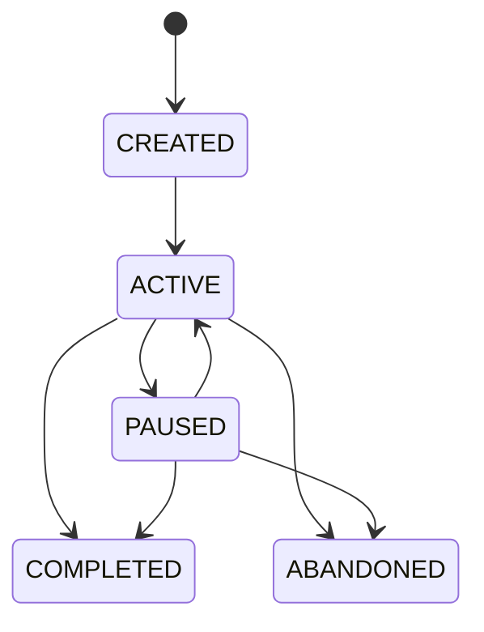
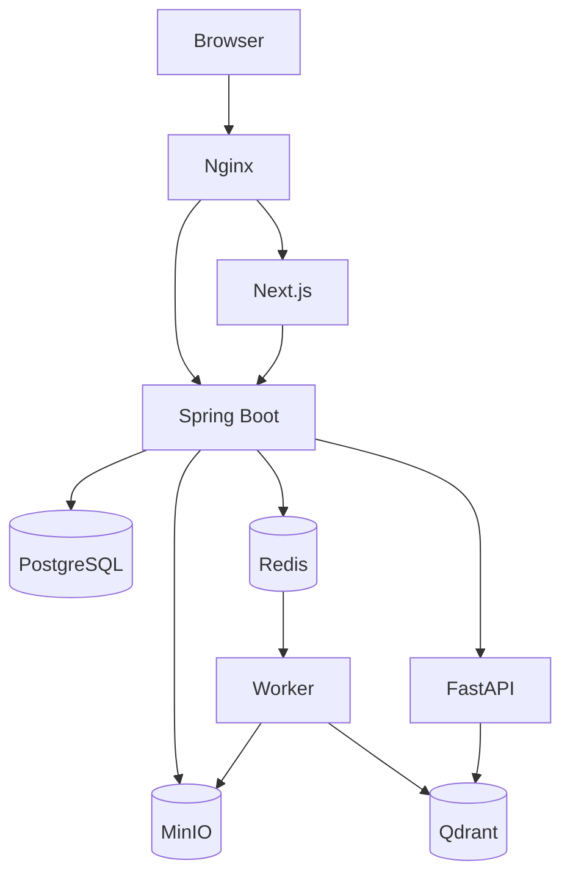
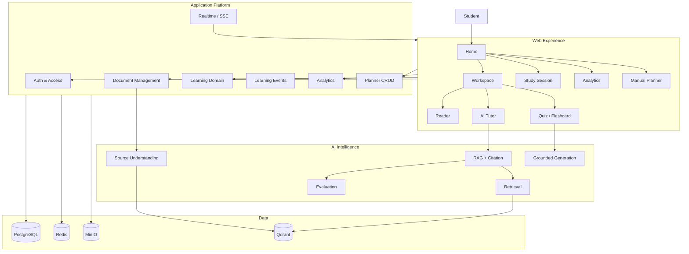

# FULL WEB SYSTEM DESIGN
# AI Study Assistant 2.0

> **Tên tài liệu:** Web Application & Platform System Design  
> **Vai trò:** Thiết kế chuyên sâu phần Web của đồ án AI Study Assistant 2.0  
> **Định hướng:** Web-first learning platform, AI-powered  
> **Mục tiêu:** Biến Source Understanding, RAG, learning-content generation và Learning Analytics thành một sản phẩm Web hoàn chỉnh, realtime, an toàn, có thể kiểm thử và triển khai.  
> **Scope:** Không có personalization UX, Recommendation Engine, Student Model, mastery/forgetting profile, automatic next-action hoặc adaptive study-plan generation.
>
> **Quan hệ với các tài liệu:**
>
> - `AI_Study_Assistant_2.0_Full_Graduation_Project_Idea.md` — source of truth cho product scope.
> - `AI_Study_Assistant_2.0_FULL_AI_SYSTEM_DESIGN.md` — source of truth cho AI/source/RAG/generation pipeline.
> - `UNIVERSAL_SOURCE_UNDERSTANDING_RAG_PARSER_DESIGN.md` — source of truth cho `Element → LogicalUnit → RetrievalUnit → Evidence → Citation`, source identity và provenance.

---

# 1. Tư tưởng thiết kế cốt lõi

Web không nên chỉ là:

```text
Login
→ Upload PDF
→ Chat
→ Logout
```

và cũng không nên tổ chức UI theo implementation details:

```text
Embedding
Vector DB
Reranker
```

Web phải bám vào learning workflow:

```text
ORGANIZE
   ↓
READ / ASK
   ↓
PRACTICE
   ↓
TRACK
   ↓
REFLECT
   ↓
PLAN
   ↓
CONTINUE
```

Kiến trúc trải nghiệm:

```text
Learning Sources
      ↓
Learning Workspace
      ↓
Reader / AI Tutor / Notes / Practice
      ↓
Learning Events
      ↓
Learning Analytics
      ↓
User-managed Study Plan
      ↓
Next Learning Session
```

Người dùng chủ động quyết định hành động học tiếp theo; Web không hiển thị recommendation cards hoặc AI-ranked next actions.

---

# 2. Vị trí Web trong toàn hệ thống

```text
┌─────────────────────────────────────────────┐
│              PRODUCT EXPERIENCE             │
│ Next.js                                     │
│ Workspace / Reader / Tutor / Quiz / Planner │
└────────────────────┬────────────────────────┘
                     ▼
┌─────────────────────────────────────────────┐
│             APPLICATION PLATFORM            │
│ Spring Boot                                 │
│ Auth / Business / Learning / Analytics      │
│ Documents / Planner / Admin / Realtime      │
└────────────────────┬────────────────────────┘
                     ▼
┌─────────────────────────────────────────────┐
│               AI INTELLIGENCE               │
│ Source Understanding / Retrieval / RAG      │
│ Grounded Generation / Evaluation            │
└─────────────────────────────────────────────┘
```

Web không gọi trực tiếp model provider.

```text
Browser
  ↓
Spring Boot
  ↓
FastAPI AI Service
```

Spring Boot là application/security boundary.

---

# 3. Mục tiêu riêng của Web System

## Product Engineering

- Information architecture.
- Multi-source learning workspace.
- Rich document reader.
- Grounded AI Tutor.
- Practice experience.
- Study-session lifecycle.
- Learning Analytics.
- Manual planner/calendar.
- Admin/debug experience.

## Frontend Engineering

- Next.js + TypeScript.
- Routing.
- Server/client boundaries.
- Server state.
- Local UI state.
- Forms.
- Streaming.
- SSE/realtime updates.
- File upload.
- Rich document interaction.
- Data visualization.
- Error recovery.
- Accessibility.
- Responsive design.

## Backend Web Engineering

- Spring Boot modular backend.
- REST API.
- Authentication / authorization.
- Transactions.
- Async jobs.
- Event handling.
- Cache.
- Notification.
- Analytics aggregation.
- Object storage integration.

## Production Quality

- Security.
- Testing.
- Performance.
- Deployment.
- Logging.
- Monitoring.
- Data isolation.

---

# 4. Web không chịu trách nhiệm cho những gì?

Web không:

```text
parse source structure
generate embeddings
rerank evidence
invent citations
calculate source provenance
infer user mastery
rank recommended actions
auto-generate personalized plan
```

Web chịu trách nhiệm:

```text
collect user intent
maintain interaction state
send valid requests
render structured outputs
show provenance/citation
capture learning interaction
render analytics
offer explicit user-controlled actions
handle loading/failure
```

---

# 5. Product Model — Learning Workspace

```text
LearningWorkspace
```

Ví dụ:

```text
Database Final Exam
Machine Learning Semester
IELTS Preparation
Software Engineering Course
```

Workspace gom:

```text
Sources
Conversations
Notes
Highlights
Quizzes
Flashcards
Study Sessions
Study Plan
Analytics
```

Nhưng source identity không bị merge:

```text
Workspace W1
 ├── Source S1
 ├── Source S2
 └── Source S3
```

Invariant:

```text
Workspace membership != Source identity
```

---

# 6. Source Scope

RAG request có explicit source scope:

```text
workspace_id = W1
selected_source_ids = [S1, S3]
```

Retrieval chỉ dùng các source được authorize và được chọn.

Không tự động kéo mọi source trong workspace vào context.

---

# 7. User Roles

MVP:

```text
STUDENT
ADMIN
```

## Student

- quản lý workspace/source;
- đọc source;
- hỏi AI;
- xem citation;
- note/highlight/bookmark;
- summary;
- quiz;
- flashcard;
- study session;
- analytics;
- manual study planner.

## Admin

- user management;
- document jobs;
- storage;
- AI usage;
- system health;
- errors;
- retrieval/source debug.

---

# 8. Information Architecture

```text
AI Study Assistant
│
├── Home
├── Workspaces
│   ├── Overview
│   ├── Sources
│   ├── Learn
│   ├── Practice
│   ├── Notes
│   └── Progress
├── Library
├── Practice
│   ├── Quizzes
│   └── Flashcards
├── Planner
├── Analytics
├── Notifications
├── Settings
└── Admin
```

Navigation theo user goal, không theo backend module.

---

# 9. Route Architecture

```text
/
├── login
├── register
└── app
    ├── home
    ├── workspaces
    │   └── [workspaceId]
    │       ├── overview
    │       ├── sources
    │       ├── learn
    │       ├── practice
    │       ├── notes
    │       └── progress
    ├── library
    ├── documents/[documentId]
    ├── quizzes/[quizId]
    ├── flashcards
    ├── planner
    ├── analytics
    ├── notifications
    ├── settings
    └── admin
```

Navigation state có ý nghĩa nên nằm trong URL khi phù hợp:

```text
/documents/{id}?page=87&tab=notes
```

---

# 10. Global Home

Home trả lời:

```text
1. Tôi đang học gì?
2. Tôi có task nào hôm nay?
3. Tiến độ gần đây thế nào?
4. Tôi vừa làm gì gần nhất?
```

Layout:

```text
┌────────────────────────────────────────────┐
│ Continue Learning                          │
├────────────────────────────────────────────┤
│ Today's Tasks         │ Recent Sources     │
├───────────────────────┼────────────────────┤
│ Quiz Performance      │ Weekly Progress    │
├───────────────────────┴────────────────────┤
│ Recent Activity                            │
└────────────────────────────────────────────┘
```

Không có Personalized Recommendations.

---

# 11. Continue Learning

Persist state tối thiểu:

```text
workspace_id
resource_id
resource_type
last_location optional
last_activity_type
last_interacted_at
```

Ví dụ:

```text
Continue Database Systems
Database Systems.pdf · page 87
Last opened yesterday
[Continue]
```

Đây là continuation state, không phải recommendation.

---

# 12. Workspace Overview

```text
Database Final Exam

Deadline: 12 days
Sources: 7
Study time this week: 4h 20m
Recent quiz: 7/10
Tasks today: 3
Recent source: Database Systems.pdf
```

Actions:

```text
Continue Learning
Start Study Session
Add Source
Practice
View Analytics
View Plan
```

---

# 13. Library

Views:

```text
All
Recent
Favorites
By Workspace
By Type
```

Filters:

```text
workspace
file_type
status
tag
created_at
```

Product metadata search và semantic knowledge search là hai feature/API khác nhau.

---

# 14. Document Status

Canonical application states:

```text
UPLOADED
QUEUED
PROCESSING
READY
FAILED
```

UI có thể hiển thị stage nếu backend report thực:

```text
UPLOADING
PARSING
STRUCTURING
INDEXING
READY
```

Không fake progress.

---

# 15. Upload UX

```text
Select / Drag-drop
      ↓
Local UX validation
      ↓
Upload
      ↓
Backend validation
      ↓
Stored
      ↓
Background processing
      ↓
READY / FAILED
```

Backend luôn validate lại file type/size/security.

---

# 16. Upload Progress vs Processing Progress

Tách:

```text
Browser → Storage/API upload progress
```

và:

```text
Parser → Structure → Index processing state
```

UI không suy đoán processing percentage nếu worker không report.

---

# 17. Realtime Processing

MVP ưu tiên SSE cho:

```text
document status
AI answer streaming
long-generation status
notifications
```

WebSocket chỉ cần sau này nếu có collaborative editing/presence.

---

# 18. Learning Workspace — màn hình trung tâm

Desktop:

```text
┌───────────────────────────────────────────────────────────┐
│ Workspace / Database Final Exam                          │
├────────────┬──────────────────────────┬───────────────────┤
│ Sources    │                          │ AI Tutor          │
│            │     Document Reader      │                   │
│ Book.pdf   │                          │ Question          │
│ Slide.pptx │                          │ Answer            │
│ Notes.docx │                          │ Citations         │
├────────────┴──────────────────────────┴───────────────────┤
│ Notes | Summary | Quiz | Flashcards | History            │
└───────────────────────────────────────────────────────────┘
```

Mục tiêu: read/ask/practice mà không phải chuyển qua nhiều page rời rạc.

---

# 19. LearningReader

Frontend abstraction:

```text
PDFRenderer
DocxRenderer
PptxRenderer
TextRenderer
```

Reader nhận:

```text
resource
location
anchors
annotations
```

Reader không tự hiểu/infer source structure.

---

# 20. Reader State

UI-local:

```text
zoom
scroll position
selected text
active citation
active highlight
side panel
```

Persist chỉ state hữu ích cho continuation:

```text
last_location
last_opened_at
```

---

# 21. SourceLocation / SourceAnchor

Location optional theo source capability.

Có thể có:

```text
page + bbox
char range
line range
source-only fallback
```

Frontend không giả định mọi citation đều có page.

Fallback:

```text
bbox → precise highlight
page → jump page
char range → select text
source-only → open source context
```

---

# 22. Citation Navigation

Citation chain:

```text
Answer Claim
 ↓
Evidence
 ↓
RetrievalUnit
 ↓
LogicalUnit / Element
 ↓
SourceAnchor
 ↓
Original Source
```

Click citation:

```text
resolve source
→ open correct reader
→ navigate anchor
→ temporary highlight if supported
```

Frontend không tính `chunk 15 = page 87`.

---

# 23. Citation UI

Ví dụ:

```text
LEFT JOIN giữ tất cả hàng từ bảng bên trái. [1]
```

Citation preview:

```text
Database Systems.pdf
Page 87 (nếu có)
"...LEFT JOIN returns..."
[Open source]
```

Nếu page không tồn tại trong provenance, không render page giả.

---

# 24. Source Selection UI

```text
Sources
☑ Database Systems.pdf
☑ Lecture 5.pptx
☐ My Notes.docx
```

Request phải gửi:

```text
selected_source_ids
```

Backend verify ownership trước AI request.

---

# 25. Selection Actions

Khi select text:

```text
[Ask AI]
[Explain]
[Highlight]
[Add Note]
[Create Flashcard]
[Practice]
```

Request giữ source anchor nếu available.

`selected_text` không thay SourceAnchor làm provenance.

---

# 26. AI Tutor

Modes có thể gồm:

```text
ASK
EXPLAIN
COMPARE
SUMMARIZE_SELECTION
PRACTICE_SELECTION
```

Backend contract nên dựa trên intent schema, không tạo endpoint riêng cho từng button nếu cùng pipeline.

---

# 27. RAG Interaction State

```text
IDLE
SUBMITTING
RETRIEVING
GENERATING
DONE
INSUFFICIENT_CONTEXT
FAILED
```

Chỉ render stage backend thật sự emit.

---

# 28. AI Answer Streaming

```text
Question
→ request accepted
→ retrieval
→ generation stream
→ final answer metadata
→ citations finalized
```

Invariant:

```text
partial text != final validated citation metadata
```

---

# 29. Streaming Event Contract

Ví dụ:

```text
rag.started
rag.retrieval_completed
rag.delta
rag.completed
rag.failed
```

`rag.completed` chứa structured final response.

Không parse citation từ free-text token stream.

---

# 30. Insufficient Context UX

Nếu AI trả:

```text
INSUFFICIENT_CONTEXT
```

UI hiển thị:

```text
Không tìm thấy đủ bằng chứng trong các nguồn đang chọn.
```

Actions:

```text
[Select more sources]
[Rephrase question]
```

Không biến abstention thành generic system error.

---

# 31. Conversation

```text
Workspace
 └── Conversation
      └── Messages
```

User có thể:

- create;
- rename;
- archive/delete;
- search history.

Mỗi AI message phải trace được source scope.

---

# 32. Conversation Memory UX

Frontend hiển thị history nhưng không khiến user hiểu rằng mọi workspace cùng dùng một context.

AI có thể dùng:

```text
recent messages
conversation summary
relevant historical turns
```

nhưng RAG source scope vẫn explicit.

---

# 33. Notes

```text
Note
- id
- user_id
- workspace_id
- title optional
- content
- source_id optional
- source_anchor optional
- created_at
- updated_at
```

Không cần xây Notion clone.

AI actions optional:

```text
summarize note
generate quiz
generate flashcards
```

---

# 34. Highlight / Bookmark

Highlight:

```text
source_id
source_anchor
selected_text snapshot
color
note optional
```

Bookmark dùng generic resource reference:

```text
resource_type
resource_id
source_anchor optional
```

---

# 35. Summary Experience

Modes:

```text
QUICK
STANDARD
DETAILED
```

UI thể hiện:

```text
source scope
generation status
created_at
source references
```

Long summary dùng background job.

---

# 36. Quiz Generation UX

```text
Select source/topic
→ configure
→ generate
→ server validation
→ ready
→ attempt
```

Config:

```text
question_count
difficulty
question_types
source scope
topic scope optional
```

---

# 37. Quiz Attempt / Submission

Frontend quản lý draft answer state.

Server là source of truth cho grading.

Submit flow:

```text
answers
→ validate
→ grade
→ persist attempt
→ emit learning event
→ refresh analytics
→ show result/review
```

Không trigger Recommendation Engine sau submit.

---

# 38. Quiz Review

Mỗi câu có:

```text
Your answer
Correct answer
Explanation
Difficulty
Topic optional
Source citation
```

Click citation quay về SourceAnchor.

---

# 39. Flashcard Experience

Views:

```text
New
All
By Topic
By Workspace
Due (nếu có scheduler)
```

Review:

```text
Front
→ Reveal
→ Again / Hard / Good / Easy
```

Nếu có spaced-repetition scheduler, backend quyết định `next_review_at`; đây chỉ là resource scheduler, không phải global recommendation system.

---

# 40. Study Session

Start:

```text
Goal
Duration
Workspace
Optional source/topic
```

StudySession là explicit user action.

Focus mode giảm navigation noise và cung cấp:

```text
Reader
Ask AI
Notes
Flashcards
Quiz
End session
```

---

# 41. Study Time

Không:

```text
study_time = tab_open_time
```

Kết hợp:

```text
start
pause/resume
visibility
heartbeat
manual end
inactivity rule
```

---

# 42. StudySession State Machine



---

# 43. Study Session Summary

Ví dụ:

```text
Study Complete
Active study time: 43 min
Documents viewed: 2
Questions asked: 4
Flashcards reviewed: 12
Quiz score: 8/10
```

Sau đó user có thể:

```text
[Create follow-up task]
[Back to workspace]
```

Hệ thống không tự sinh “next recommended action”.

---

# 44. Learning Events

Semantic events ví dụ:

```text
DOCUMENT_OPEN
DOCUMENT_READ
CHAT_QUESTION
SUMMARY_VIEW
QUIZ_START
QUIZ_SUBMIT
QUESTION_ANSWER
FLASHCARD_REVIEW
NOTE_CREATE
BOOKMARK_CREATE
HIGHLIGHT_CREATE
PLAN_TASK_COMPLETE
```

Không gửi mọi UI click/mousemove thành LearningEvent.

---

# 45. UI Telemetry vs Learning Event

```text
button_clicked
```

có thể là telemetry.

```text
QUIZ_SUBMIT
```

là learning event.

Analytics dùng semantic application data, không dựa trực tiếp vào raw click stream.

---

# 46. Learning Analytics IA

```text
OVERVIEW
CONSISTENCY
PERFORMANCE
TOPICS
ACTIVITY
```

Analytics mô tả/chẩn đoán; không tạo prescriptive recommendations.

---

# 47. Overview Analytics

Cards:

```text
Study time
Quiz accuracy
Current streak
Sessions this week
Tasks completed
Recent activity
```

Không có personalized next-action card.

---

# 48. Consistency Analytics

```text
study time trend
daily heatmap
session count
streak
weekly goal
```

Không kết luận “học hiệu quả” chỉ từ duration.

---

# 49. Performance Analytics

```text
quiz score trend
accuracy
accuracy by difficulty
response time
flashcard review stats
```

Mỗi metric cần tooltip/definition rõ.

---

# 50. Topic Performance

Thay vì Student Model/mastery, UI hiển thị dữ liệu quan sát trực tiếp:

```text
LEFT JOIN
Attempts: 10
Correct: 4
Accuracy: 40%
Last practiced: 5 days ago
Recent quiz: 2/6
```

Nếu số sample ít, phải hiển thị số attempts; không gọi accuracy là “mastery” hoặc “confidence”.

---

# 51. Learning Timeline

Có thể tổng hợp:

```text
study sessions
document reads
chat questions
quiz attempts
flashcard reviews
completed tasks
notes/highlights
```

Timeline là history, không phải recommendation feed.

---

# 52. Mindmap / Concept Graph

Input từ AI/source layer:

```text
document structure
validated topic hierarchy/relations optional
```

Frontend render graph để navigation/exploration.

Không cần full Knowledge Graph backend cho MVP.

---

# 53. Manual Planner

Views:

```text
Today
Week
Calendar
Plan Overview
```

Task:

```text
title
topic optional
resource optional
scheduled_at
estimated_minutes optional
status
```

User chủ động create/edit/reschedule.

---

# 54. Planner Interaction

Actions:

```text
create
start
complete
skip
reschedule
open resource
```

Status:

```text
TODO
IN_PROGRESS
COMPLETED
SKIPPED
```

Không có:

```text
automatic priority ranking
AI-created personalized tasks
adaptive replanning
silent schedule rewrite
```

---

# 55. Drag & Drop Calendar

Frontend:

```text
optimistic visual move
```

Backend:

```text
validate ownership
validate state
persist
```

Nếu reject:

```text
rollback UI
show contextual error
```

---

# 56. Notifications

Phù hợp:

```text
DOCUMENT_READY
DOCUMENT_FAILED
TASK_DUE
TASK_MISSED
FLASHCARD_REVIEW_DUE optional
SYSTEM
```

Notification được tạo từ explicit state/deadline, không từ Recommendation Engine.

---

# 57. Notification Preferences

```text
document processing
study task reminder
flashcard review reminder optional
system notice
```

MVP chỉ cần in-app.

---

# 58. Admin Dashboard

Views:

```text
Users
Documents
Processing Jobs
AI Usage
Storage
System Health
Errors
```

Admin không cần access raw private content nếu không có lý do operational rõ.

---

# 59. Retrieval Debug UI

Input:

```text
query
source scope
```

Output:

```text
Top-K RetrievalUnits
retrieval scores
rerank scores
selected evidence
answer
citations
```

Đây là feature rất có giá trị khi demo/defense.

---

# 60. Source Understanding Debug UI

```text
Original Source
    ↓
Elements
    ↓
LogicalUnits
    ↓
Context / Relations
    ↓
RetrievalUnits
    ↓
SourceAnchors
```

Mục tiêu:

```text
traceability
evaluation
debugging
```

Chỉ dành cho admin/debug role.

---

# 61. Frontend Architecture

Feature-first:

```text
frontend/
├── src/app/
├── src/features/
│   ├── auth/
│   ├── workspace/
│   ├── library/
│   ├── documents/
│   ├── reader/
│   ├── tutor/
│   ├── notes/
│   ├── quiz/
│   ├── flashcards/
│   ├── study-session/
│   ├── planner/
│   ├── analytics/
│   ├── notifications/
│   └── admin/
├── src/components/
├── src/lib/
├── src/hooks/
├── src/types/
└── src/styles/
```

Không có `recommendation/` hoặc `personalization/` feature.

---

# 62. Feature Boundary

Domain component ở đúng feature.

Ví dụ:

```text
features/quiz/
├── api/
├── components/
├── hooks/
├── schemas/
└── types/
```

Primitive reusable mới để trong `components/ui`.

---

# 63. Server State

Server state:

```text
workspaces
documents
conversations
quiz attempts
flashcard reviews
study plans
analytics
notifications
```

Không copy toàn bộ response vào giant client store.

---

# 64. Client State

```text
sidebar
modal
active tab
reader zoom
selection
draft input
panel sizes
```

Local/store nhỏ là đủ.

---

# 65. URL State

State có ý nghĩa navigation/share:

```text
workspace
document
page/location
tab
filter
search query
```

nên nằm trong route/query parameter khi phù hợp.

---

# 66. Form Validation

Hai tầng:

```text
Client validation
+
Server validation
```

Server vẫn là security/business source of truth.

---

# 67. Optimistic UI

Phù hợp:

```text
favorite
rename
mark task complete
calendar move
```

Không phù hợp:

```text
quiz final score
AI answer
document READY
```

---

# 68. Loading / Error UX

Loading patterns:

```text
skeleton
inline progress
button pending
streaming text
background toast
```

Error types:

```text
validation
permission
not found
network
processing failure
AI unavailable
insufficient context
conflict
rate limited
```

Không map tất cả thành “Something went wrong”.

---

# 69. API Error Contract

```json
{
  "code": "DOCUMENT_NOT_READY",
  "message": "Document is still processing.",
  "request_id": "...",
  "details": {}
}
```

Frontend map code → UX; không parse business state từ free-text message.

---

# 70. Backend Web Architecture

```text
com.studyassistant
├── auth
├── user
├── workspace
├── document
├── library
├── conversation
├── note
├── quiz
├── flashcard
├── learning
├── analytics
├── planner
├── notification
├── admin
├── integration/ai
└── infrastructure
```

Không có recommendation module.

---

# 71. API Base

```text
/api/v1
```

Resource-oriented.

Đúng:

```text
GET /analytics/overview
GET /study-tasks
GET /documents
```

Không tạo endpoint theo tên card/component UI.

---

# 72. Workspace API

```text
POST   /workspaces
GET    /workspaces
GET    /workspaces/{id}
PATCH  /workspaces/{id}
DELETE /workspaces/{id}

POST   /workspaces/{id}/sources
DELETE /workspaces/{id}/sources/{sourceId}
GET    /workspaces/{id}/overview
```

---

# 73. Reader State API

```text
GET /documents/{id}/reading-state
PUT /documents/{id}/reading-state
```

Persist:

```text
last_location
last_opened_at
```

Không save scroll event liên tục.

---

# 74. Notes / Highlights / Bookmarks API

```text
POST/GET/PATCH/DELETE /notes
POST/GET/DELETE       /highlights
POST/GET/DELETE       /bookmarks
```

Object-level ownership validation bắt buộc.

---

# 75. Study Session API

```text
POST /study-sessions
POST /study-sessions/{id}/start
POST /study-sessions/{id}/pause
POST /study-sessions/{id}/resume
POST /study-sessions/{id}/complete
GET  /study-sessions/{id}
```

Heartbeat nếu cần:

```text
POST /study-sessions/{id}/heartbeat
```

---

# 76. Analytics API

```text
GET /analytics/overview
GET /analytics/study-time
GET /analytics/quiz-performance
GET /analytics/topic-performance
GET /analytics/activity
```

Không có mastery/recommendation endpoint.

---

# 77. Planner API

```text
POST   /study-plans
GET    /study-plans
GET    /study-plans/{id}
PATCH  /study-plans/{id}
DELETE /study-plans/{id}

POST   /study-plans/{id}/tasks
PATCH  /study-tasks/{id}
DELETE /study-tasks/{id}
```

Planner API là CRUD/state API, không gọi AI để rank/generate plan.

---

# 78. Event Stream API

```text
GET /events/stream
```

Events:

```text
document.status
generation.status
notification.created
```

RAG stream có endpoint/lifecycle riêng nếu thuận tiện.

---

# 79. Pagination / Filtering

Dataset lớn phải filter server-side.

```text
GET /documents?workspaceId=...&status=READY&type=PDF&page=0&size=20
```

Không tải toàn bộ rồi filter trong browser.

---

# 80. Idempotency / Background Jobs

Cần quan tâm cho:

```text
document processing
reprocessing
long generation
quiz generation
```

Long task pattern:

```text
POST
→ 202 Accepted
→ background job
→ status/event
```

---

# 81. Event-driven Integration

Ví dụ events:

```text
DocumentReady
QuizSubmitted
FlashcardReviewed
StudyTaskCompleted
```

Có thể trigger:

```text
analytics update
notification
operational event
```

Không trigger recommendation refresh.

---

# 82. Database Web Extensions

```text
workspaces
workspace_sources
notes
highlights
bookmarks
document_reading_states
study_sessions
study_plans
study_tasks
notifications
notification_preferences
jobs optional
```

Không có recommendation tables hoặc personalization profile.

---

# 83. Cache Strategy

Redis:

```text
session
rate limit
dashboard aggregates
analytics summaries
temporary job state
```

Frontend server-state cache:

```text
workspaces
documents
analytics
study tasks
```

Cache key luôn giữ user/source scope.

---

# 84. Authentication / Authorization

Backend là real security boundary.

Mọi resource phải validate object-level access:

```text
document
workspace
note
quiz
plan
conversation
```

Frontend hide/disable chỉ là UX.

---

# 85. Cross-user Isolation

Invariant:

```text
User A cannot retrieve/read User B sources
```

Enforce xuyên suốt:

```text
Browser
↓
Spring ownership validation
↓
AI request source scope
↓
Vector DB filter
```

---

# 86. Upload Security

Backend:

```text
size limit
MIME validation
extension validation
safe filename
system-generated object key
no execution
```

Optional malware scan.

---

# 87. XSS / Untrusted Content

Hệ thống render:

```text
document text
AI output
notes
markdown
```

Không render raw untrusted HTML.

Markdown/rich text phải sanitize/schema-control.

---

# 88. Prompt Injection

Source text không được trigger instruction/tool action.

```text
Ignore previous instructions...
```

chỉ là document content.

Frontend không tự execute tool/action từ source text.

---

# 89. CSRF / CORS / Token Security

Nếu cookie-based auth:

```text
Secure
HttpOnly
SameSite
CSRF strategy
```

CORS dùng explicit allowed origins.

Không coi localStorage là mặc định an toàn cho refresh token.

---

# 90. Rate Limiting

Policy riêng cho:

```text
login
upload
AI chat
generation
password reset
```

AI endpoints đắt hơn CRUD.

---

# 91. AI Integration Contract

```text
Web Request
→ Spring Application Command
→ AI Client Interface
→ FastAPI
```

Frontend không phụ thuộc trực tiếp model/provider.

---

# 92. RAG Request Contract

```json
{
  "conversation_id": "...",
  "query": "...",
  "workspace_id": "...",
  "selected_source_ids": ["..."],
  "mode": "GROUNDED_ONLY"
}
```

Spring resolve:

```text
user_id
permissions
authorized source scope
```

trước khi gọi AI.

---

# 93. RAG Response Contract

```json
{
  "message_id": "...",
  "answer": "...",
  "confidence": "HIGH",
  "citations": [
    {
      "source_id": "...",
      "source_name": "...",
      "source_anchor": {},
      "preview_text": "..."
    }
  ],
  "status": "ANSWERED",
  "retrieval_trace_id": "..."
}
```

Citation metadata từ provenance system, không từ frontend guess.

---

# 94. Learning Analytics Contract

Frontend đọc structured aggregates:

```text
study_time
session_count
quiz_attempts
quiz_accuracy
topic_attempts
topic_accuracy
activity timeline
completed_tasks
```

Frontend không tự infer mastery, forgetting risk hoặc recommended actions.

---

# 95. Planner Contract

Structured user-managed tasks:

```json
{
  "plan_id": "...",
  "tasks": [
    {
      "id": "...",
      "title": "Review LEFT JOIN",
      "scheduled_at": "2026-08-10T19:00:00+07:00",
      "estimated_minutes": 30,
      "status": "TODO"
    }
  ]
}
```

Không có AI priority/reason codes.

---

# 96. Responsive Design

Desktop primary cho document-heavy workflow.

Desktop:

```text
source panel + reader + tutor
```

Tablet:

```text
reader + collapsible panel
```

Mobile:

```text
single primary content + tabs/bottom sheet
```

Không scale ba cột xuống màn hình nhỏ.

---

# 97. Accessibility

MVP:

- keyboard navigation;
- visible focus;
- semantic labels;
- accessible forms/errors;
- dialogs;
- contrast;
- screen-reader text.

Citation phải usable không phụ thuộc hover.

---

# 98. Performance

Phân nhóm:

```text
initial load
navigation
API latency
reader rendering
AI TTFT
generation completion
upload
background processing
charts
```

Không load PDF/graph/editor engines trên mọi page.

---

# 99. Reader Performance

Source lớn:

```text
render visible pages
prefetch nearby pages
cleanup overlays
lazy load heavy renderer
```

Không render toàn PDF khi mở.

---

# 100. Observability

Web/API request:

```text
request_id
route
status
latency
user id/redacted identity
```

AI:

```text
trace_id
conversation_id
retrieval_trace_id
model metadata
```

Không log secret/token/private source content tùy tiện.

---

# 101. Correlation ID

```text
Browser
→ Spring request_id
→ FastAPI trace_id
→ worker/job id
```

Correlation giúp demo/debug production flow.

---

# 102. Web Metrics

```text
page/navigation latency
API p95
upload success
READY rate
stream disconnect/reconnect
error rate
quiz completion
planner task completion
citation navigation success
```

AI quality metrics tách riêng.

---

# 103. Frontend Unit Tests

Ưu tiên business UX behavior:

```text
citation opens correct source
quiz selection/submission
planner drag rollback
document status rendering
insufficient-context UX
```

Không cần snapshot mọi primitive.

---

# 104. Backend Unit Tests

```text
ownership
workspace membership
study-session transitions
planner task transitions
document states
quiz grading
analytics aggregation
```

Không có recommendation-action tests.

---

# 105. Integration Tests

```text
Spring + PostgreSQL
Spring + MinIO
Spring + Redis
Spring ↔ FastAPI contract
SSE events
```

AI model thật có thể stub cho Web integration tests.

---

# 106. E2E Critical Journey

```text
Register/Login
→ Create workspace
→ Upload source
→ Wait READY
→ Open reader
→ Ask grounded question
→ Open citation
→ Generate quiz
→ Submit
→ View analytics
→ Create/reschedule study task
→ Resume learning
```

Không có recommendation step.

---

# 107. Failure E2E

Test:

```text
invalid upload
processing FAILED
AI insufficient context
AI timeout
unauthorized source
network reconnect
quiz double-submit
planner conflict
```

---

# 108. Security Tests

```text
User A cannot access User B document
User A cannot use User B source in RAG scope
User cannot edit another user's plan
invalid upload rejected
XSS sanitized
rate limit works
```

---

# 109. Usability Evaluation

Task-based evaluation với sinh viên:

```text
upload material
find source
ask question
open citation
generate quiz
view analytics
create/reschedule task
resume source
```

Measure:

```text
task completion
time on task
error count
usefulness
citation trust
navigation clarity
```

---

# 110. UX Invariants

```text
user luôn biết workspace/source scope
citation quay được về source nếu anchor resolvable
processing state không bị giả
AI abstention không bị render thành generic error
analytics chỉ trình bày metric được tính thật
planner chỉ thay đổi từ explicit user action/system state rule
```

---

# 111. Data Integrity Invariants

```text
workspace membership valid
no cross-user references
note/highlight anchors reference authorized source
quiz attempt belongs to user/quiz
learning event resource reference valid
study task belongs to user's plan
```

---

# 112. Anti-pattern — Web chỉ là CRUD dashboard

Không dừng ở:

```text
CRUD Documents
Chat
Charts
```

Phải có integrated workflow:

```text
Reader
Citation
Practice
Study Session
Analytics
Planner
```

---

# 113. Anti-pattern — Frontend biết quá nhiều AI

Frontend không biết/điều khiển trực tiếp:

```text
embedding model
top_k
rerank threshold
chunk format
```

Admin debug UI là ngoại lệ có chủ đích.

---

# 114. Anti-pattern — Fake Citation

Không chỉ render string:

```text
Page 87
```

Citation cần:

```text
source_id
SourceAnchor
preview metadata
```

---

# 115. Anti-pattern — Fake Realtime

Không dùng timer giả 73% nếu backend chỉ biết `PROCESSING`.

Correctness quan trọng hơn animation đẹp.

---

# 116. Anti-pattern — Over-engineering

Không cần ngay:

```text
microfrontend
GraphQL federation
Kafka cluster
CRDT
multi-region
full offline sync
```

---

# 117. Repository Structure

```text
support_learning/
├── frontend/
├── backend/
├── ai-service/
├── source_understanding/
├── infra/
├── docs/
├── scripts/
└── docker-compose.yml
```

---

# 118. Backend Repository Detail

```text
backend/
└── src/main/java/.../
    ├── auth/
    ├── user/
    ├── workspace/
    ├── document/
    ├── conversation/
    ├── note/
    ├── quiz/
    ├── flashcard/
    ├── learning/
    ├── analytics/
    ├── planner/
    ├── notification/
    ├── admin/
    └── infrastructure/
```

Không có recommendation package.

---

# 119. Deployment Architecture



---

# 120. Graceful Degradation

Nếu AI down, Web vẫn cho phép:

```text
login
open existing source
view notes
view saved quizzes
view analytics
manage planner
```

AI actions hiển thị temporarily unavailable.

---

# 121. Versioning

Track:

```text
frontend release
backend release
api version
source schema/parser version
retrieval version
prompt/model version
```

Không có personalization/recommendation version.

---

# 122. Development Phases

```text
Phase A — Platform Shell
Phase B — Source & Reader
Phase C — Grounded RAG
Phase D — Practice
Phase E — Tracking & Analytics
Phase F — Manual Planner + Admin
Phase G — Production Quality
```

---

# 123. Phase A — Platform Shell

```text
Authentication
App layout
Navigation
Workspace basic CRUD
API client
Error handling
```

---

# 124. Phase B — Source & Reader

```text
Library
Upload
MinIO
Processing state
Realtime updates
Reader
Reading state
Citation navigation foundation
```

---

# 125. Phase C — Grounded RAG

```text
AI Tutor
Source selection
RAG request
Streaming
Citation UI/navigation
Insufficient-context UX
```

---

# 126. Phase D — Practice

```text
Summary
Quiz generation
Quiz attempt/review
Flashcards
```

---

# 127. Phase E — Tracking & Analytics

```text
StudySession
LearningEvent
Notes
Highlights
Bookmarks
Analytics overview
Topic performance
Learning timeline
```

---

# 128. Phase F — Planner + Admin

```text
Manual StudyPlan CRUD
StudyTask lifecycle
Calendar
Notifications
Admin dashboard
Retrieval debug UI
Source-understanding debug UI
```

Không có personalization phase.

---

# 129. Phase G — Production Quality

```text
security hardening
E2E
performance
observability
deployment
usability testing
```

---

# 130. P0 — Web MVP

```text
Authentication
Workspace
Library
Upload
Processing status
Document Reader
AI Tutor
Source selection
Streaming answer
Citation navigation
Summary
Quiz
Flashcard
Study Session
Learning Events
Analytics overview
Topic performance
Manual Planner
Admin basic
Responsive core flows
Security
E2E
Docker deployment
```

---

# 131. P1

```text
SSE unified events
Rich notes/highlights
Mindmap
Notification center
Calendar drag/drop
Command palette
PWA shell
Advanced admin/debug UI
Outbox/reliability
Spaced repetition optional
```

---

# 132. P2

```text
Collaboration
Shared workspace
WebSocket presence
Full offline sync
Voice
Social learning
Gamification nâng cao
```

---

# 133. MVP Definition of Done

Student làm được:

```text
1. Register/Login
2. Create/Open Workspace
3. Upload PDF/DOCX/PPTX
4. See real processing status
5. Open source in Reader
6. Ask AI using selected sources
7. Receive grounded answer
8. Open citation back to source
9. Create note/highlight
10. Generate quiz
11. Complete/review quiz
12. Review flashcards
13. Run Study Session
14. View analytics
15. View topic attempts/accuracy
16. Create/manage study tasks
17. Resume learning later
18. Data remains isolated per user
```

---

# 134. Learning Loop Acceptance

```text
Practice
 ↓
Attempt Data
 ↓
Learning Event
 ↓
Analytics Aggregate
 ↓
Progress UI
```

Planner là user-driven branch:

```text
User creates/edits task
→ Planner state
→ Reminder/Completion
```

Không có `Analytics → Recommendation → Planner` automation.

---

# 135. Demo Scenario — Web-first

## Step 1 — Login / Workspace

Open `Database Final Exam`.

## Step 2 — Upload + Realtime

Upload source, observe:

```text
UPLOADED → PROCESSING → READY
```

## Step 3 — Reader + AI

Open source, select LEFT JOIN, ask Explain.

## Step 4 — Citation

Click citation and jump to SourceAnchor.

## Step 5 — Multi-source Control

Select Book + Lecture, exclude Personal Notes, ask comparison.

## Step 6 — Practice

Generate and submit JOIN quiz.

## Step 7 — Analytics

View:

```text
quiz score
JOIN attempts
JOIN accuracy
study activity
```

## Step 8 — Planner

User creates:

```text
Review LEFT JOIN
Wednesday 20:00
30 min
```

Then drag/reschedule and persist.

## Step 9 — Study Session

Run 20-minute session and observe timeline update.

## Step 10 — Admin / Debug

Open retrieval trace/source graph.

---

# 136. “Có phải chỉ là chatbot PDF?”

Không.

```text
Sources
→ Reader/Tutor
→ Grounded Citation
→ Practice
→ Learning Events
→ Analytics
→ User-managed Planner
```

Chat chỉ là một interaction.

---

# 137. “Điểm Web nằm ở đâu?”

```text
1. Multi-source workspace
2. Interactive reader
3. Citation deep-linking
4. Streaming/realtime UX
5. Practice workflows
6. Study-session lifecycle
7. Analytics visualization
8. Planner/calendar interaction
9. Auth/object authorization
10. Async jobs
11. State management
12. Error recovery
13. Responsive/accessibility
14. Admin/debug tooling
15. Deployment/observability
```

---

# 138. “Vì sao bỏ personalization/recommendation?”

Vì subsystem đó yêu cầu thêm:

```text
Student Model
mastery calibration
forgetting model
ranking policy
recommendation lifecycle
adaptive planner
separate evaluation dataset
```

Đây là scope lớn nhưng không cần thiết để chứng minh Web Engineering, RAG correctness hoặc Learning Analytics. Phiên bản hiện tại giữ user control: analytics cung cấp dữ liệu minh bạch, còn người dùng tự quyết định task/plan.

---

# 139. Quan hệ với FULL AI SYSTEM DESIGN

```text
WEB EXPERIENCE
     │ user intent + source scope
     ▼
APPLICATION BACKEND
     │ authorized structured request
     ▼
AI SYSTEM
     │ evidence / answer / generated content / citation
     ▼
APPLICATION BACKEND
     │ persist events / analytics
     ▼
WEB EXPERIENCE
```

AI không quản lý planner hoặc user learning policy.

---

# 140. Quan hệ với Universal Source Understanding

```text
Source Understanding:
Source → Element → LogicalUnit → RetrievalUnit → Evidence → Citation

Web:
Library → Reader → Source Selection → AI Interaction → Citation Navigation
```

Điểm nối:

```text
source_id
RetrievalUnit/Evidence IDs
SourceAnchor
citation metadata
```

---

# 141. Final Architecture



---

# 142. Core Web Loop

```text
Learning Home
    ↓
Workspace
    ↓
Reader / AI Tutor / Practice
    ↓
Learning Events
    ↓
Analytics
    ↓
User Reflection
    ↓
Manual Planner / Continue Learning
```

Không có hidden algorithm tự chuyển analytics thành hành động bắt buộc hoặc recommendation.

---

# 143. Nguyên tắc cuối cùng

Mỗi Web feature nên cải thiện ít nhất một trong:

```text
1. Learning continuity
2. User control
3. Source traceability
4. Practice usability
5. System observability
6. Security/correctness
```

Nếu feature chỉ tăng complexity nhưng không cải thiện các điểm trên, không ưu tiên.

---

# 144. Một câu mô tả phần Web dùng trong báo cáo

> **Web System của AI Study Assistant 2.0 được thiết kế như một Learning Workspace nơi người học tổ chức nhiều nguồn học tập, đọc và tương tác trực tiếp với tài liệu, hỏi AI có citation, thực hành bằng quiz/flashcard, ghi nhận study session, xem Learning Analytics và tự quản lý kế hoạch học. Web là Product Experience Layer kết nối Spring Boot Application Platform với Source Understanding/RAG AI, đồng thời đảm bảo realtime interaction, provenance navigation, user control, state consistency, security, testing và khả năng triển khai thực tế. Hệ thống không triển khai personalization hoặc Recommendation Engine.**

---

# 145. Kết luận

Thiết kế cuối:

```text
                   PRODUCT EXPERIENCE
                          │
                          ▼
               ┌───────────────────┐
               │   Learning Web    │
               └─────────┬─────────┘
                         │
                  User Interaction
                         ▼
               ┌───────────────────┐
               │ Application Layer │
               └─────────┬─────────┘
                         │
          ┌──────────────┼──────────────┐
          ▼              ▼              ▼
    Source System     AI/RAG       Learning Data
          │              │              │
          └──────────────┼──────────────┘
                         ▼
                     Analytics
                         │
                         ▼
                 User-controlled Action
```

Giá trị cốt lõi của Web:

> **Source-grounded learning experience → measurable learning interaction → transparent analytics → user-controlled planning.**

Đây là một đồ án Web Engineering có AI đủ sâu ở Source Understanding/RAG, nhưng không phải gánh thêm một personalization/recommendation subsystem độc lập.
