# ĐỒ ÁN TỐT NGHIỆP  
# Personalized AI Learning Platform using LLM, RAG and Learning Analytics

> **Tên tiếng Việt đề xuất:** Nền tảng học tập cá nhân hóa ứng dụng Mô hình Ngôn ngữ Lớn, Retrieval-Augmented Generation và Learning Analytics  
> **Tên ngắn:** AI Study Assistant 2.0  
> **Loại đề tài:** Hệ thống phần mềm tích hợp AI / Web / Data Analytics  
> **Định hướng:** Xây dựng một nền tảng học tập thông minh, không chỉ là chatbot hỏi đáp tài liệu mà là một hệ thống khép kín từ **quản lý tri thức → học tập → đánh giá → mô hình hóa năng lực → cá nhân hóa → gợi ý học tiếp**.

---

# 1. Tóm tắt đề tài

AI Study Assistant 2.0 là nền tảng học tập cá nhân hóa cho phép người dùng:

- Quản lý tài liệu học tập.
- Tự động trích xuất và cấu trúc hóa nội dung tài liệu.
- Hỏi đáp dựa trên chính tài liệu bằng RAG.
- Tạo tóm tắt, quiz, flashcard và mindmap.
- Theo dõi quá trình học.
- Phân tích điểm mạnh, điểm yếu theo từng chủ đề.
- Ước lượng mức độ thành thạo kiến thức.
- Phát hiện kiến thức có nguy cơ quên.
- Đề xuất nội dung cần ôn.
- Sinh kế hoạch học cá nhân hóa.
- Theo dõi tiến độ qua dashboard.
- Hỗ trợ gamification để tăng động lực học tập.

Điểm khác biệt chính của hệ thống là AI không chỉ sinh nội dung mà còn sử dụng **dữ liệu học tập của từng người dùng** để đưa ra các khuyến nghị cá nhân hóa.

---

# 2. Bối cảnh và vấn đề

Các công cụ AI hiện nay hỗ trợ tốt việc:

- Hỏi đáp.
- Tóm tắt tài liệu.
- Sinh nội dung.
- Sinh câu hỏi.

Tuy nhiên, phần lớn các hệ thống đơn giản vẫn có các hạn chế:

1. Không quản lý được toàn bộ nguồn tài liệu của người học.
2. Không đảm bảo câu trả lời bám sát tài liệu.
3. Không lưu lại lịch sử học dưới dạng dữ liệu có cấu trúc.
4. Không biết người học đang mạnh/yếu ở chủ đề nào.
5. Không biết kiến thức nào sắp bị quên.
6. Không tự điều chỉnh kế hoạch học theo kết quả thực tế.
7. Các tính năng chat, quiz, flashcard, planner thường hoạt động tách rời.

Đề tài giải quyết vấn đề trên bằng cách xây dựng một vòng lặp:

```text
Knowledge
   ↓
Learning Interaction
   ↓
Learning Data
   ↓
Student Model
   ↓
Personalized Recommendation
   ↓
Next Learning Activity
```

---

# 3. Mục tiêu của đề tài

## 3.1. Mục tiêu tổng quát

Xây dựng một nền tảng học tập cá nhân hóa có khả năng:

- Quản lý tri thức học tập.
- Hiểu và truy xuất nội dung tài liệu.
- Sinh nội dung hỗ trợ học tập.
- Theo dõi hành vi học.
- Đánh giá mức độ hiểu bài.
- Phát hiện lỗ hổng kiến thức.
- Đề xuất nội dung học phù hợp.
- Hỗ trợ lập kế hoạch học.

## 3.2. Mục tiêu kỹ thuật

Hệ thống cần chứng minh được năng lực ở các nhóm sau:

### Software Engineering

- Kiến trúc phân tầng.
- Tách Backend nghiệp vụ và AI Service.
- REST API.
- Authentication / Authorization.
- Database design.
- File storage.
- Caching.
- Background processing.
- Logging.
- Testing.
- Docker deployment.

### Artificial Intelligence

- OCR.
- Document parsing.
- Chunking.
- Embedding.
- Semantic retrieval.
- Reranking.
- Retrieval-Augmented Generation.
- Grounded answer.
- AI content generation.
- Learning analytics.
- Recommendation logic.

### Data Analytics

- Study time.
- Quiz accuracy.
- Topic mastery.
- Learning streak.
- Learning heatmap.
- Weak-topic detection.
- Review priority.
- Forgetting estimation.

---

# 4. Phạm vi hệ thống

Để tránh đồ án quá rộng, hệ thống được chia thành 3 mức.

## 4.1. Core MVP — bắt buộc hoàn thiện

1. Authentication.
2. User Profile.
3. Document Management.
4. PDF/DOCX/PPTX processing.
5. RAG Chat.
6. Source Citation.
7. Summary.
8. Quiz.
9. Flashcard.
10. Study Session Tracking.
11. Learning Event Tracking.
12. Learning Analytics Dashboard.
13. Topic Mastery.
14. Weak-topic Detection.
15. Personalized Recommendation.
16. Study Planner.
17. Admin Dashboard.
18. Docker deployment.

## 4.2. Advanced Features — nên có nếu đủ thời gian

- Hybrid Search.
- Reranking.
- OCR ảnh.
- Knowledge Mindmap.
- Spaced Repetition.
- Forgetting Curve.
- Gamification.
- Notification.
- Calendar.
- Highlight.
- Bookmark.

## 4.3. Optional Features — chỉ làm cuối

- Voice input.
- Voice output.
- Ranking.
- Challenge.
- Social learning.
- Collaborative document sharing.
- Mobile application.

---

# 5. Đối tượng sử dụng

## 5.1. Student

Người học sử dụng hệ thống để:

- Quản lý tài liệu.
- Hỏi AI.
- Ôn tập.
- Làm quiz.
- Học flashcard.
- Theo dõi tiến độ.
- Nhận khuyến nghị.
- Lập kế hoạch học.

## 5.2. Admin

Quản trị viên:

- Quản lý người dùng.
- Theo dõi AI usage.
- Theo dõi storage.
- Xem system analytics.
- Quản lý báo cáo lỗi.
- Theo dõi trạng thái dịch vụ.

---

# 6. Các phân hệ chính

## 6.1. Identity & Access Management

Chức năng:

- Đăng ký.
- Đăng nhập.
- Refresh token.
- Đăng xuất.
- Quên mật khẩu.
- Đổi mật khẩu.
- Phân quyền.
- Profile.

Role:

```text
STUDENT
ADMIN
```

---

## 6.2. Knowledge Management

### Document

Hỗ trợ:

- PDF.
- DOCX.
- PPTX.
- TXT.
- Ảnh.

MVP ưu tiên:

```text
PDF
DOCX
PPTX
```

Chức năng:

- Upload.
- Rename.
- Delete.
- Download.
- Folder.
- Tag.
- Search.
- Filter.
- View processing status.

Document status:

```text
UPLOADED
QUEUED
PROCESSING
READY
FAILED
```

---

## 6.3. Document Processing Pipeline

Luồng xử lý:

```text
Upload
  ↓
File Validation
  ↓
Object Storage
  ↓
Processing Queue
  ↓
Text Extraction
  ↓
OCR if necessary
  ↓
Cleaning
  ↓
Structure Detection
  ↓
Chunking
  ↓
Metadata Generation
  ↓
Embedding
  ↓
Vector Database
  ↓
READY
```

Metadata của chunk:

```text
document_id
page
chapter
section
chunk_index
text
token_count
embedding
```

---

# 7. RAG Learning Engine

## 7.1. Mục tiêu

AI chỉ trả lời dựa trên nguồn tri thức được phép.

## 7.2. Pipeline

```text
User Question
      ↓
Query Preprocessing
      ↓
Query Embedding
      ↓
Retriever
      ↓
Top-K Candidate Chunks
      ↓
Reranker
      ↓
Top-N Context Chunks
      ↓
Prompt Builder
      ↓
LLM
      ↓
Grounded Answer
      ↓
Citation
```

## 7.3. Answer Citation

Ví dụ:

```text
INNER JOIN chỉ trả về các bản ghi có giá trị khớp ở cả hai bảng.

Nguồn:
- Database Systems.pdf
- Chapter 5
- Page 87
```

## 7.4. Hallucination Control

Nếu retrieval không tìm được context đủ mạnh:

```text
IF max_retrieval_score < threshold
    return INSUFFICIENT_CONTEXT
```

AI trả lời:

> Không tìm thấy đủ thông tin trong các tài liệu hiện có để trả lời câu hỏi này một cách đáng tin cậy.

---

# 8. Semantic Search

Không chỉ tìm exact keyword.

Ví dụ:

```text
Query:
"Câu nói về tính đa hình"

Document:
"Polymorphism allows..."
```

Embedding search vẫn tìm được nội dung có liên quan.

Các chế độ có thể triển khai:

### MVP

- Dense Vector Search.

### Advanced

- BM25.
- Dense Search.
- Hybrid Search.
- Reranking.

---

# 9. AI Summary

Ba mức:

```text
QUICK
STANDARD
DETAILED
```

Ví dụ:

- Summary 1 phút.
- Summary 5 phút.
- Summary chi tiết.

Với tài liệu dài:

```text
Document
   ↓
Section Summary
   ↓
Chapter Summary
   ↓
Global Summary
```

Sử dụng hierarchical summarization thay vì đưa toàn bộ tài liệu vào một prompt.

---

# 10. AI Quiz

Quiz type:

```text
MULTIPLE_CHOICE
TRUE_FALSE
FILL_BLANK
SHORT_ANSWER
ESSAY
```

Mỗi câu hỏi lưu:

```text
question
type
topic
difficulty
correct_answer
explanation
source_document
source_chunk
```

Difficulty:

```text
EASY
MEDIUM
HARD
```

---

# 11. Flashcard

Flashcard gồm:

```text
Front
Back
Topic
Source
Difficulty
```

Mode:

- Learn.
- Shuffle.
- Test.

Advanced:

- Again.
- Hard.
- Good.
- Easy.

Có thể áp dụng thuật toán spaced repetition.

---

# 12. Mindmap

Nguồn dữ liệu:

```text
Document Structure
+
Detected Topics
+
Topic Relationships
```

Ví dụ:

```text
Database
├── SQL
│   ├── SELECT
│   ├── JOIN
│   │   ├── INNER JOIN
│   │   ├── LEFT JOIN
│   │   └── RIGHT JOIN
│   └── GROUP BY
└── Normalization
```

---

# 13. Notebook, Bookmark và Highlight

## Notebook

Người dùng:

- Tạo note.
- Gắn tag.
- Link note với tài liệu.
- Link note với topic.

AI có thể:

- Gợi ý tag.
- Tóm tắt note.
- Gom nhóm note.

## Bookmark

Lưu:

- Document.
- Page.
- Chunk.
- Quiz.
- Flashcard.

## Highlight

Lưu:

```text
document_id
page
start_offset
end_offset
selected_text
color
note
```

---

# 14. Learning Tracking

Đây là phần quan trọng để hệ thống thực sự cá nhân hóa.

## 14.1. Study Session

```text
StudySession
- id
- user_id
- started_at
- ended_at
- total_duration
- source
```

## 14.2. Learning Event

Mỗi hành vi học được lưu thành event.

```text
LearningEvent
- id
- user_id
- event_type
- resource_type
- resource_id
- topic_id
- occurred_at
- duration
- metadata
```

Event types:

```text
DOCUMENT_OPEN
DOCUMENT_READ
CHAT_QUESTION
SUMMARY_VIEW
QUIZ_START
QUIZ_SUBMIT
QUESTION_ANSWER
FLASHCARD_REVIEW
NOTE_CREATE
BOOKMARK_CREATE
HIGHLIGHT_CREATE
PLAN_TASK_COMPLETE
```

---

# 15. Learning Analytics

## 15.1. Descriptive Analytics

Trả lời:

> Người học đã học như thế nào?

Metric:

- Study Time.
- Quiz Score.
- Accuracy.
- Learning Streak.
- Daily Heatmap.
- Weekly Goal.
- Number of Documents.
- Number of Questions Asked.
- Flashcard Reviews.

## 15.2. Diagnostic Analytics

Trả lời:

> Người học đang yếu ở đâu?

Ví dụ:

```text
SQL                     0.78
├── SELECT              0.90
├── JOIN                0.52
│   ├── INNER JOIN      0.82
│   └── LEFT JOIN       0.39
└── GROUP BY            0.75
```

## 15.3. Prescriptive Analytics

Trả lời:

> Người học nên làm gì tiếp theo?

Ví dụ:

```text
Weak topic: LEFT JOIN

Recommendations:
1. Đọc lại Chapter 5.3
2. Xem summary
3. Học 5 flashcards
4. Làm quiz 10 câu
5. Ôn lại sau 2 ngày
```

---

# 16. Topic Model

Mỗi nội dung nên liên kết với Topic.

```text
Topic
- id
- parent_id
- name
- description
```

Ví dụ:

```text
Database
  SQL
    SELECT
    JOIN
      INNER JOIN
      LEFT JOIN
    GROUP BY
```

Topic giúp kết nối:

```text
Document Chunk
Quiz Question
Flashcard
Learning Event
User Mastery
Recommendation
```

---

# 17. User Topic Mastery

Mỗi user có mastery score theo từng topic.

```text
UserTopicMastery
- user_id
- topic_id
- mastery_score
- confidence
- last_practiced_at
- updated_at
```

Range:

```text
0.0 → chưa biết
1.0 → thành thạo
```

Ví dụ:

| Topic | Mastery |
|---|---:|
| SELECT | 0.91 |
| INNER JOIN | 0.82 |
| LEFT JOIN | 0.39 |
| GROUP BY | 0.76 |

---

# 18. Mastery Score

Phiên bản MVP có thể sử dụng công thức dễ giải thích:

\[
M = 0.50Q + 0.20F + 0.20R + 0.10C
\]

Trong đó:

- `Q`: Quiz accuracy.
- `F`: Flashcard performance.
- `R`: Recent performance.
- `C`: Study consistency.

Sau này có thể nghiên cứu:

- Item Response Theory.
- Bayesian Knowledge Tracing.
- Deep Knowledge Tracing.

---

# 19. Forgetting Model

Có thể dùng đường cong quên:

\[
R(t)=e^{-t/S}
\]

Trong đó:

- `R(t)`: khả năng ghi nhớ.
- `t`: thời gian từ lần ôn gần nhất.
- `S`: độ bền trí nhớ.

Nếu:

```text
R(t) < review_threshold
```

hệ thống tạo recommendation ôn tập.

---

# 20. Recommendation Engine

Input:

```text
Topic mastery
Quiz history
Flashcard history
Study frequency
Recent activity
Forgetting score
Upcoming deadline
```

Output:

```text
Recommended resource
Recommended topic
Recommended quiz
Recommended flashcard
Recommended study task
```

Rule MVP:

```text
IF mastery < 0.60
    priority += HIGH

IF forgetting_probability > threshold
    priority += HIGH

IF exam_deadline_is_near
    priority += HIGH
```

Recommendation có lý do:

```text
"Bạn nên ôn LEFT JOIN vì:
- mastery = 0.39
- sai 4/6 câu gần nhất
- đã 5 ngày chưa ôn"
```

---

# 21. AI Study Planner

Input:

```text
Goal
Deadline
Available hours/day
Topic list
Topic mastery
Difficulty
```

Output:

```text
Study Plan
├── Day 1
│   ├── Topic A
│   └── Quiz A
├── Day 2
│   ├── Topic B
│   └── Flashcards
└── ...
```

Planner không chỉ dùng LLM mà nên có scheduler logic.

Priority:

\[
Priority =
w_1(1-Mastery)
+
w_2 ForgettingRisk
+
w_3 ExamUrgency
+
w_4 Difficulty
\]

---

# 22. Calendar & Notification

Calendar:

- Study task.
- Quiz.
- Review.
- Exam.
- Deadline.

Notification:

- Daily study reminder.
- Review reminder.
- Plan task reminder.
- Streak warning.

---

# 23. Pomodoro

Mode:

```text
25 / 5
50 / 10
Custom
```

Pomodoro session có thể kết nối StudySession để tính study time thực tế.

---

# 24. Gamification

MVP:

- XP.
- Level.
- Badge.
- Daily streak.

Ví dụ XP:

```text
Complete quiz       +20 XP
Review flashcard    +5 XP
Complete study task +15 XP
7-day streak        +50 XP
```

Không ưu tiên leaderboard trong MVP.

---

# 25. Admin Module

Admin dashboard:

- Total users.
- Active users.
- Total documents.
- Total storage.
- AI requests.
- Token usage.
- Failed jobs.
- Average processing time.
- System errors.

Admin functions:

```text
User Management
Storage Monitoring
AI Usage Monitoring
Report Management
System Analytics
```

---

# 26. Kiến trúc tổng thể

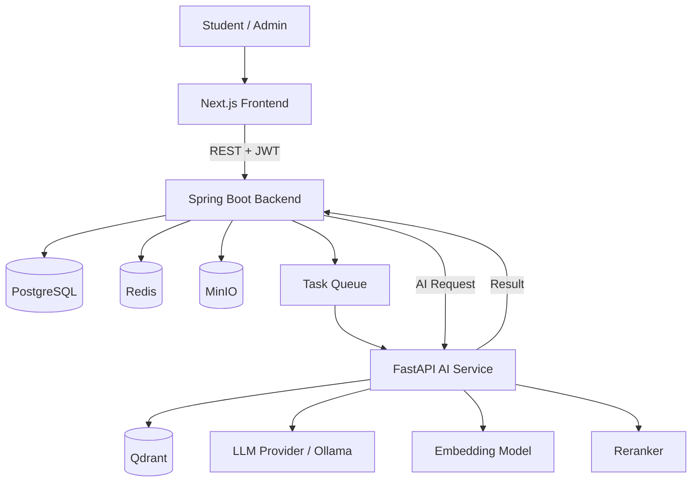

---

# 27. Component Diagram

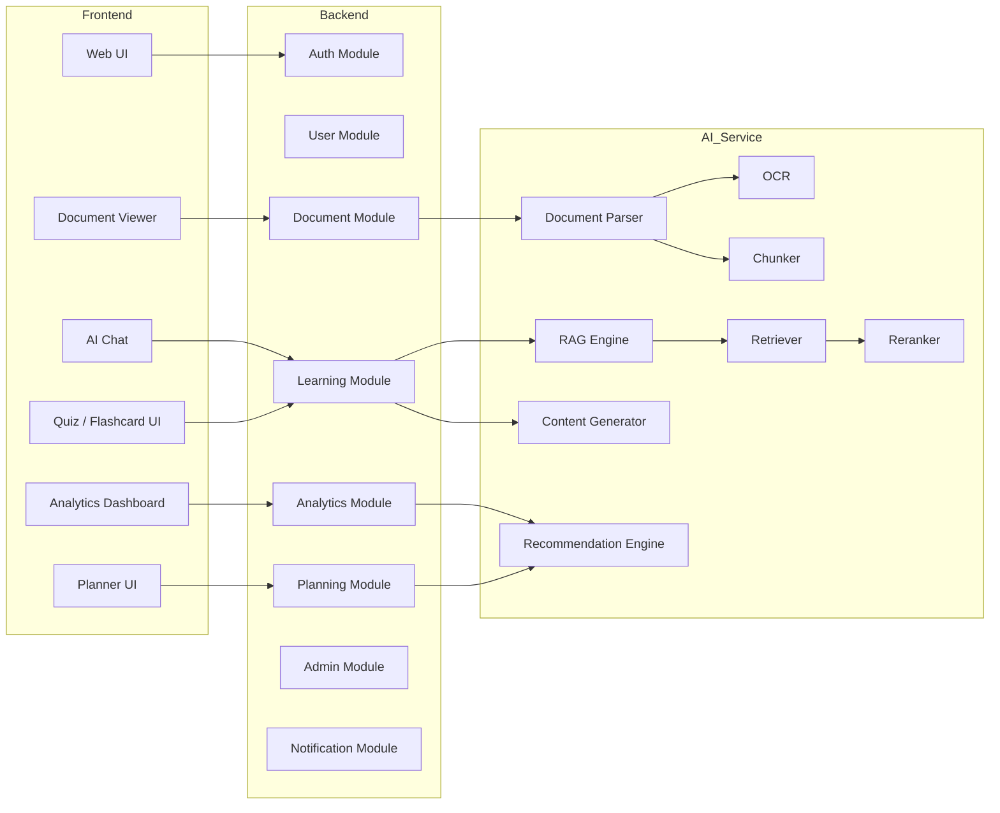

---

# 28. Deployment Diagram

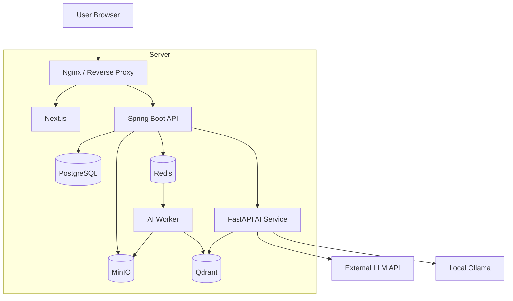

---

# 29. Use Case Diagram — Tổng quan

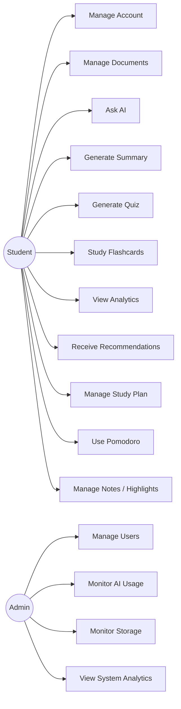

---

# 30. Use Case — Document Management

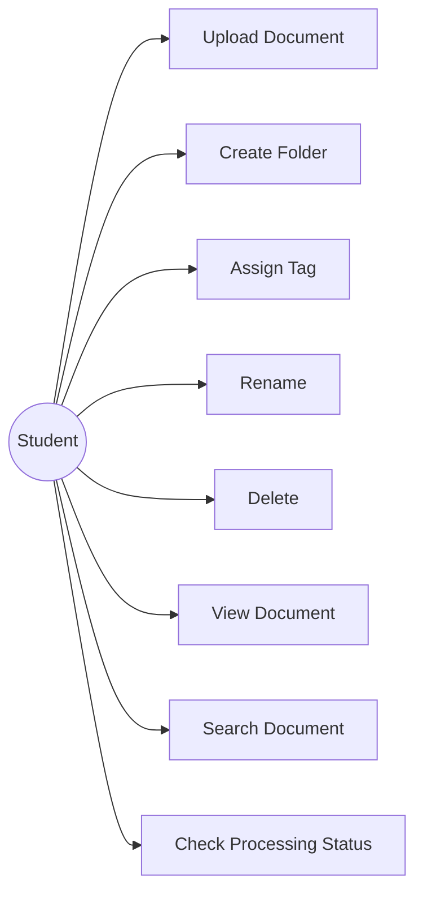

---

# 31. Use Case — AI Learning

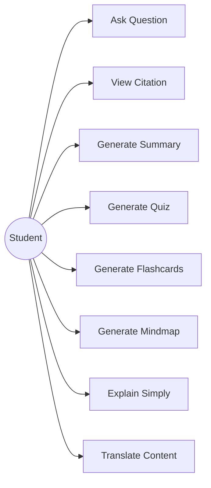

---

# 32. Activity Diagram — Upload Document

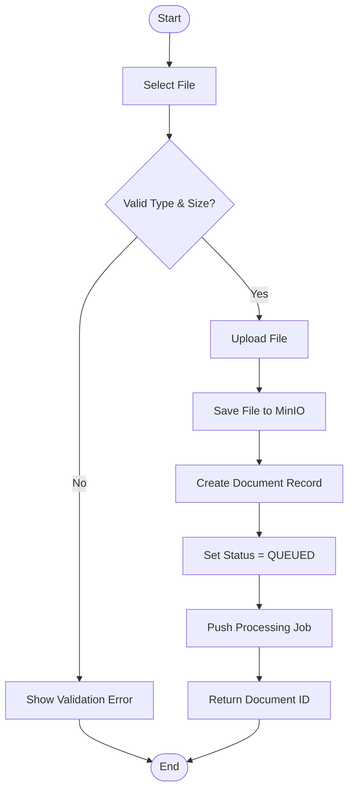

---

# 33. Activity Diagram — Document Processing

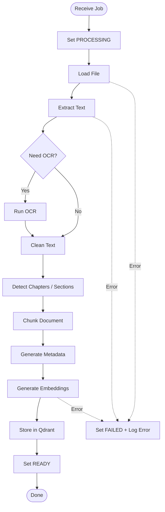

---

# 34. Activity Diagram — RAG Chat

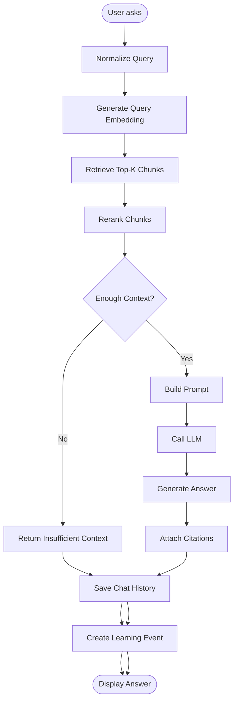

---

# 35. Activity Diagram — Quiz Learning Loop

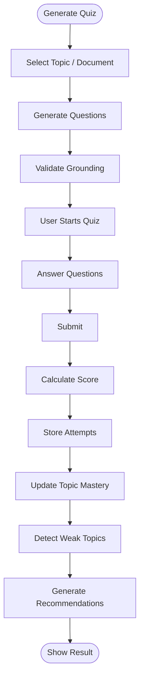

---

# 36. Activity Diagram — Personalized Recommendation

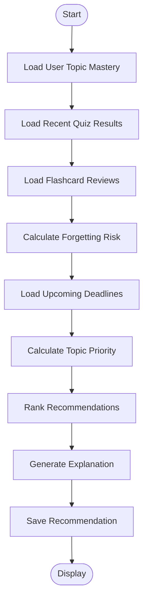

---

# 37. Sequence Diagram — Login

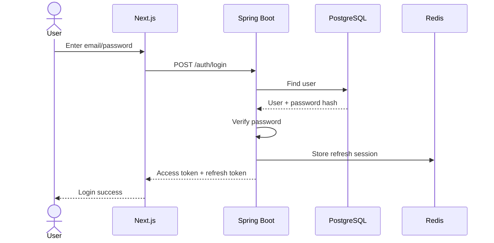

---

# 38. Sequence Diagram — Upload & Process Document

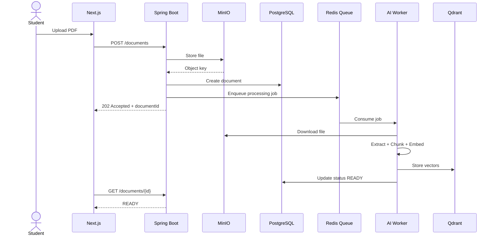

---

# 39. Sequence Diagram — RAG Question Answering

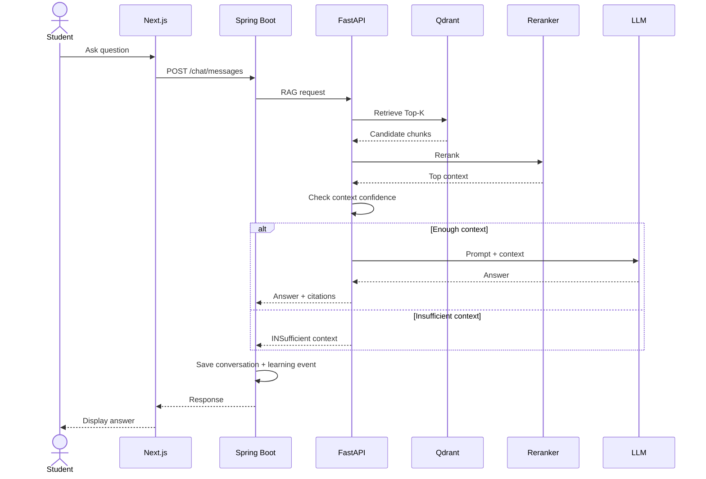

---

# 40. Sequence Diagram — Quiz Submission

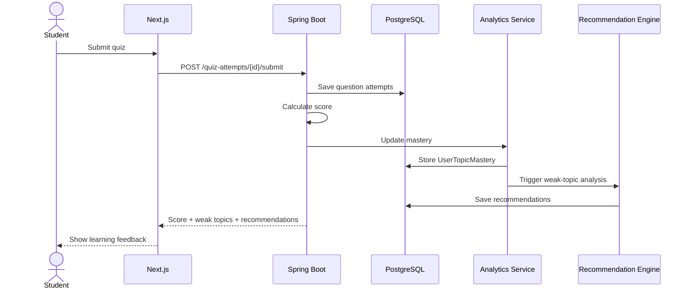

---

# 41. Sequence Diagram — Study Planner

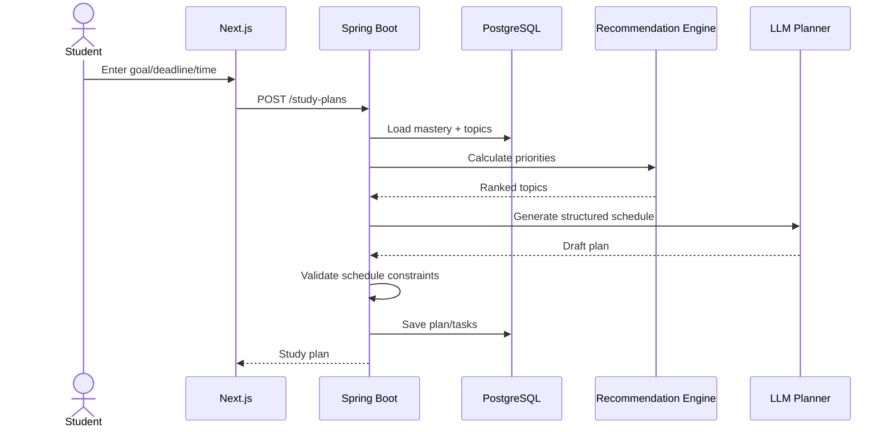

---

# 42. State Diagram — Document

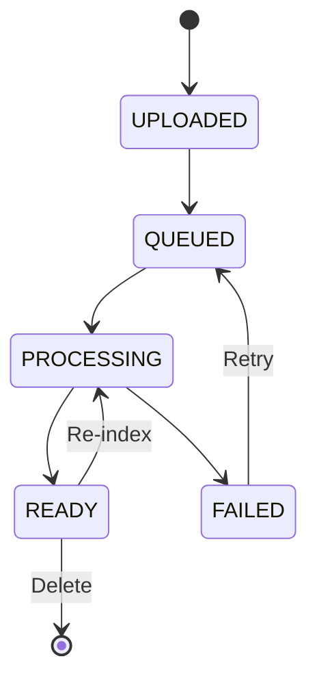

---

# 43. State Diagram — Study Task

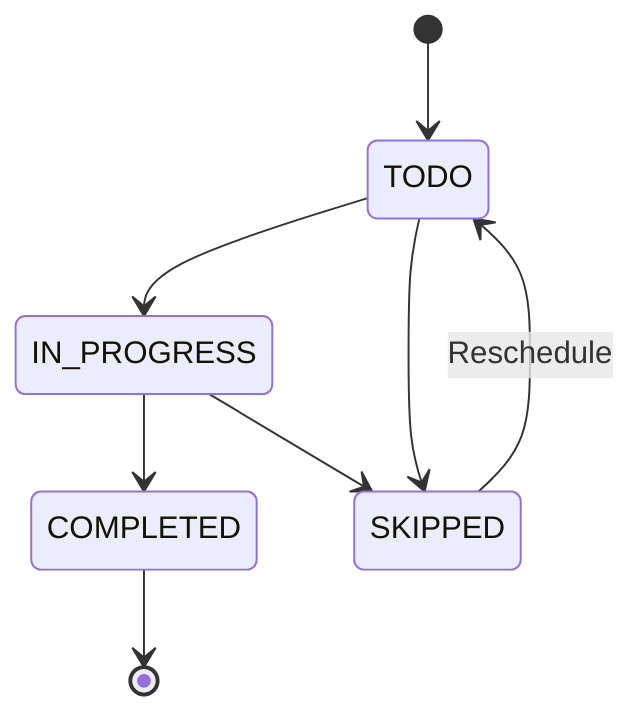

---

# 44. Class Diagram — Domain Model

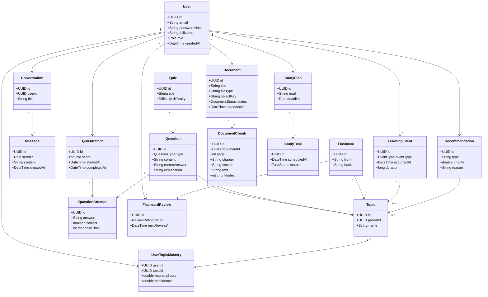

---

# 45. ERD rút gọn

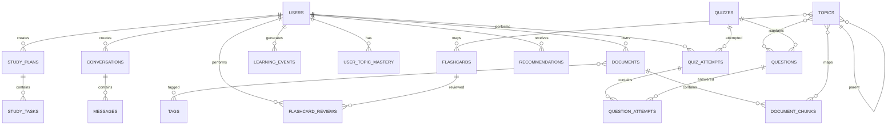

---

# 46. Cấu trúc cơ sở dữ liệu đề xuất

## users

```text
id
email
password_hash
full_name
role
avatar_url
created_at
updated_at
```

## documents

```text
id
user_id
folder_id
title
original_filename
file_type
object_key
status
page_count
error_message
created_at
processed_at
```

## document_chunks

```text
id
document_id
page_number
chapter
section
chunk_index
content
token_count
vector_id
```

## topics

```text
id
parent_id
name
description
```

## document_chunk_topics

```text
chunk_id
topic_id
confidence
```

## conversations

```text
id
user_id
title
created_at
```

## messages

```text
id
conversation_id
role
content
metadata
created_at
```

## quizzes

```text
id
user_id
document_id
title
difficulty
created_at
```

## questions

```text
id
quiz_id
type
content
correct_answer
explanation
difficulty
source_chunk_id
```

## question_topics

```text
question_id
topic_id
```

## quiz_attempts

```text
id
quiz_id
user_id
score
started_at
completed_at
```

## question_attempts

```text
id
quiz_attempt_id
question_id
user_answer
is_correct
response_time_ms
```

## flashcards

```text
id
user_id
document_id
front
back
source_chunk_id
created_at
```

## flashcard_reviews

```text
id
flashcard_id
user_id
rating
reviewed_at
next_review_at
interval_days
```

## learning_events

```text
id
user_id
event_type
resource_type
resource_id
topic_id
duration_seconds
metadata
occurred_at
```

## user_topic_mastery

```text
user_id
topic_id
mastery_score
confidence
last_practiced_at
updated_at
```

## study_plans

```text
id
user_id
goal
deadline
hours_per_day
status
created_at
```

## study_tasks

```text
id
plan_id
topic_id
resource_type
resource_id
scheduled_at
estimated_minutes
status
```

## recommendations

```text
id
user_id
topic_id
recommendation_type
resource_id
priority
reason
created_at
expires_at
```

---

# 47. API Design

Base:

```text
/api/v1
```

## Authentication

```text
POST   /auth/register
POST   /auth/login
POST   /auth/refresh
POST   /auth/logout
POST   /auth/forgot-password
POST   /auth/reset-password
```

## User

```text
GET    /users/me
PATCH  /users/me
GET    /users/me/dashboard
```

## Documents

```text
POST   /documents
GET    /documents
GET    /documents/{id}
PATCH  /documents/{id}
DELETE /documents/{id}

GET    /documents/{id}/status
POST   /documents/{id}/reprocess
```

## Search

```text
POST   /search/semantic
```

## Chat

```text
POST   /conversations
GET    /conversations
GET    /conversations/{id}
POST   /conversations/{id}/messages
```

## Summary

```text
POST   /documents/{id}/summaries
GET    /documents/{id}/summaries
```

## Quiz

```text
POST   /quizzes/generate
GET    /quizzes/{id}

POST   /quizzes/{id}/attempts
POST   /quiz-attempts/{id}/answers
POST   /quiz-attempts/{id}/submit
```

## Flashcard

```text
POST   /flashcards/generate
GET    /flashcards
POST   /flashcards/{id}/reviews
```

## Analytics

```text
GET /analytics/overview
GET /analytics/study-time
GET /analytics/quiz-performance
GET /analytics/topics
GET /analytics/mastery
GET /analytics/weak-topics
```

## Recommendation

```text
GET  /recommendations
POST /recommendations/{id}/complete
POST /recommendations/{id}/dismiss
```

## Study Plan

```text
POST   /study-plans
GET    /study-plans
GET    /study-plans/{id}
PATCH  /study-plans/{id}

POST   /study-plans/{id}/tasks
PATCH  /study-tasks/{id}
```

## Admin

```text
GET /admin/users
GET /admin/storage
GET /admin/ai-usage
GET /admin/jobs
GET /admin/system-analytics
```

---

# 48. Kiến trúc Backend

## Spring Boot

Phụ trách:

```text
Authentication
Authorization
Users
Documents metadata
Folders
Tags
Conversations
Quiz records
Flashcard records
Learning events
Analytics APIs
Study plans
Notifications
Admin
```

Package gợi ý:

```text
com.studyassistant
├── auth
├── user
├── document
├── knowledge
├── chat
├── quiz
├── flashcard
├── learning
├── analytics
├── recommendation
├── planner
├── notification
├── admin
├── common
└── infrastructure
```

---

# 49. Kiến trúc AI Service

FastAPI:

```text
ai_service/
├── api/
├── ingestion/
│   ├── parser/
│   ├── ocr/
│   ├── cleaner/
│   ├── chunker/
│   └── metadata/
├── embeddings/
├── retrieval/
├── reranking/
├── rag/
├── generation/
│   ├── summary/
│   ├── quiz/
│   ├── flashcard/
│   └── mindmap/
├── analytics/
├── recommendation/
├── planner/
├── evaluation/
└── core/
```

---

# 50. Background Processing

Không chạy document ingestion trong HTTP request.

```text
POST /documents
      ↓
Save file
      ↓
Create document row
      ↓
Push job
      ↓
Return 202
```

Worker:

```text
Consume job
   ↓
Process
   ↓
Store embeddings
   ↓
Update document status
```

---

# 51. Cache Strategy

Redis có thể cache:

- Session.
- Rate limit.
- Dashboard statistics.
- Popular retrieval result.
- Temporary generation result.
- Processing progress.

Không cache dữ liệu cá nhân nhạy cảm một cách tùy tiện.

---

# 52. File Storage

MinIO structure:

```text
/users/{user_id}/documents/{document_id}/original.pdf
/users/{user_id}/documents/{document_id}/preview/
/users/{user_id}/exports/
```

---

# 53. Vector Database

Qdrant collection:

```text
document_chunks
```

Payload:

```json
{
  "user_id": "...",
  "document_id": "...",
  "page": 10,
  "chapter": "Chapter 3",
  "section": "Polymorphism",
  "chunk_index": 20
}
```

Retrieval bắt buộc filter theo ownership:

```text
user_id = current_user
```

hoặc collection/domain tương ứng.

---

# 54. Chunking Strategy

Không chỉ fixed character.

MVP:

```text
Recursive chunking
chunk_size ≈ 500–1000 tokens
overlap ≈ 10–20%
```

Advanced:

```text
Structure-aware chunking
Chapter
Section
Paragraph
Table
```

Các tham số cần được benchmark thay vì cố định cảm tính.

---

# 55. Retrieval Strategy

## Baseline A

```text
Dense Retrieval
Top-K = 10
```

## Baseline B

```text
Dense Retrieval
+
Reranking
Top-10 → Top-5
```

## Advanced

```text
BM25
+
Dense Retrieval
+
Reciprocal Rank Fusion
+
Cross-Encoder Reranking
```

---

# 56. Prompt Grounding

Prompt cần chứa rule:

```text
- Chỉ sử dụng context được cung cấp.
- Không tự bổ sung kiến thức ngoài nguồn nếu chế độ grounded-only được bật.
- Nếu context không đủ, nói rõ không đủ thông tin.
- Trích dẫn nguồn tương ứng.
```

---

# 57. AI Content Generation Safety

Quiz/summary/flashcard phải liên kết với source chunk.

Sau sinh:

```text
Generated Content
      ↓
Source Grounding Check
      ↓
Quality Validation
      ↓
Save
```

Không coi nội dung LLM sinh ra là chính xác mặc định.

---

# 58. Logging

Log:

```text
request_id
user_id
endpoint
latency
status
ai_model
token_usage
retrieval_latency
llm_latency
error_code
```

Không log:

- Password.
- Refresh token.
- Full sensitive content khi không cần thiết.

---

# 59. Security

## Authentication

- Password hashing: BCrypt/Argon2.
- Access token ngắn hạn.
- Refresh token.
- Rotation.
- Revoke session.

## Authorization

Object-level permission:

```text
current_user.id == document.user_id
```

## Upload Security

- MIME validation.
- Extension validation.
- Max file size.
- Safe filename.
- Virus scanning nếu có điều kiện.
- Không execute uploaded files.

## API

- Rate limiting.
- CORS policy.
- Request validation.
- SQL injection prevention.
- XSS prevention.
- CSRF tùy cơ chế token/cookie.

## AI Security

- Prompt injection defense.
- Retrieval ownership filter.
- No cross-user retrieval.
- Input length limit.
- Output sanitation.

---

# 60. Non-Functional Requirements

## Performance

Mục tiêu đề xuất:

```text
Normal API p95          < 500 ms
Dashboard cached p95    < 1 s
RAG first response      < 5–10 s
Upload request          < 2 s để trả 202
```

Document processing chạy background.

## Reliability

- Job retry.
- Dead-letter mechanism.
- Idempotent processing.
- Graceful failure.

## Scalability

Có thể scale riêng:

```text
Spring Boot
FastAPI
Worker
Qdrant
```

## Maintainability

- Modular architecture.
- API versioning.
- Unit test.
- Integration test.
- Docker.

---

# 61. Testing Strategy

## Unit Test

- Auth.
- Mastery calculation.
- Recommendation scoring.
- Quiz grading.
- Scheduler.

## Integration Test

- Spring Boot + PostgreSQL.
- Upload + MinIO.
- AI Service + Qdrant.
- Queue + worker.

## E2E Test

Flow:

```text
Register
→ Login
→ Upload
→ Wait READY
→ Ask
→ Generate Quiz
→ Submit
→ View Analytics
→ View Recommendation
```

## Security Test

- Unauthorized access.
- Cross-user document access.
- Invalid upload.
- Token expiration.
- Prompt injection test.

---

# 62. AI Evaluation

Đây là phần bắt buộc nếu muốn đồ án có chiều sâu.

## 62.1. RAG Retrieval Dataset

Tạo:

```text
100–300 question–evidence pairs
```

Mỗi mẫu:

```text
question
relevant_document
relevant_page
relevant_chunk
reference_answer
```

## 62.2. Retrieval Metrics

- Recall@K.
- Hit Rate@K.
- MRR.
- Precision@K.

## 62.3. RAG Answer Metrics

- Answer Correctness.
- Faithfulness.
- Context Relevance.
- Citation Correctness.

## 62.4. Ablation

Ví dụ:

| Method | Recall@5 | MRR |
|---|---:|---:|
| BM25 | x | x |
| Dense | x | x |
| Dense + Reranker | x | x |
| Hybrid + Reranker | x | x |

Không điền số trước khi thực nghiệm.

---

# 63. Quiz Evaluation

Đánh giá:

- Relevance.
- Correctness.
- Groundedness.
- Difficulty appropriateness.
- Explanation correctness.

Có thể đánh giá thủ công bằng rubric 1–5.

---

# 64. Recommendation Evaluation

Offline scenario:

```text
Student A:
SELECT mastery = 0.90
JOIN mastery = 0.42
GROUP BY mastery = 0.81

Expected top recommendation:
JOIN
```

Metric:

- Weak-topic detection accuracy.
- Precision@K.
- Recommendation relevance rating.

---

# 65. Usability Evaluation

Có thể mời 10–20 sinh viên test.

Survey:

- Ease of use.
- Helpfulness.
- Trust in citations.
- Quiz usefulness.
- Recommendation usefulness.
- Dashboard clarity.

Dùng Likert scale 1–5.

---

# 66. KPI đồ án

Ví dụ KPI kỹ thuật:

```text
Document success processing rate
RAG Recall@5
RAG answer correctness
Citation correctness
Quiz groundedness
Average response latency
Recommendation relevance
User task completion rate
```

---

# 67. Dữ liệu và quyền riêng tư

Dữ liệu người dùng:

- Tài liệu.
- Chat history.
- Quiz attempts.
- Study events.
- Learning profile.

Nguyên tắc:

- User chỉ truy cập dữ liệu của chính mình.
- Có chức năng delete.
- Không đưa tài liệu riêng vào training model.
- Chỉ gửi phần context cần thiết đến external LLM nếu dùng cloud API.
- Có thông báo cho người dùng về external AI provider.

---

# 68. Công nghệ đề xuất

| Layer | Technology |
|---|---|
| Frontend | Next.js + TypeScript |
| UI | Tailwind CSS + shadcn/ui |
| Backend | Spring Boot |
| AI Service | FastAPI |
| Main DB | PostgreSQL |
| Vector DB | Qdrant |
| Cache / Queue | Redis |
| File Storage | MinIO |
| Authentication | JWT + Refresh Token |
| Container | Docker Compose |
| Local LLM | Ollama |
| External LLM | API provider tùy cấu hình |
| AI Framework | Có thể dùng LangChain/LlamaIndex hoặc tự xây pipeline |

Khuyến nghị: không phụ thuộc quá sâu vào framework AI để dễ trình bày pipeline khi bảo vệ.

---

# 69. UI Screens

## Authentication

- Login.
- Register.
- Forgot password.

## Home Dashboard

- Continue Learning.
- Weekly Goal.
- Study Time.
- Streak.
- Weak Topics.
- Recommendations.

## Library

- Folder sidebar.
- Document cards.
- Upload.
- Search.
- Filter.
- Tag.

## Document Workspace

```text
┌───────────────────────────────────────┐
│ Document Viewer        │ AI Assistant │
│                        │              │
│ PDF                    │ Chat         │
│                        │              │
├────────────────────────┴──────────────┤
│ Summary | Quiz | Flashcard | Notes    │
└───────────────────────────────────────┘
```

## Analytics

- Heatmap.
- Study time.
- Quiz trend.
- Topic mastery.
- Weak topics.
- Recommended review.

## Planner

- Goal.
- Calendar.
- Daily tasks.
- Completion status.

---

# 70. Dashboard Information Architecture

```text
Dashboard
├── Today
│   ├── Study tasks
│   ├── Reviews due
│   └── Continue learning
│
├── Progress
│   ├── Study time
│   ├── Quiz score
│   └── Streak
│
├── Knowledge
│   ├── Mastery map
│   ├── Weak topics
│   └── Forgetting risk
│
└── Recommendations
    ├── Read
    ├── Quiz
    ├── Flashcard
    └── Review
```

---

# 71. Demo Scenario bảo vệ

Demo không nên trình bày hàng chục feature rời rạc.

## Kịch bản

### Bước 1

Student đăng nhập.

### Bước 2

Upload:

```text
Database Systems.pdf
```

System hiển thị:

```text
PROCESSING
```

sau đó:

```text
READY
```

### Bước 3

Student hỏi:

```text
"INNER JOIN khác LEFT JOIN như thế nào?"
```

AI trả lời và trích dẫn:

```text
Database Systems.pdf
Chapter 5
Page 87
```

### Bước 4

Student chọn:

```text
Generate 10-question quiz
```

### Bước 5

Student làm sai nhiều câu về LEFT JOIN.

### Bước 6

Analytics cập nhật:

```text
LEFT JOIN mastery = 0.42
```

### Bước 7

Recommendation:

```text
Bạn nên ôn LEFT JOIN.
Reason:
- 4/6 câu gần nhất trả lời sai
- mastery thấp
- 5 ngày chưa ôn
```

### Bước 8

System đề xuất:

- Đọc section 5.3.
- 5 flashcards.
- 10-question practice quiz.
- Review tomorrow.

### Bước 9

Planner tự chèn task vào study plan.

Đây là luồng thể hiện trọn vẹn giá trị:

```text
Document
→ RAG
→ Learning
→ Analytics
→ Personalization
```

---

# 72. Điểm mới và giá trị của đề tài

## 72.1. Không phải PDF chatbot

Hệ thống không dừng ở:

```text
Upload
→ Ask
→ Answer
```

mà là:

```text
Upload
→ Understand
→ Learn
→ Assess
→ Model learner
→ Recommend
```

## 72.2. Kết nối nội dung với hành vi

Một topic có thể xuất hiện đồng thời trong:

- Document.
- Chat.
- Quiz.
- Flashcard.
- Analytics.
- Mastery.
- Recommendation.

## 72.3. Recommendation có giải thích

Không chỉ:

> Hãy học SQL.

Mà:

> Hãy ôn LEFT JOIN vì mastery hiện chỉ 0.39, bạn sai 4/6 câu gần nhất và đã 5 ngày chưa ôn.

---

# 73. Các câu hỏi hội đồng có thể hỏi

## Vì sao phải dùng RAG?

Vì kiến thức chính nằm trong tài liệu cá nhân của user và cần câu trả lời bám sát nguồn.

## Vì sao cần Qdrant?

Để lưu embedding và truy xuất semantic các document chunks.

## Vì sao tách Spring Boot và FastAPI?

Spring Boot xử lý business logic; FastAPI xử lý AI pipeline. Hai thành phần có lifecycle và dependency khác nhau.

## Vì sao không gọi LLM trực tiếp từ frontend?

Vì:
- lộ API key;
- khó kiểm soát quyền;
- khó logging;
- khó lưu learning events;
- khó grounding;
- khó áp dụng business rules.

## Làm thế nào hạn chế hallucination?

- Retrieval.
- Reranking.
- Confidence threshold.
- Prompt grounding.
- Source citation.
- Insufficient-context response.

## Personalization có thật hay chỉ prompt?

Có student model:

```text
UserTopicMastery
ForgettingRisk
QuizHistory
FlashcardHistory
StudyHistory
```

Planner/recommendation dùng các tín hiệu này trước khi dùng LLM.

---

# 74. Rủi ro kỹ thuật

| Risk | Impact | Mitigation |
|---|---|---|
| OCR lỗi | Retrieval sai | OCR fallback + quality check |
| Chunking kém | RAG kém | Benchmark nhiều chunk size |
| LLM hallucination | Sai kiến thức | Grounding + threshold + citation |
| Token cost cao | Tốn chi phí | Cache + local model + context limit |
| File lớn | Timeout | Background worker |
| Scope quá rộng | Không hoàn thiện | Core MVP + Phase 2 |
| Recommendation đơn giản | Ít thuyết phục | Có mastery + forgetting + explainability |
| Cross-user data leak | Nghiêm trọng | Ownership filtering toàn pipeline |

---

# 75. Lộ trình 14 tuần

## Tuần 1 — Phân tích

- Problem statement.
- Functional requirements.
- Non-functional requirements.
- Use Case.
- Architecture draft.

## Tuần 2 — Thiết kế

- ERD.
- Database.
- API contract.
- UI/UX Figma.
- Docker skeleton.

## Tuần 3 — Backend Core

- User.
- Auth.
- JWT.
- Refresh token.
- Role.
- PostgreSQL.

## Tuần 4 — Document Management

- Upload.
- Folder.
- Tag.
- MinIO.
- File metadata.

## Tuần 5 — Ingestion Pipeline

- PDF parser.
- DOCX parser.
- PPTX parser.
- Chunking.
- Background worker.

## Tuần 6 — RAG v1

- Embedding.
- Qdrant.
- Semantic retrieval.
- Chat.
- Citation.

## Tuần 7 — RAG v2

- Reranker.
- Confidence threshold.
- Grounded response.
- Evaluation dataset.
- Retrieval benchmark.

## Tuần 8 — Learning Content

- Summary.
- Quiz.
- Flashcard.
- Source grounding.

## Tuần 9 — Learning Tracking

- StudySession.
- LearningEvent.
- QuizAttempt.
- FlashcardReview.

## Tuần 10 — Analytics

- Study time.
- Accuracy.
- Heatmap.
- Topic mastery.
- Weak-topic detection.

## Tuần 11 — Personalization

- Recommendation Engine.
- Forgetting score.
- Study Planner.

## Tuần 12 — Enhancement

Ưu tiên:

- Spaced repetition.
- Mindmap.
- Gamification.
- Pomodoro.

## Tuần 13 — Production Readiness

- Security.
- Logging.
- Testing.
- Performance.
- Docker Compose.
- Deployment.

## Tuần 14 — Evaluation & Defense

- AI benchmark.
- User testing.
- Report.
- Slides.
- Demo script.
- Video backup.

---

# 76. Work Breakdown Structure

```mermaid
flowchart TD
    P[Graduation Project]

    P --> A[Analysis & Design]
    P --> B[Core Platform]
    P --> C[AI Engine]
    P --> D[Learning Intelligence]
    P --> E[Quality & Deployment]
    P --> F[Report & Defense]

    A --> A1[SRS]
    A --> A2[UML]
    A --> A3[ERD]
    A --> A4[UI/UX]

    B --> B1[Auth]
    B --> B2[Documents]
    B --> B3[Storage]
    B --> B4[Quiz / Flashcard]

    C --> C1[Ingestion]
    C --> C2[RAG]
    C --> C3[Summary]
    C --> C4[Generation]

    D --> D1[Learning Events]
    D --> D2[Analytics]
    D --> D3[Mastery]
    D --> D4[Recommendation]
    D --> D5[Planner]

    E --> E1[Test]
    E --> E2[Security]
    E --> E3[Docker]
    E --> E4[Evaluation]

    F --> F1[Report]
    F --> F2[Slides]
    F --> F3[Demo]
```

---

# 77. Phân chia độ ưu tiên

## P0 — bắt buộc

- Auth.
- Document management.
- File processing.
- RAG.
- Citation.
- Quiz.
- Flashcard.
- Learning events.
- Analytics.
- Mastery.
- Recommendation.
- Planner.

## P1 — rất nên có

- Reranker.
- Hybrid search.
- Spaced repetition.
- Forgetting curve.
- Mindmap.
- Gamification.

## P2 — chỉ làm nếu còn thời gian

- Speech.
- Ranking.
- Challenge.
- Collaboration.

---

# 78. Tiêu chí hoàn thành MVP

MVP được coi là hoàn thành khi một user có thể:

```text
1. Register/Login
2. Upload document
3. Wait until READY
4. Search document semantically
5. Ask grounded questions
6. See citations
7. Generate summary
8. Generate quiz
9. Complete quiz
10. Generate/review flashcards
11. See learning analytics
12. See topic mastery
13. Receive weak-topic recommendations
14. Create a personalized study plan
```

---

# 79. Cấu trúc repository gợi ý

```text
ai-study-assistant/
├── frontend/
├── backend/
├── ai-service/
├── infra/
│   ├── docker/
│   ├── nginx/
│   └── monitoring/
├── docs/
│   ├── srs/
│   ├── uml/
│   ├── api/
│   ├── database/
│   └── evaluation/
├── scripts/
├── docker-compose.yml
└── README.md
```

---

# 80. Cấu trúc báo cáo đồ án gợi ý

## Chương 1 — Tổng quan

- Lý do chọn đề tài.
- Bài toán.
- Mục tiêu.
- Phạm vi.
- Đóng góp.

## Chương 2 — Cơ sở lý thuyết

- LLM.
- Embedding.
- Vector Search.
- RAG.
- Reranking.
- Learning Analytics.
- Knowledge Mastery.
- Forgetting Curve.
- Recommendation.

## Chương 3 — Phân tích và thiết kế

- Requirement.
- Use Case.
- UML.
- ERD.
- Architecture.
- Security.

## Chương 4 — Xây dựng hệ thống

- Frontend.
- Backend.
- AI service.
- Database.
- RAG.
- Analytics.
- Recommendation.

## Chương 5 — Thực nghiệm và đánh giá

- RAG dataset.
- Retrieval benchmark.
- Answer evaluation.
- Quiz evaluation.
- Recommendation evaluation.
- Performance.
- User testing.

## Chương 6 — Kết luận

- Kết quả.
- Hạn chế.
- Hướng phát triển.

---

# 81. Hướng nghiên cứu nâng cao

Sau khi MVP hoàn thiện có thể mở rộng:

## RAG

- Query rewriting.
- Multi-query retrieval.
- HyDE.
- Parent-child retrieval.
- Knowledge graph RAG.

## Student Modeling

- Bayesian Knowledge Tracing.
- Deep Knowledge Tracing.
- Item Response Theory.

## Personalization

- Learning-to-rank.
- Contextual bandit.
- Adaptive difficulty.

## Multimodal

- Image understanding.
- Diagram understanding.
- Lecture video ingestion.

---

# 82. Kết luận kiến trúc

Trọng tâm của đồ án không nên là số lượng feature.

Trái tim hệ thống là:

```text
                    ┌──────────────┐
                    │  Documents   │
                    └──────┬───────┘
                           │
                           ▼
                    ┌──────────────┐
                    │ Knowledge DB │
                    └──────┬───────┘
                           │
                 ┌─────────┴──────────┐
                 ▼                    ▼
            ┌─────────┐          ┌─────────┐
            │   RAG   │          │Learning │
            └────┬────┘          │ Content │
                 │               └────┬────┘
                 └─────────┬──────────┘
                           ▼
                  ┌────────────────┐
                  │ Learning Event │
                  └───────┬────────┘
                          ▼
                  ┌────────────────┐
                  │ Student Model  │
                  └───────┬────────┘
                          ▼
                  ┌────────────────┐
                  │Recommendation  │
                  └───────┬────────┘
                          ▼
                  ┌────────────────┐
                  │ Next Learning  │
                  └────────────────┘
```

Giá trị cốt lõi:

> **Knowledge → Interaction → Learning Data → Student Model → Personalized Learning**

Đây là hướng giúp AI Study Assistant 2.0 trở thành một **đồ án tốt nghiệp có chiều sâu về Software Engineering, AI và Data Analytics**, thay vì chỉ là một ứng dụng CRUD tích hợp chatbot.

---

# 83. Ranh giới giữa ý tưởng gốc và phần mở rộng trong tài liệu này

## Kế thừa trực tiếp từ ý tưởng ban đầu

- AI Study Assistant / personalized learning platform.
- Quản lý PDF, Word, PPT, ảnh, TXT.
- OCR và trích xuất nội dung.
- Chat với tài liệu.
- Summary.
- Quiz.
- Flashcard.
- Mindmap.
- Explain.
- Translate.
- Notebook.
- Bookmark.
- Highlight.
- Semantic Search.
- Learning Analytics.
- Dashboard.
- Gamification.
- Roadmap / Planner.
- Calendar.
- Notification.
- Pomodoro.
- Speech.
- Admin.
- Next.js.
- Spring Boot.
- FastAPI.
- PostgreSQL.
- Redis.
- MinIO.
- Qdrant.
- Docker Compose.

## Phần được mở rộng để phù hợp mức đồ án tốt nghiệp

- Scope MVP / P0 / P1 / P2.
- Background job architecture.
- Student model.
- Topic mastery.
- Learning event model.
- Forgetting curve.
- Explainable recommendation.
- Grounded citation.
- Hallucination control.
- Reranking.
- RAG evaluation.
- Quiz evaluation.
- Recommendation evaluation.
- Security model.
- Testing strategy.
- Non-functional requirements.
- API design.
- Detailed database schema.
- UML diagrams.
- Deployment architecture.
- Demo scenario.
- Defense questions.
- Technical risk management.

---

# 84. Tên đề tài khuyến nghị cuối cùng

## Tiếng Việt

**Xây dựng nền tảng học tập cá nhân hóa ứng dụng mô hình ngôn ngữ lớn, Retrieval-Augmented Generation và Learning Analytics**

## Tiếng Anh

**Design and Development of a Personalized AI Learning Platform using Large Language Models, Retrieval-Augmented Generation and Learning Analytics**

## Tên sản phẩm

**AI Study Assistant 2.0**

---

# 85. Một câu mô tả dùng khi bảo vệ

> AI Study Assistant 2.0 là một nền tảng học tập cá nhân hóa, trong đó RAG giúp người học tương tác đáng tin cậy với tài liệu của chính mình, Learning Analytics xây dựng hồ sơ kiến thức của từng người học, và Recommendation Engine sử dụng hồ sơ đó để đề xuất nội dung, bài luyện tập và kế hoạch học phù hợp theo thời gian.

