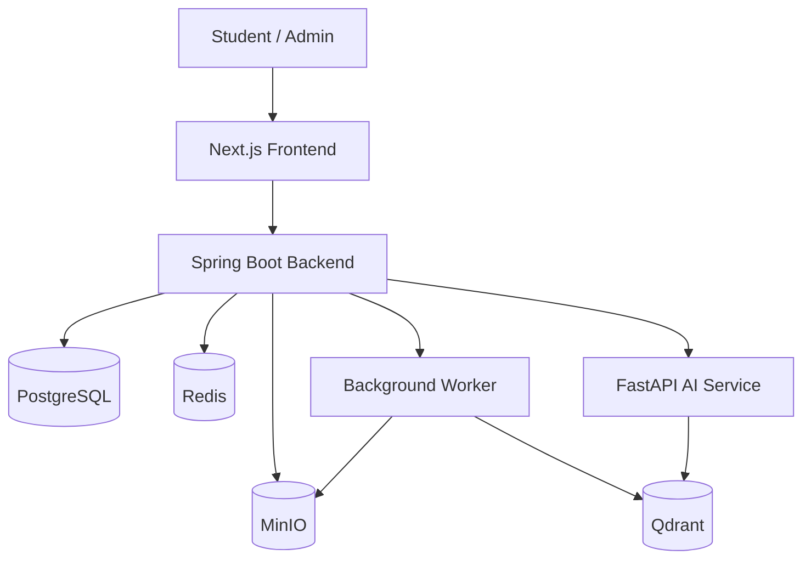
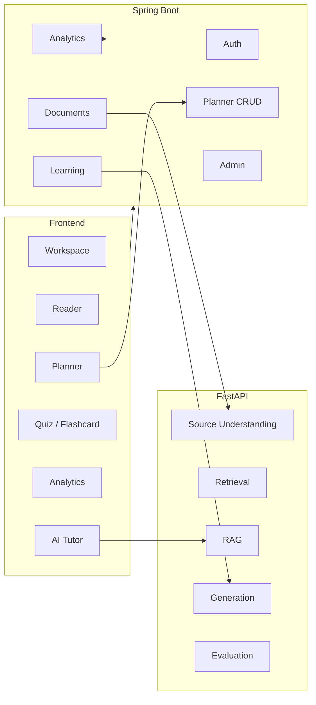
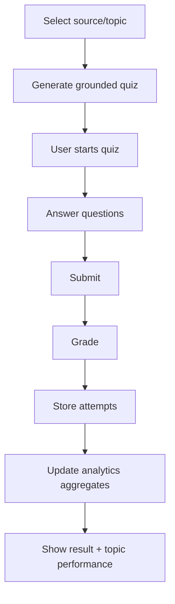
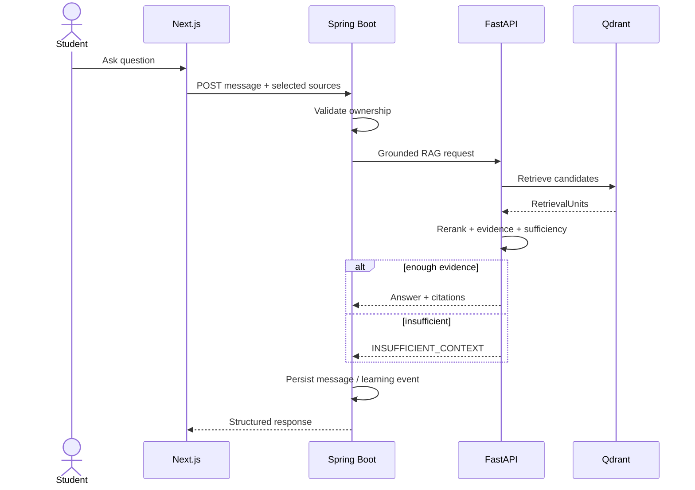
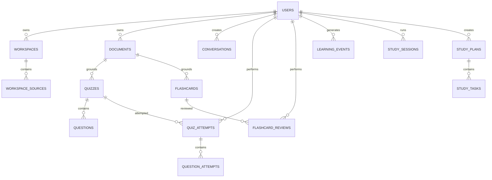
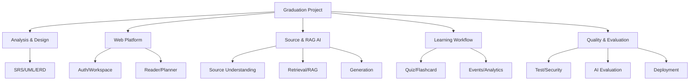

# ĐỒ ÁN TỐT NGHIỆP
# AI-Powered Learning Platform using LLM, RAG and Learning Analytics

> **Tên tiếng Việt đề xuất:** Xây dựng nền tảng hỗ trợ học tập ứng dụng Mô hình Ngôn ngữ Lớn, Retrieval-Augmented Generation và Learning Analytics  
> **Tên ngắn:** AI Study Assistant 2.0  
> **Loại đề tài:** Hệ thống phần mềm tích hợp Web / AI / Data Analytics  
> **Định hướng:** Web-first learning platform với AI hỗ trợ hiểu tài liệu, hỏi đáp có căn cứ, sinh học liệu và phân tích quá trình học.  
> **Quyết định scope:** Không triển khai personalization, Student Model, Recommendation Engine, forgetting model, adaptive planner hoặc hệ thống tự gợi ý người dùng nên học gì tiếp theo.

---

# 1. Tóm tắt đề tài

AI Study Assistant 2.0 là một nền tảng Web hỗ trợ người học quản lý tài liệu và sử dụng AI trực tiếp trên nguồn học tập của mình.

Hệ thống cho phép:

- Quản lý tài liệu học tập theo workspace.
- Xử lý PDF/DOCX/PPTX thành biểu diễn có cấu trúc và có provenance.
- Hỏi đáp trên nguồn được chọn bằng RAG.
- Trả lời có citation quay được về source gốc.
- Tạo summary, quiz, flashcard và mindmap từ tài liệu.
- Theo dõi study session và learning event.
- Tổng hợp Learning Analytics như study time, quiz accuracy, activity trend và topic performance.
- Cho phép người dùng tự quản lý study plan, calendar và task.
- Cung cấp admin/debug tools để theo dõi document processing, AI usage và retrieval trace.

Điểm khác biệt chính không nằm ở personalization mà ở một workflow hoàn chỉnh:

```text
Learning Sources
      ↓
Source Understanding
      ↓
Grounded Retrieval / RAG
      ↓
Learning Content
      ↓
Practice & Learning Events
      ↓
Learning Analytics
      ↓
User-managed Study Plan
```

AI hỗ trợ người dùng học từ nguồn của họ; **hệ thống không tự quyết định nội dung hoặc hoạt động học tiếp theo cho từng cá nhân**.

---

# 2. Bối cảnh và vấn đề

Các công cụ AI hiện nay làm tốt:

- hỏi đáp;
- tóm tắt;
- sinh nội dung;
- sinh câu hỏi.

Nhưng một ứng dụng học tập hoàn chỉnh còn phải giải quyết:

1. Quản lý nhiều nguồn tài liệu và giữ source identity rõ ràng.
2. Không làm mất cấu trúc hoặc provenance khi xử lý nguồn.
3. Bảo đảm câu trả lời bám vào tài liệu được phép.
4. Cho phép người dùng kiểm tra citation và quay về nguồn.
5. Kết nối đọc tài liệu, chat, quiz, flashcard, note và study session trong cùng workflow.
6. Lưu learning interaction thành dữ liệu có cấu trúc.
7. Trình bày tiến độ và kết quả học bằng analytics dễ hiểu.
8. Cho phép người dùng chủ động lập và quản lý kế hoạch học.

Đề tài tập trung vào **correctness, traceability, retrieval quality và Web learning workflow**, thay vì mở rộng sang recommendation/personalization.

---

# 3. Mục tiêu của đề tài

## 3.1. Mục tiêu tổng quát

Xây dựng một nền tảng Web hỗ trợ học tập có khả năng:

- quản lý nguồn học tập;
- hiểu và truy xuất nội dung nguồn;
- sinh nội dung học tập có grounding;
- hỗ trợ thực hành và đánh giá;
- ghi nhận learning activity;
- trực quan hóa kết quả học;
- hỗ trợ người dùng tự quản lý study plan.

## 3.2. Mục tiêu kỹ thuật

### Web / Software Engineering

- Next.js frontend.
- Spring Boot application backend.
- FastAPI AI service.
- REST API và SSE.
- Authentication / Authorization.
- Object-level access control.
- PostgreSQL.
- Redis.
- MinIO.
- Qdrant.
- Background jobs.
- Error handling.
- Logging / observability.
- Testing.
- Docker deployment.

### Artificial Intelligence

- Document/source understanding.
- OCR khi cần.
- Canonical source representation.
- RetrievalUnit construction.
- Embedding.
- Dense / hybrid retrieval.
- Reranking.
- Evidence construction.
- Retrieval-Augmented Generation.
- Grounded answer.
- Citation validation.
- Summary generation.
- Quiz generation.
- Flashcard generation.
- Mindmap / structured learning-content generation.

### Data Analytics

- Study time.
- Session count.
- Learning streak.
- Quiz score / accuracy.
- Accuracy theo topic.
- Flashcard review statistics.
- Learning activity timeline.
- Task completion.
- Weekly/monthly trends.

Không có mục tiêu kỹ thuật về:

```text
UserTopicMastery
Student Model
ForgettingRisk
Recommendation ranking
Personalized next action
Adaptive plan generation
```

---

# 4. Phạm vi hệ thống

## 4.1. Core MVP — bắt buộc

1. Authentication.
2. Workspace.
3. Document/Source Management.
4. PDF/DOCX/PPTX processing.
5. Universal Source Understanding.
6. RAG Chat.
7. Source Citation.
8. Summary.
9. Quiz.
10. Flashcard.
11. Study Session Tracking.
12. Learning Event Tracking.
13. Learning Analytics Dashboard.
14. Topic Performance / Weak-topic Analytics dựa trên dữ liệu trực tiếp.
15. Manual Study Planner / Calendar.
16. Admin Dashboard.
17. Retrieval / Source Understanding Debug UI.
18. Docker deployment.

## 4.2. Advanced Features — nếu đủ thời gian

- Hybrid Search.
- Reranking nâng cao.
- OCR ảnh/scanned PDF.
- Mindmap.
- Spaced-repetition flashcard scheduler.
- Notification.
- Calendar drag/drop.
- Highlight.
- Bookmark.
- PWA shell.
- Advanced admin/observability.

## 4.3. Optional Features — chỉ làm cuối

- Voice input/output.
- Social learning.
- Collaborative workspace.
- Shared editing.
- Mobile application.
- Gamification nâng cao.

## 4.4. Ngoài phạm vi

Các chức năng sau **không nằm trong đồ án hiện tại**:

- personalization engine;
- Student Model;
- mastery inference từ nhiều loại evidence;
- forgetting curve cho từng người dùng;
- Recommendation Engine;
- resource/topic/practice recommendation;
- automatic next-learning-action;
- AI-generated personalized study plan;
- adaptive replanning dựa trên performance;
- recommendation evaluation.

---

# 5. Đối tượng sử dụng

## 5.1. Student

Student có thể:

- quản lý workspace và source;
- đọc tài liệu;
- hỏi AI trên source được chọn;
- kiểm tra citation;
- tạo note/highlight/bookmark;
- tạo và làm quiz;
- học flashcard;
- chạy study session;
- xem analytics;
- tự tạo và quản lý study task/calendar.

## 5.2. Admin

Admin có thể:

- quản lý user;
- theo dõi document jobs;
- theo dõi storage;
- theo dõi AI usage;
- xem failed jobs;
- xem system health;
- mở retrieval/source-understanding debug tools.

---

# 6. Các phân hệ chính

```text
1. Identity & Access
2. Workspace & Source Management
3. Source Understanding / Ingestion
4. Knowledge Index & Retrieval
5. RAG Tutor
6. Learning Content Generation
7. Practice
8. Notes / Highlights / Bookmarks
9. Study Session & Learning Events
10. Learning Analytics
11. Manual Planner / Calendar
12. Admin & Observability
```

Không có Recommendation subsystem.

---

# 7. Workspace & Source Management

Workspace là product organization boundary:

```text
Workspace
 ├── Source A
 ├── Source B
 └── Source C
```

Source identity vẫn độc lập.

```text
Workspace membership != Source identity
```

User có thể:

- upload;
- rename;
- delete;
- tag;
- filter;
- tìm theo metadata;
- chọn source scope cho RAG;
- xem processing state.

Document status:

```text
UPLOADED
QUEUED
PROCESSING
READY
FAILED
```

---

# 8. Universal Source Understanding

Pipeline chuẩn:

```text
ANY SOURCE
   ↓
Element
   ↓
LogicalUnit
   ↓
RetrievalUnit
   ↓
Evidence
   ↓
Grounded Answer
   ↓
Citation
```

Song song:

```text
LogicalUnit
   ↓
Inferred Structure
   ↓
Semantic Enrichment
```

Ba loại thông tin phải tách rõ:

```text
SOURCE FACT
INFERRED STRUCTURE
SEMANTIC ENRICHMENT
```

Không ép mọi document thành:

```text
Chapter → Section → Paragraph
```

Các structure mode hợp lệ:

```text
UNKNOWN
FLAT
LOCAL
GROUPED
HIERARCHICAL
MIXED
```

Provenance chain:

```text
RetrievalUnit
→ LogicalUnit
→ Element
→ SourceAnchor
→ Original Source
```

---

# 9. Document Processing Pipeline

```text
Upload
  ↓
File validation
  ↓
Object storage
  ↓
Background job
  ↓
Native extraction / OCR
  ↓
RawElement
  ↓
Element normalization
  ↓
Content profiling
  ↓
Structure signals
  ↓
Boundary / grouping / hierarchy
  ↓
CanonicalDocument
  ↓
RetrievalUnit projection
  ↓
Embedding / indexing
  ↓
READY
```

Mục tiêu chính:

```text
information preservation
stable source order
provenance
retrieval readiness
citation safety
```

---

# 10. RAG Learning Engine

## 10.1. Pipeline

```text
User Question
      ↓
Resolve authorized source scope
      ↓
Query Analysis
      ↓
Retrieval
      ↓
Reranking
      ↓
Evidence Construction
      ↓
Confidence / Sufficiency Check
      ↓
Grounded Generation
      ↓
Citation Validation
      ↓
Structured Answer
```

## 10.2. Hallucination Control

Nếu evidence không đủ:

```text
INSUFFICIENT_CONTEXT
```

AI không được tự bổ sung fact ngoài source khi ở grounded mode.

## 10.3. Citation

Citation phải resolve từ provenance thực:

```text
Answer claim
→ Evidence
→ RetrievalUnit
→ Element
→ SourceAnchor
→ Original Source
```

LLM không tự bịa page/bbox/source.

---

# 11. Semantic Search

Baseline:

```text
Dense Retrieval
```

Advanced:

```text
BM25
+
Dense Retrieval
+
Rank Fusion
+
Reranker
```

Evaluation:

- Recall@K.
- Hit@K.
- MRR.
- nDCG nếu có graded relevance.

---

# 12. AI Summary

Các mode có thể gồm:

```text
QUICK
STANDARD
DETAILED
```

Summary phải:

- giữ source scope;
- lưu source references;
- validate grounding;
- hỗ trợ background job nếu dài.

---

# 13. AI Quiz

Quiz type:

```text
MULTIPLE_CHOICE
TRUE_FALSE
FILL_BLANK
SHORT_ANSWER
ESSAY
```

Mỗi question cần:

```text
question
type
difficulty
correct_answer
explanation
topic optional
source references
```

Generation flow:

```text
Source scope
→ Evidence
→ Generate candidates
→ Schema validation
→ Grounding validation
→ Deduplicate
→ Save
```

---

# 14. Flashcard

Flashcard:

```text
front
back
topic optional
source references
```

Review modes:

```text
AGAIN
HARD
GOOD
EASY
```

Nếu triển khai spaced repetition, đây là scheduler của flashcard resource; nó không được mở rộng thành Recommendation Engine cho toàn hệ thống.

---

# 15. Mindmap

Mindmap nên bắt nguồn từ:

```text
inferred document structure
+
topic relations nếu có evidence
```

Không để LLM tự tạo graph không truy vết được về source.

---

# 16. Notes, Bookmark và Highlight

## Notes

- note độc lập;
- optional workspace/source link;
- optional SourceAnchor;
- user-owned.

AI action tùy chọn:

- summarize note;
- generate quiz from note;
- generate flashcards from note.

## Bookmark

Có thể trỏ tới:

- source location;
- quiz;
- flashcard;
- study task.

## Highlight

Lưu:

```text
source_id
SourceAnchor
selected_text snapshot
color
note optional
```

Anchor là navigation reference; selected text chỉ là snapshot.

---

# 17. Learning Tracking

Learning tracking phục vụ analytics, lịch sử và usability; **không dùng để xây personalized recommendation model**.

## StudySession

```text
id
user_id
workspace_id
started_at
ended_at
active_duration
status
```

## LearningEvent

```text
id
user_id
event_type
resource_type
resource_id
topic_id optional
occurred_at
duration optional
metadata
```

Event types ví dụ:

```text
DOCUMENT_OPEN
DOCUMENT_READ
CHAT_QUESTION
SUMMARY_VIEW
QUIZ_START
QUIZ_SUBMIT
QUESTION_ANSWER
FLASHCARD_REVIEW
NOTE_CREATE
BOOKMARK_CREATE
HIGHLIGHT_CREATE
PLAN_TASK_COMPLETE
```

Không gửi raw mousemove/click thành learning event.

---

# 18. Learning Analytics

Learning Analytics có hai mục tiêu:

## 18.1. Descriptive

> Người dùng đã học như thế nào?

Metrics:

- study time;
- session count;
- streak;
- quiz score;
- quiz accuracy;
- flashcard review count;
- completed tasks;
- activity heatmap.

## 18.2. Diagnostic

> Kết quả của người dùng đang tốt/kém ở phần nào?

Có thể tính trực tiếp từ dữ liệu quan sát:

```text
Topic Performance
= correct answers / attempted questions
```

Ví dụ:

| Topic | Attempts | Accuracy |
|---|---:|---:|
| SELECT | 20 | 90% |
| INNER JOIN | 12 | 75% |
| LEFT JOIN | 10 | 40% |

Nếu sample nhỏ, UI phải hiển thị rõ số attempts; không gọi đây là “mastery” hoặc một fact về năng lực dài hạn.

## 18.3. Không có Prescriptive Analytics

Hệ thống không tự trả lời:

> “Bạn nên học gì tiếp theo?”

Không có automatic recommendation/ranking từ analytics.

---

# 19. Topic Model

Topic dùng để tổ chức content và aggregate analytics:

```text
Topic
- id
- parent_id optional
- name
- description
```

Topic có thể map với:

```text
RetrievalUnit
Quiz Question
Flashcard
Learning Event
```

Không có mapping tới `UserTopicMastery` hoặc `Recommendation`.

---

# 20. Manual Study Planner

Planner là application feature do người dùng điều khiển.

User tự tạo:

```text
StudyPlan
- id
- user_id
- name
- goal optional
- deadline optional
```

Task:

```text
StudyTask
- id
- plan_id
- title
- resource_type optional
- resource_id optional
- topic_id optional
- scheduled_at
- estimated_minutes optional
- status
```

Status:

```text
TODO
IN_PROGRESS
COMPLETED
SKIPPED
```

Hệ thống hỗ trợ:

- create task;
- edit task;
- complete;
- skip;
- reschedule;
- calendar view;
- reminder.

Không có:

```text
AI priority ranking
auto task insertion
performance-based replanning
mastery-based scheduling
recommendation → planner conversion
```

---

# 21. Notification

Notification phù hợp:

```text
DOCUMENT_READY
DOCUMENT_FAILED
TASK_DUE
TASK_MISSED
SYSTEM
```

Nếu flashcard scheduler được bật:

```text
FLASHCARD_REVIEW_DUE
```

Notification chỉ phản ánh state/rule đã tồn tại; không phải recommendation engine.

---

# 22. Kiến trúc tổng thể



Responsibility:

```text
Next.js
→ Product UX

Spring Boot
→ auth, ownership, business state, analytics, planner, persistence

FastAPI
→ source understanding, retrieval, RAG, generation, AI evaluation
```

---

# 23. Component Diagram



Không có Student Model hoặc Recommendation Engine trong component graph.

---

# 24. Use Cases

Student:

```text
Manage Account
Manage Workspace
Manage Sources
Read Source
Ask AI
View Citation
Generate Summary
Generate Quiz
Generate Flashcards
Use Notes/Highlights
Run Study Session
View Analytics
Manage Study Plan
```

Admin:

```text
Manage Users
Monitor Processing
Monitor Storage
Monitor AI Usage
Inspect Retrieval Trace
View System Analytics
```

---

# 25. Quiz Learning Flow



Flow kết thúc ở **feedback/analytics**; không trigger recommendation.

---

# 26. RAG Sequence



---

# 27. Data Model — core

Các entity chính:

```text
User
Workspace
WorkspaceSource
Document / Source
Conversation
Message
Note
Highlight
Bookmark
Quiz
Question
QuizAttempt
QuestionAttempt
Flashcard
FlashcardReview
StudySession
LearningEvent
StudyPlan
StudyTask
Notification
```

AI/source-understanding layer có canonical objects riêng:

```text
CanonicalDocument
Element
LogicalUnit
ContextNode
Relation
RetrievalUnit
SourceAnchor
```

Không có:

```text
UserTopicMastery
Recommendation
RecommendationReason
PersonalizationProfile
```

---

# 28. ERD rút gọn



---

# 29. Database schema đề xuất

## users

```text
id
email
password_hash
full_name
role
created_at
updated_at
```

## workspaces

```text
id
user_id
name
description
goal optional
deadline optional
created_at
updated_at
```

## workspace_sources

```text
workspace_id
source_id
added_at
```

## documents

```text
id
user_id
title
original_filename
file_type
object_key
status
error_message
created_at
processed_at
```

## conversations / messages

Lưu chat history và source scope/trace metadata.

## quizzes / questions / attempts

Lưu generated practice, source references, user answers và score.

## flashcards / flashcard_reviews

Lưu card, source references và review history.

## learning_events

```text
id
user_id
event_type
resource_type
resource_id
topic_id optional
duration_seconds optional
metadata
occurred_at
```

## study_sessions

```text
id
user_id
workspace_id
started_at
ended_at
active_duration_seconds
status
```

## study_plans

```text
id
user_id
name
goal optional
deadline optional
created_at
```

## study_tasks

```text
id
plan_id
title
topic_id optional
resource_type optional
resource_id optional
scheduled_at
estimated_minutes optional
status
```

Không tạo bảng `recommendations`, `user_topic_mastery` hoặc `forgetting_state`.

---

# 30. API Design

Base:

```text
/api/v1
```

## Auth

```text
POST /auth/register
POST /auth/login
POST /auth/refresh
POST /auth/logout
```

## Workspace / Sources

```text
POST   /workspaces
GET    /workspaces
GET    /workspaces/{id}
PATCH  /workspaces/{id}
DELETE /workspaces/{id}

POST   /workspaces/{id}/sources
DELETE /workspaces/{id}/sources/{sourceId}
```

## Documents

```text
POST   /documents
GET    /documents
GET    /documents/{id}
PATCH  /documents/{id}
DELETE /documents/{id}
GET    /documents/{id}/status
POST   /documents/{id}/reprocess
```

## Chat / RAG

```text
POST /conversations
GET  /conversations
GET  /conversations/{id}
POST /conversations/{id}/messages
```

## Generation

```text
POST /summaries
POST /quizzes/generate
POST /flashcards/generate
POST /mindmaps/generate
```

## Analytics

```text
GET /analytics/overview
GET /analytics/study-time
GET /analytics/quiz-performance
GET /analytics/topic-performance
GET /analytics/activity
```

## Study Planner

```text
POST   /study-plans
GET    /study-plans
GET    /study-plans/{id}
PATCH  /study-plans/{id}
DELETE /study-plans/{id}
POST   /study-plans/{id}/tasks
PATCH  /study-tasks/{id}
DELETE /study-tasks/{id}
```

Không có `/recommendations`, `/mastery` hoặc AI planner endpoint.

---

# 31. Backend Architecture

Spring Boot modules:

```text
com.studyassistant
├── auth
├── user
├── workspace
├── document
├── conversation
├── note
├── quiz
├── flashcard
├── learning
├── analytics
├── planner
├── notification
├── admin
└── infrastructure
```

`planner` là CRUD/scheduling domain do user điều khiển, không phải personalization engine.

---

# 32. AI Service Architecture

```text
ai_service/
├── api/
├── source_understanding/
├── ingestion/
├── embeddings/
├── retrieval/
├── reranking/
├── rag/
├── generation/
│   ├── summary/
│   ├── quiz/
│   ├── flashcard/
│   └── mindmap/
├── evaluation/
├── observability/
└── core/
```

Không có:

```text
student_model/
recommendation/
personalization/
adaptive_planner/
```

---

# 33. Background Processing

Background jobs phù hợp:

```text
DOCUMENT_PROCESS
OCR
EMBED
REINDEX
SUMMARY_LONG
QUIZ_GENERATE
FLASHCARD_GENERATE
MINDMAP_GENERATE
```

Không có recommendation refresh job.

---

# 34. Security

Critical invariants:

```text
User A cannot retrieve User B sources
requested source ids ⊆ authorized source ids
citation cannot resolve to unauthorized source
frontend is not an authorization boundary
```

Upload security:

- file-size limits;
- MIME/extension validation;
- generated object keys;
- no execution;
- optional malware scan.

AI security:

- prompt-injection defense;
- source isolation;
- evidence delimiting;
- no tool action triggered by source text;
- output schema validation.

---

# 35. Non-functional requirements

## Reliability

- background job retry;
- idempotency;
- failure state;
- graceful degradation.

## Performance

- normal API low latency;
- document processing async;
- RAG streaming where useful;
- retrieval benchmarked;
- reader lazy rendering.

## Maintainability

- modular boundaries;
- typed contracts;
- versioning;
- migration-based DB changes;
- automated tests.

---

# 36. Testing Strategy

## Unit

- auth;
- ownership;
- quiz grading;
- study-session state;
- planner task state;
- analytics aggregation;
- source-understanding invariants.

## Integration

- Spring + PostgreSQL;
- Spring + MinIO;
- AI + Qdrant;
- queue/worker;
- SSE.

## E2E

```text
Register/Login
→ Create workspace
→ Upload
→ Wait READY
→ Open source
→ Ask grounded question
→ Open citation
→ Generate quiz
→ Submit
→ View analytics
→ Create/reschedule a study task
```

Không có recommendation step trong E2E.

---

# 37. AI Evaluation

## Retrieval

- Recall@K.
- Hit@K.
- MRR.
- nDCG nếu phù hợp.

## RAG

- answer correctness;
- faithfulness;
- citation correctness;
- context relevance;
- abstention accuracy.

## Quiz

- correctness;
- relevance;
- groundedness;
- difficulty appropriateness;
- explanation correctness.

## Summary

- factual consistency;
- coverage;
- redundancy;
- citation/source coverage.

Không có recommendation/personalization benchmark.

---

# 38. Usability Evaluation

Có thể mời 10–20 sinh viên thực hiện các task:

```text
upload material
find a source
ask grounded question
open citation
generate quiz
view analytics
create study task
resume learning
```

Measure:

- task completion;
- time on task;
- error count;
- navigation clarity;
- citation trust;
- usefulness.

---

# 39. KPI đồ án

```text
Document processing success rate
Retrieval Recall@K
Citation correctness
RAG answer correctness
Abstention accuracy
Quiz groundedness
Upload completion rate
E2E task completion rate
Frontend/API error rate
```

Không có `Recommendation relevance` hoặc `Personalization precision`.

---

# 40. UI Screens

## Home

- Continue Learning.
- Recent Workspaces.
- Today's Tasks.
- Weekly Progress.
- Recent Activity.

## Workspace

- Sources.
- Reader.
- AI Tutor.
- Notes.
- Practice.
- Progress.

## Analytics

- Study time.
- Quiz score trend.
- Topic attempts/accuracy.
- Heatmap.
- Completed tasks.

## Planner

- Calendar.
- User-created tasks.
- Task status.
- Reschedule.

Không có recommendation cards.

---

# 41. Dashboard Information Architecture

```text
Dashboard
├── Continue Learning
├── Today's Tasks
├── Recent Sources
├── Progress
│   ├── Study time
│   ├── Quiz accuracy
│   ├── Session count
│   └── Streak
└── Topic Performance
    ├── Attempts
    └── Accuracy
```

Dashboard không có “Recommended next action”.

---

# 42. Demo Scenario bảo vệ

## Bước 1 — Login / Workspace

Student login và mở workspace.

## Bước 2 — Upload

Upload `Database Systems.pdf`.

```text
UPLOADED → PROCESSING → READY
```

## Bước 3 — Reader + RAG

Hỏi:

```text
INNER JOIN khác LEFT JOIN như thế nào?
```

AI trả lời có citation.

## Bước 4 — Citation

User click citation và Reader quay đúng SourceAnchor.

## Bước 5 — Quiz

User generate quiz về JOIN, làm bài và submit.

## Bước 6 — Analytics

Dashboard cập nhật:

```text
JOIN attempts
accuracy
quiz score trend
study activity
```

## Bước 7 — Planner

User tự tạo task:

```text
Review LEFT JOIN
Wednesday 20:00
30 minutes
```

và có thể reschedule/complete.

## Bước 8 — Admin / Debug

Admin mở retrieval trace:

```text
query
retrieved RetrievalUnits
rerank scores
selected evidence
citation
```

Luồng demo:

```text
Source
→ Understand
→ Retrieve
→ Learn
→ Practice
→ Analytics
→ User-managed planning
```

---

# 43. Điểm mới và giá trị của đề tài

## 43.1. Không phải PDF chatbot

Hệ thống có:

```text
multi-source workspace
source understanding
grounded RAG
citation navigation
learning-content generation
practice workflow
learning-event tracking
analytics
manual planning
```

## 43.2. Provenance là first-class

AI answer và generated learning content phải có khả năng truy về source.

## 43.3. Retrieval có thể đánh giá được

Đồ án có benchmark Retrieval/RAG thay vì chỉ demo câu trả lời “có vẻ hay”.

## 43.4. Web Engineering rõ ràng

Có:

- complex workspace;
- reader;
- streaming;
- async jobs;
- SSE;
- auth/security;
- analytics;
- planner/calendar;
- error recovery;
- observability;
- deployment.

---

# 44. Các câu hỏi hội đồng có thể hỏi

## Đây có phải chỉ là chatbot PDF?

Không. Chat chỉ là một interaction trong workflow:

```text
Source Management
→ Source Understanding
→ Reader/RAG
→ Practice
→ Analytics
→ Planner
```

## Vì sao dùng RAG?

Vì kiến thức chính nằm trong nguồn của user và câu trả lời cần bám sát source.

## Vì sao tách Spring Boot và FastAPI?

Spring Boot xử lý application/business/security state; FastAPI xử lý AI pipeline có dependency và lifecycle khác.

## Làm thế nào hạn chế hallucination?

- retrieval;
- reranking;
- sufficiency threshold;
- evidence-grounded prompt;
- citation validation;
- abstention.

## Vì sao bỏ personalization/recommendation?

Vì đây là một subsystem độc lập cần Student Model, evidence calibration, mastery/forgetting assumptions, ranking policy và evaluation riêng. Nó làm scope tăng mạnh nhưng không cần thiết để chứng minh giá trị cốt lõi của đồ án Web + RAG + Learning Analytics. Thay vào đó, hệ thống giữ analytics minh bạch và để người dùng chủ động quyết định kế hoạch học.

---

# 45. Rủi ro kỹ thuật

| Risk | Impact | Mitigation |
|---|---|---|
| Parsing/OCR lỗi | Retrieval sai | preserve source + quality checks + fallback |
| Structure inference sai | citation/retrieval kém | confidence + UNKNOWN/FLAT fallback |
| Retrieval kém | RAG sai | benchmark + reranker + evidence inspection |
| LLM hallucination | sai kiến thức | grounding + citation + abstention |
| File lớn | timeout | async worker |
| Scope quá rộng | không hoàn thiện | bỏ personalization/recommendation; P0/P1/P2 rõ |
| Cross-user leak | nghiêm trọng | ownership filter xuyên suốt |

---

# 46. Lộ trình 14 tuần

## Tuần 1–2 — Analysis & Design

- requirements;
- architecture;
- ERD;
- API;
- UI/UX;
- evaluation plan.

## Tuần 3 — Platform Core

- auth;
- user;
- workspace;
- PostgreSQL;
- project skeleton.

## Tuần 4 — Source Management

- upload;
- MinIO;
- metadata;
- status;
- async job foundation.

## Tuần 5–6 — Source Understanding

- adapters;
- Element/LogicalUnit;
- structure signals/grouping;
- CanonicalDocument;
- RetrievalUnit;
- provenance/citation anchors.

## Tuần 7 — Retrieval

- embedding;
- Qdrant;
- dense retrieval;
- source filters;
- baseline benchmark.

## Tuần 8 — RAG

- reranking;
- evidence construction;
- grounded answer;
- citation;
- abstention;
- evaluation.

## Tuần 9 — Learning Content

- summary;
- quiz;
- flashcard;
- grounding validation.

## Tuần 10 — Learning Workflow

- reader integration;
- notes/highlights;
- study session;
- learning events.

## Tuần 11 — Analytics & Planner

- study-time aggregation;
- quiz/topic performance;
- dashboard;
- manual plan/task/calendar.

## Tuần 12 — Web Quality

- realtime/SSE;
- responsive UX;
- notification nếu còn thời gian;
- admin/debug UI.

## Tuần 13 — Production Readiness

- security;
- tests;
- performance;
- observability;
- Docker deployment.

## Tuần 14 — Evaluation & Defense

- benchmark;
- usability test;
- report;
- slides;
- demo script;
- video backup.

---

# 47. Work Breakdown Structure



---

# 48. Phân chia độ ưu tiên

## P0

- Auth.
- Workspace.
- Source management.
- Source understanding.
- Retrieval.
- RAG.
- Citation.
- Summary.
- Quiz.
- Flashcard.
- Learning events.
- Analytics.
- Manual planner.
- Core Web UX.
- Security.
- Tests.
- Deployment.

## P1

- Hybrid retrieval.
- Better reranking.
- OCR.
- Mindmap.
- Rich notes/highlights.
- Spaced repetition.
- Notification.
- Advanced debug UI.

## P2

- Voice.
- Collaboration.
- PWA offline sync.
- Social learning.
- Gamification nâng cao.

---

# 49. MVP Definition of Done

Một user phải làm được:

```text
1. Register/Login
2. Create/Open Workspace
3. Upload PDF/DOCX/PPTX
4. See processing status
5. Open source in Reader
6. Ask AI on selected sources
7. Receive grounded answer
8. Open citation back to source
9. Generate summary
10. Generate and complete quiz
11. Generate/review flashcards
12. Create note/highlight
13. Run Study Session
14. View Learning Analytics
15. Create/reschedule/complete Study Tasks
16. Resume learning later
17. All data remains isolated per user
```

Không có acceptance criterion về recommendation hoặc personalized plan.

---

# 50. Cấu trúc repository gợi ý

```text
support_learning/
├── frontend/
├── backend/
├── ai-service/
├── source_understanding/
├── infra/
├── docs/
├── scripts/
└── docker-compose.yml
```

---

# 51. Cấu trúc báo cáo đồ án

## Chương 1 — Tổng quan

- problem;
- objectives;
- scope;
- contribution.

## Chương 2 — Cơ sở lý thuyết

- LLM;
- embedding;
- vector search;
- RAG;
- reranking;
- source understanding;
- learning analytics.

## Chương 3 — Phân tích và thiết kế

- requirements;
- UML;
- ERD;
- architecture;
- security;
- provenance/citation.

## Chương 4 — Xây dựng hệ thống

- frontend;
- backend;
- source-understanding pipeline;
- AI service;
- retrieval/RAG;
- learning tools;
- analytics;
- planner.

## Chương 5 — Thực nghiệm và đánh giá

- parsing/source quality;
- retrieval benchmark;
- RAG evaluation;
- quiz/summary evaluation;
- performance;
- usability.

## Chương 6 — Kết luận

- results;
- limitations;
- future work.

Recommendation/personalization không phải chương bắt buộc hoặc contribution của phiên bản này.

---

# 52. Hướng nghiên cứu nâng cao

Có thể mở rộng sau khi MVP ổn định:

## RAG

- query rewriting;
- multi-query retrieval;
- HyDE;
- parent-child retrieval;
- Graph RAG.

## Source Understanding

- multimodal parsing;
- better table/figure understanding;
- structure evaluation;
- cross-format benchmarking.

## Learning Content

- adaptive quiz difficulty theo explicit user choice;
- richer exercise types;
- lecture video ingestion.

Personalization/recommendation có thể trở thành **một đề tài mở rộng độc lập trong tương lai**, không phải dependency của đồ án hiện tại.

---

# 53. Kết luận kiến trúc

Trái tim của hệ thống:

```text
Learning Sources
      ↓
Source Understanding
      ↓
Retrieval Units
      ↓
Evidence
      ↓
Grounded RAG / Learning Generation
      ↓
Learning Interaction
      ↓
Learning Events
      ↓
Analytics
```

Planner là nhánh application do user điều khiển:

```text
User Intent
   ↓
Study Plan / Tasks / Calendar
```

Không có vòng:

```text
Student Model
→ Recommendation
→ Personalized Action
```

Giá trị cốt lõi:

> **Source-grounded learning experience → measurable learning interaction → transparent analytics.**

---

# 54. Tên đề tài khuyến nghị cuối cùng

## Tiếng Việt

**Xây dựng nền tảng hỗ trợ học tập ứng dụng mô hình ngôn ngữ lớn, Retrieval-Augmented Generation và Learning Analytics**

## Tiếng Anh

**Design and Development of an AI-Powered Learning Platform using Large Language Models, Retrieval-Augmented Generation and Learning Analytics**

## Tên sản phẩm

**AI Study Assistant 2.0**

---

# 55. Một câu mô tả dùng khi bảo vệ

> **AI Study Assistant 2.0 là một nền tảng Web hỗ trợ học tập, trong đó hệ thống Source Understanding bảo toàn và cấu trúc hóa nhiều loại tài liệu, RAG cho phép người học hỏi đáp có citation trên các nguồn được chọn, AI tạo summary/quiz/flashcard có grounding, còn Learning Analytics giúp người dùng quan sát quá trình và kết quả học của mình. Hệ thống không triển khai personalization hoặc Recommendation Engine; người dùng chủ động quản lý kế hoạch học thông qua planner/calendar.**
