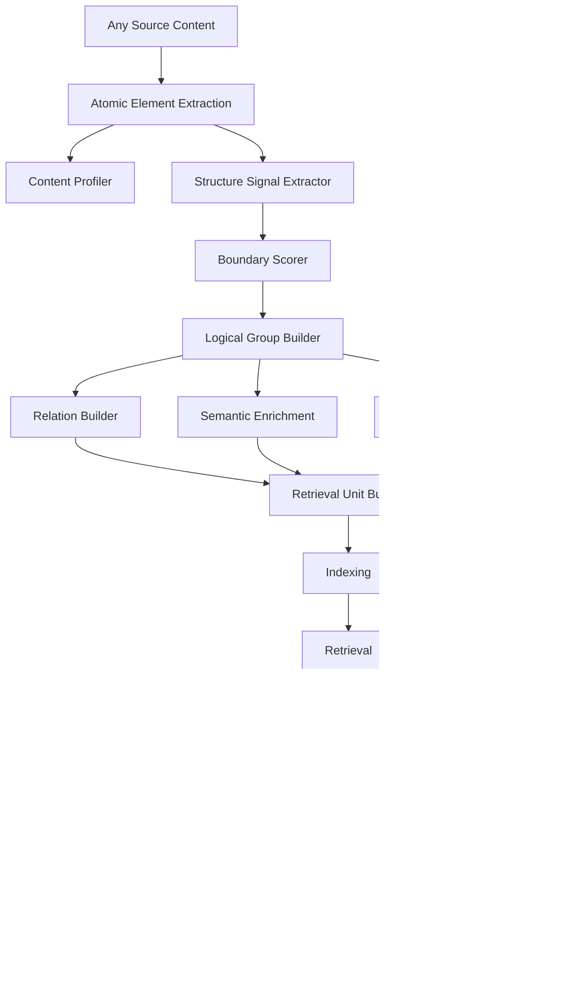
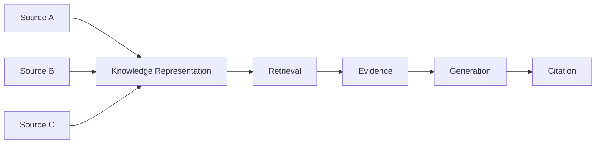
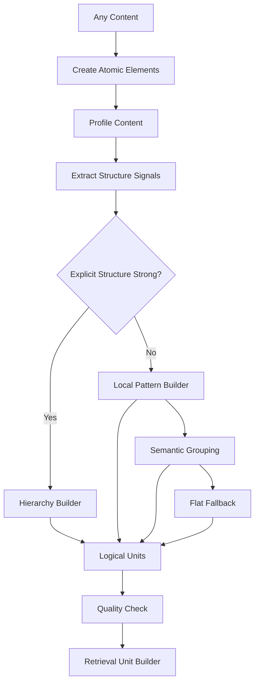
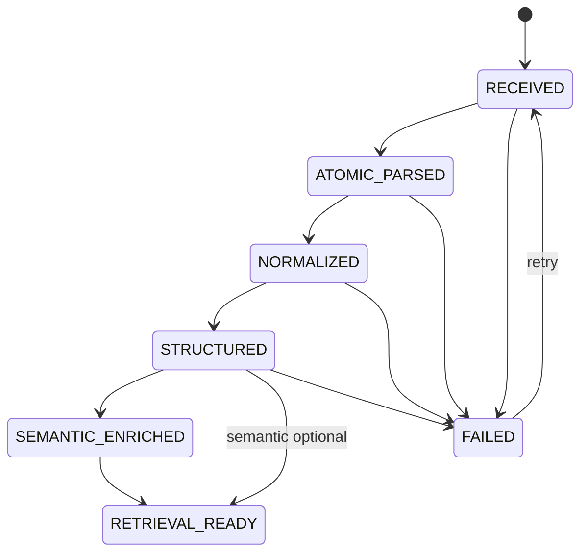
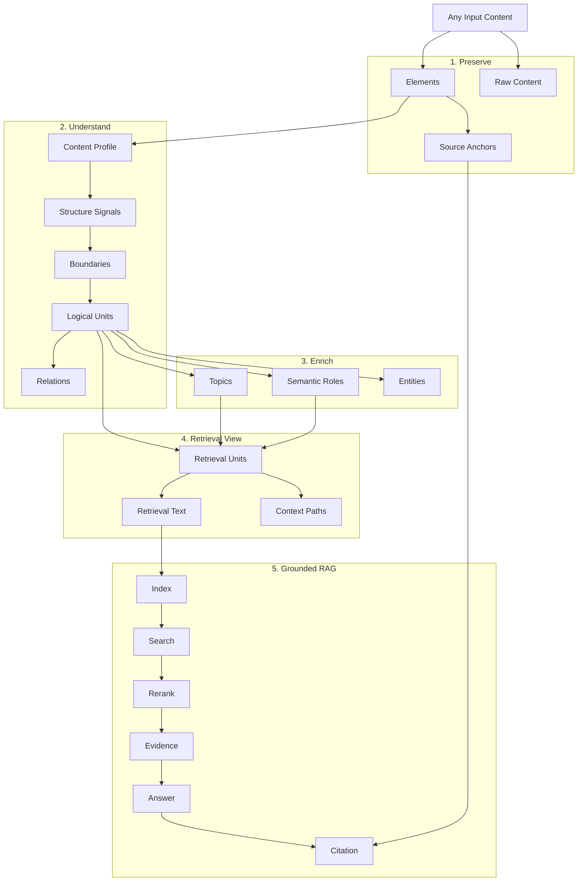

# UNIVERSAL SOURCE UNDERSTANDING & RAG PARSER DESIGN
# AI Study Assistant 2.0

> **Mục tiêu tài liệu:** Thiết kế chi tiết tầng hiểu nguồn dữ liệu (Universal Source Understanding Layer) cho hệ thống RAG của AI Study Assistant 2.0.  
> **Phạm vi:** Chưa phụ thuộc loại file cụ thể. Hệ thống giả định đầu vào cuối cùng là một nguồn nội dung bất kỳ đã được đưa về dạng có thể quan sát được: text, block, table, code, image metadata, vị trí, hoặc các tín hiệu cấu trúc khác.  
> **Triết lý cốt lõi:** Không giả định tài liệu có `Chapter → Section → Paragraph`. Mọi nguồn đều được mô hình hóa theo `Element → LogicalUnit → RetrievalUnit → Evidence → Citation`.

---

# 1. Bài toán cần giải quyết

Một hệ thống RAG thực tế không thể giả định đầu vào luôn là:

```text
Book
└── Chapter
    └── Section
        └── Paragraph
```

Nguồn người dùng có thể là:

```text
- giáo trình;
- paper;
- ghi chú cá nhân;
- meeting note;
- FAQ;
- hợp đồng;
- đề thi;
- log;
- chat transcript;
- source code;
- text dump;
- bảng dữ liệu;
- transcript;
- tài liệu copy từ nhiều nguồn;
- nội dung có heading nhưng không theo chapter;
- nội dung hoàn toàn phẳng;
- nội dung có nhiều loại cấu trúc trộn lẫn.
```

Do đó hệ thống phải trả lời được câu hỏi:

> Với một nguồn nội dung bất kỳ, làm thế nào để giữ được nhiều thông tin nhất, hiểu được cấu trúc nếu có, không bịa cấu trúc nếu không có, và tạo ra các đơn vị retrieval tốt cho RAG?

---

# 2. Sai lầm kiến trúc cần tránh

Không xây parser như sau:

```text
Input
  ↓
Extract text
  ↓
Find Chapter
  ↓
Find Section
  ↓
Chunk 600 tokens
```

Vì:

```text
- không phải tài liệu nào cũng có chapter;
- nhiều tài liệu chỉ có local structure;
- một file có thể chứa nhiều loại nội dung;
- bảng/code/FAQ/chat/log không phù hợp paragraph chunking;
- semantic group có thể tồn tại dù không có heading;
- một tài liệu lộn xộn vẫn phải được chấp nhận;
- structure không chắc chắn phải được biểu diễn bằng confidence chứ không được ép thành fact.
```

---

# 3. Triết lý thiết kế

## 3.1. Element-first

Đơn vị cơ bản của hệ thống là `Element`, không phải `Chapter`.

```text
Document
  ↓
Elements
  ↓
Logical Units
  ↓
Retrieval Units
```

## 3.2. Structure is optional

Tài liệu hoàn toàn phẳng vẫn là tài liệu hợp lệ.

```text
structure = FLAT
```

không phải lỗi.

## 3.3. Unknown is valid

Các trạng thái sau là hợp lệ:

```text
UNKNOWN_STRUCTURE
UNKNOWN_TOPIC
UNKNOWN_RELATION
LOW_CONFIDENCE
UNCLASSIFIED
```

## 3.4. Source fact và inferred structure phải tách biệt

Ví dụ tài liệu thực sự có:

```text
5.2 LEFT JOIN
```

thì:

```text
source = EXPLICIT
```

Nếu AI suy ra nhóm nội dung nói về LEFT JOIN:

```text
source = INFERRED
```

Không trộn hai loại.

## 3.5. Không flatten quá sớm

Không chuyển toàn bộ tài liệu thành một string Markdown rồi bỏ representation giàu thông tin.

Master representation phải giữ:

```text
raw text
normalized text
order
location
style
element type
relations
groups
confidence
provenance
```

---

# 4. Kiến trúc tổng thể



---

# 5. Các tầng information

Hệ thống lưu ba lớp thông tin riêng biệt.

## 5.1. Source Information

Những gì thực sự tồn tại trong nguồn.

Ví dụ:

```text
- text;
- heading;
- line;
- table;
- code;
- caption;
- list;
- speaker label;
- timestamp;
- coordinates;
- style;
- separator.
```

## 5.2. Inferred Structure

Cấu trúc hệ thống suy ra.

Ví dụ:

```text
- topic group;
- logical section;
- conversation topic;
- subdocument boundary;
- continuation;
- Q&A pair.
```

## 5.3. Semantic Enrichment

Ý nghĩa bổ sung.

Ví dụ:

```text
- topic;
- concept;
- definition;
- example;
- warning;
- exercise;
- answer;
- prerequisite.
```

Luôn phân biệt:

```text
EXPLICIT
INFERRED
DERIVED
```

---

# 6. CanonicalDocument

Core schema:

```text
CanonicalDocument
│
├── metadata
├── elements[]
├── logical_units[]
├── context_nodes[]
├── relations[]
├── semantic_annotations[]
├── assets[]
├── subdocuments[]
└── quality
```

Không bắt buộc:

```text
chapters[]
sections[]
```

---

# 7. Document schema

```json
{
  "document_id": "doc_001",

  "metadata": {
    "title": null,
    "language": "vi",
    "source_name": "unknown",
    "created_at": null
  },

  "structure": {
    "mode": "GROUPED",
    "confidence": 0.72
  },

  "elements": [],
  "logical_units": [],
  "context_nodes": [],
  "relations": [],
  "semantic_annotations": [],
  "assets": [],
  "subdocuments": [],

  "quality": {}
}
```

---

# 8. Structure Mode

Chia thành 4 mức.

## 8.1. FLAT

Không có structure đủ tin cậy.

```text
E1
E2
E3
...
```

## 8.2. LOCAL

Nhận diện được local pattern:

```text
paragraph
list
Q&A
code
table
dialogue
```

nhưng không có hierarchy toàn tài liệu.

## 8.3. GROUPED

Có thể tạo các group logic:

```text
Topic A
Topic B
Topic C
```

nhưng không chắc đây là hierarchy.

## 8.4. HIERARCHICAL

Có cấu trúc nhiều cấp đủ rõ:

```text
Level 1
 └ Level 2
    └ Level 3
```

---

# 9. Element — đơn vị nguyên tử

```python
class Element:
    id: str

    type: ElementType

    order: int

    raw_text: str | None
    normalized_text: str | None

    location: SourceLocation | None

    style: StyleInfo | None

    attributes: dict

    confidence: ElementConfidence

    provenance: Provenance
```

---

# 10. ElementType

Không giới hạn vào paragraph.

```text
TITLE
HEADING

PARAGRAPH
SENTENCE
LINE

LIST
LIST_ITEM

TABLE
TABLE_ROW
TABLE_CELL

CODE
FORMULA

QUESTION
ANSWER

DIALOGUE_TURN

LOG_ENTRY

KEY_VALUE

FIGURE
CHART
CAPTION

FOOTNOTE

SEPARATOR

HEADER
FOOTER

UNKNOWN
```

---

# 11. SourceLocation

Nếu nguồn có location:

```json
{
  "page": 17,
  "bbox": [72, 140, 514, 225],
  "start_char": null,
  "end_char": null
}
```

Nếu chỉ text:

```json
{
  "page": null,
  "bbox": null,
  "start_char": 200,
  "end_char": 350
}
```

Location là optional.

---

# 12. Raw và normalized text

Luôn lưu cả hai nếu có transformation.

Ví dụ:

```text
raw:
multi-
processing

normalized:
multiprocessing
```

Không overwrite raw.

---

# 13. Provenance

```json
{
  "source": "original",
  "extractor": "parser_name",
  "extractor_version": "v1",
  "transformation": [],
  "confidence": 0.96
}
```

Nếu element do semantic inference sinh:

```json
{
  "source": "inferred",
  "extractor": "semantic_grouping_v1",
  "confidence": 0.78
}
```

---

# 14. Element confidence

```json
{
  "overall": 0.93,
  "text": 0.98,
  "type": 0.92,
  "order": 0.95,
  "location": 1.0
}
```

Không bắt buộc mọi parser phải cung cấp đầy đủ.

---

# 15. LogicalUnit

`LogicalUnit` là đơn vị nội dung có ý nghĩa.

Nó khác Element.

Ví dụ:

```text
Question + Answer
```

là hai Element nhưng một LogicalUnit.

Schema:

```python
class LogicalUnit:
    id: str

    type: LogicalUnitType

    element_ids: list[str]

    context_node_ids: list[str]

    label: str | None

    source: StructureSource

    confidence: float

    metadata: dict
```

---

# 16. LogicalUnitType

```text
TEXT_BLOCK

SECTION
TOPIC_GROUP

QA_PAIR

DIALOGUE_SEGMENT

PROCEDURE

DEFINITION_BLOCK

EXAMPLE_BLOCK

EXERCISE_BLOCK

CODE_BLOCK

TABLE_BLOCK

LOG_WINDOW

KEY_VALUE_GROUP

LIST_GROUP

SUBDOCUMENT

UNKNOWN_GROUP
```

---

# 17. ContextNode

Không dùng field cứng `chapter` và `section`.

Dùng:

```python
class ContextNode:
    id: str
    type: str
    label: str
    level: int | None

    source: EXPLICIT | INFERRED

    confidence: float

    parent_id: str | None
```

Ví dụ textbook:

```json
[
  {
    "type": "CHAPTER",
    "label": "SQL",
    "level": 1
  },
  {
    "type": "SECTION",
    "label": "JOIN",
    "level": 2
  },
  {
    "type": "SUBSECTION",
    "label": "LEFT JOIN",
    "level": 3
  }
]
```

Meeting:

```json
[
  {
    "type": "MEETING",
    "label": "Sprint Review"
  },
  {
    "type": "TOPIC",
    "label": "Redis Incident"
  }
]
```

Raw dump:

```json
[]
```

---

# 18. Relation

```python
class Relation:
    id: str

    type: RelationType

    source_id: str
    target_id: str

    confidence: float

    source: EXPLICIT | INFERRED | DERIVED
```

---

# 19. RelationType

```text
NEXT

PREVIOUS

PARENT_OF

CHILD_OF

CONTINUES

QUESTION_ANSWER

CAPTION_OF

FOOTNOTE_OF

EXPLAINS

REFERS_TO

SAME_TOPIC

PREREQUISITE_OF

PART_OF

SEQUENCE_BEFORE
```

---

# 20. Content Profiler

Không cố gán một `document_type` duy nhất.

Profiler trả về tỷ lệ/phân bố.

Ví dụ:

```json
{
  "content_profile": {
    "narrative": 0.35,
    "list": 0.20,
    "dialogue": 0.15,
    "code": 0.10,
    "table": 0.10,
    "qa": 0.10
  },

  "signals": {
    "heading_count": 3,
    "list_count": 4,
    "speaker_turn_count": 12,
    "table_count": 2
  }
}
```

---

# 21. Tại sao không dùng một document type?

Một source có thể:

```text
30% narrative
20% table
20% source code
20% Q&A
10% notes
```

Do đó routing nên theo region/logical unit.

Không:

```text
document_type=BOOK
→ parse all as book
```

---

# 22. Content region

Có thể tạo:

```python
class ContentRegion:
    id: str

    element_ids: list[str]

    profile: dict

    dominant_type: str | None

    confidence: float
```

Ví dụ:

```text
Region 1 → narrative
Region 2 → table
Region 3 → code
Region 4 → FAQ
```

---

# 23. Structure Signals

Hệ thống tìm signal chứ không tìm Chapter.

Các nhóm signal:

```text
- typography/style;
- numbering;
- lexical markers;
- whitespace/separators;
- indentation;
- semantic similarity;
- entity/topic continuity;
- content type change;
- speaker change;
- timestamp pattern;
- Q/A marker;
- table boundary;
- code boundary;
- list continuity.
```

---

# 24. Explicit structure signals

Ví dụ:

```text
1.
1.1
1.1.1

Chapter
Section
Part
Điều
Khoản
Mục
Question
Answer
Q:
A:
TODO:
Summary:
```

Nhưng không hard-code logic vào tiếng Anh duy nhất.

---

# 25. Style signal

Nếu có style:

```text
font size
bold
indentation
spacing
alignment
```

sử dụng làm structural evidence.

Ví dụ:

```text
large + bold + isolated
→ heading_candidate
```

---

# 26. Semantic signal

Tính semantic similarity giữa các element gần nhau.

Ví dụ:

```text
sim(E1,E2) = 0.91
sim(E2,E3) = 0.89
sim(E3,E4) = 0.25
```

E3→E4 có thể là semantic boundary.

Nhưng semantic signal không được thắng explicit structure.

---

# 27. Boundary Score

Giữa hai Element liên tiếp:

```text
E_i
E_{i+1}
```

tính:

```text
BoundaryScore(i)
```

Một baseline:

```text
B =
w_explicit * explicit_signal
+
w_style * style_change
+
w_type * content_type_change
+
w_semantic * semantic_change
+
w_separator * separator_signal
+
w_pattern * pattern_change
```

Các weight config.

---

# 28. Boundary classes

```text
HARD
SOFT
NONE
UNKNOWN
```

## HARD

Không merge qua nếu không có lý do đặc biệt.

Ví dụ:

```text
explicit heading
table boundary
code boundary
different FAQ item
subdocument separator
```

## SOFT

Có thể merge.

Ví dụ:

```text
paragraph break
minor topic change
blank line
```

---

# 29. Priority khi conflict

```text
Explicit structure
    >
Content-type integrity
    >
Strong local pattern
    >
Semantic boundary
    >
Token target
```

Ví dụ INNER JOIN và LEFT JOIN semantic gần nhau nhưng nếu có hai heading explicit khác nhau thì không merge bừa.

---

# 30. Logical Group Builder

Input:

```text
Elements
+
Boundary scores
+
Content profile
+
Relations
```

Output:

```text
LogicalUnits
```

---

# 31. Grouping strategies

Không dùng một strategy cho tất cả.

```text
Hierarchical grouping

Local-pattern grouping

Semantic grouping

Conversation grouping

Q&A grouping

Table grouping

Code grouping

Log window grouping

Fallback flat grouping
```

---

# 32. Hierarchical grouping

Nếu heading/numbering mạnh:

```text
H1
 └ H2
    └ content
```

Group builder tạo ContextNodes.

---

# 33. Topic grouping

Nếu không heading nhưng semantic cluster rõ:

```text
Paragraph 1
Paragraph 2
Paragraph 3

→ Topic A
```

Label có thể suy ra bằng keyword extraction/LLM.

Bắt buộc:

```text
source = INFERRED
confidence < 1
```

---

# 34. Không được hallucinate structure

Nếu grouping confidence thấp:

```text
không tạo hierarchy giả.
```

Ví dụ:

```json
{
  "structure": {
    "mode": "FLAT",
    "confidence": 0.18
  }
}
```

là kết quả tốt hơn việc bịa chapter.

---

# 35. FAQ pattern

Input:

```text
Q: Làm sao đổi mật khẩu?
A: Vào Settings...

Q: Có hỗ trợ PDF không?
A: Có...
```

Elements:

```text
QUESTION
ANSWER
QUESTION
ANSWER
```

Relations:

```text
Q1 QUESTION_ANSWER A1
Q2 QUESTION_ANSWER A2
```

LogicalUnits:

```text
QA_PAIR 1
QA_PAIR 2
```

Retrieval:

```text
1 QA_PAIR = 1 RetrievalUnit
```

nếu đủ nhỏ.

---

# 36. Chat transcript

Input:

```text
Nam: deploy chưa?
An: rồi nhưng Redis timeout.
Nam: lỗi từ đâu?
An: cache server.
```

Element:

```text
DIALOGUE_TURN
```

Attributes:

```json
{
  "speaker": "Nam"
}
```

Grouping:

```text
conversation window
+
topic segmentation
```

---

# 37. Meeting notes

Meeting note có thể chứa:

```text
title
attendees
dialogue
bullets
TODO
decision
code
```

Không ép thành section hierarchy.

Semantic enrichment có thể nhận:

```text
DECISION
ACTION_ITEM
ISSUE
OWNER
DEADLINE
```

nhưng đây là optional enrichment.

---

# 38. Log

Element:

```python
LogEntry:
    timestamp
    severity
    component
    message
```

RetrievalUnit có thể theo:

```text
same incident
same time window
same component
```

Không theo 600 token.

---

# 39. Source code

Code giữ:

```text
indentation
line breaks
symbols
language
line numbers nếu có
```

LogicalUnit có thể là:

```text
function
class
method
code block
```

Không nối với paragraph tùy tiện.

---

# 40. Contract/legal text

Không cần khái niệm Chapter.

Ví dụ:

```text
Điều
Khoản
Điểm
```

được chuyển thành ContextNode generic theo level.

```text
level 1
level 2
level 3
```

Label gốc vẫn giữ nguyên.

---

# 41. Exam / worksheet

Elements:

```text
QUESTION
CHOICE
ANSWER
EXPLANATION
```

LogicalUnit:

```text
QUESTION_GROUP
```

Sau này Study Assistant có thể dùng trực tiếp.

---

# 42. Mixed source

Một source có thể:

```text
text
→ code
→ table
→ FAQ
→ text
```

Pipeline route từng region.

Không route toàn file theo một parser semantic duy nhất.

---

# 43. SubDocument

Một file có thể chứa nhiều tài liệu copy-paste.

Schema:

```python
class SubDocument:
    id: str
    element_ids: list[str]

    label: str | None

    source_hint: str | None

    confidence: float

    inferred: bool
```

---

# 44. Subdocument boundary

Signal:

```text
strong separator
new title
source attribution
URL change
massive style change
topic discontinuity
metadata marker
```

Nếu confidence cao, tạo SubDocument.

---

# 45. Cross-boundary safety

RetrievalUnit không nên merge hai SubDocument khác nhau trừ khi query-level aggregation yêu cầu.

---

# 46. Semantic Enrichment

Chỉ chạy sau structural parsing.

Output:

```text
topics
concepts
semantic roles
entities
keywords
learning roles
```

---

# 47. SemanticRole

Đặc biệt hữu ích cho Study Assistant.

```text
DEFINITION
EXAMPLE
THEOREM
PROOF
WARNING
NOTE
EXERCISE
QUESTION
ANSWER
SUMMARY
PROCEDURE
KEY_POINT
LEARNING_OBJECTIVE
```

---

# 48. Semantic annotation schema

```json
{
  "annotation_id": "a1",

  "target_id": "lu23",

  "type": "TOPIC",

  "value": "LEFT JOIN",

  "source": "INFERRED",

  "confidence": 0.87,

  "model_version": "topic_v1"
}
```

---

# 49. Inferred topic không giả làm heading

Sai:

```text
section = LEFT JOIN
```

nếu tài liệu không có section.

Đúng:

```text
inferred_topics = [LEFT JOIN]
```

---

# 50. Explicit Context vs Semantic Context

Một LogicalUnit có:

```text
explicit_context
```

và:

```text
semantic_context
```

riêng.

Ví dụ:

```json
{
  "explicit_context": [
    "Chapter 5",
    "5.2 SQL"
  ],

  "semantic_context": [
    {
      "topic": "LEFT JOIN",
      "confidence": 0.88
    }
  ]
}
```

---

# 51. RetrievalUnit

Đây là đơn vị embedding/search.

Không đồng nhất với Element.

```python
class RetrievalUnit:
    id: str

    document_id: str
    subdocument_id: str | None

    logical_unit_ids: list[str]
    element_ids: list[str]

    retrieval_text: str
    display_text: str

    context_path: list[ContextNodeRef]

    semantic_annotations: list[AnnotationRef]

    source_anchors: list[SourceAnchor]

    unit_type: str

    token_count: int

    quality: float

    version: str
```

---

# 52. Element vs LogicalUnit vs RetrievalUnit

Ví dụ FAQ:

```text
Element:
Question

Element:
Answer

LogicalUnit:
QA_PAIR

RetrievalUnit:
QA_PAIR
```

Ví dụ textbook:

```text
Element:
paragraph 1
paragraph 2
formula

LogicalUnit:
section content

RetrievalUnit:
paragraph 1 + 2 + formula context
```

---

# 53. RetrievalUnit Builder

Không dùng:

```text
RecursiveCharacterTextSplitter(full_markdown)
```

Mà:

```text
CanonicalDocument
 ↓
Logical Units
 ↓
adaptive retrieval builder
```

---

# 54. Adaptive chunking mode

```text
HIERARCHICAL
→ structure-aware

GROUPED
→ group-aware + semantic

LOCAL
→ element-aware + semantic

FLAT
→ paragraph/sentence + semantic
```

---

# 55. HIERARCHICAL chunking

Ưu tiên section boundary.

Ví dụ:

```text
Section A
paragraph
paragraph

Section B
paragraph
```

Không merge A+B chỉ vì thiếu token.

---

# 56. GROUPED chunking

Ví dụ topic groups inferred.

```text
Topic A
  P1
  P2
  P3

Topic B
  P4
```

Giữ nhóm nếu confidence đủ cao.

---

# 57. LOCAL chunking

Ví dụ FAQ:

```text
QA_PAIR
QA_PAIR
```

Mỗi pair là atomic retrieval unit.

Ví dụ code:

```text
FUNCTION
```

là atomic unit.

---

# 58. FLAT chunking

Fallback:

```text
lines/sentences
 ↓
paragraph units
 ↓
semantic boundary
 ↓
token budget
```

Không thất bại chỉ vì không có structure.

---

# 59. Token target không phải hard rule

Ví dụ target:

```text
500–700 tokens
```

Nhưng:

```text
QA pair 160 tokens
```

giữ nguyên.

```text
function 220 tokens
```

giữ nguyên.

```text
table 1000 rows
```

split theo row groups.

---

# 60. Retrieval text khác display text

Ví dụ source:

```text
It returns all rows...
```

Display:

```text
It returns all rows...
```

Retrieval:

```text
Document: Database Systems
Explicit Context: SQL > JOIN
Inferred Topics: LEFT JOIN

It returns all rows...
```

Embedding dùng retrieval_text.

User/citation dùng display/source.

---

# 61. Không đưa inferred metadata quá nhiều vào embedding

Nếu nhét hàng chục inferred topic vào retrieval text:

```text
embedding bị bias.
```

Nên chỉ dùng:

```text
high-confidence topic
explicit context
document title
unit label
```

---

# 62. Retrieval text builder

Pseudo:

```python
def build_retrieval_text(unit):
    parts = []

    if document_title:
        parts.append(document_title)

    if explicit_context:
        parts.append(" > ".join(explicit_context))

    for topic in high_confidence_topics[:3]:
        parts.append(topic.label)

    parts.append(unit.display_text)

    return "\n".join(parts)
```

---

# 63. SourceAnchor

Citation provenance.

```python
class SourceAnchor:
    source_id: str

    page: int | None
    bbox: list[float] | None

    start_char: int | None
    end_char: int | None

    element_id: str
```

---

# 64. Citation chain

```text
Answer claim
 ↓
Evidence ID
 ↓
RetrievalUnit
 ↓
Element IDs
 ↓
SourceAnchor
 ↓
Original Source
```

Không để LLM tự bịa source location.

---

# 65. Evidence

Sau reranking, không gửi raw RetrievalUnit thẳng cho LLM.

Tạo Evidence object:

```python
class Evidence:
    id: str

    retrieval_unit_id: str

    text: str

    source_anchors: list[SourceAnchor]

    retrieval_score: float
    rerank_score: float

    evidence_quality: float
```

---

# 66. Evidence Builder

Xử lý:

```text
duplicate
overlap
adjacent unit
same source
topic diversity
token budget
citation anchor
```

---

# 67. Evidence quality

Có thể gồm:

```text
parse quality
retrieval score
rerank score
source confidence
semantic annotation confidence
```

---

# 68. Source scope

Học một ý quan trọng từ các sản phẩm source-grounded: `Source` là boundary retrieval quan trọng.

Query context:

```python
RetrievalScope:
    user_id
    source_ids[]
    optional_subdocument_ids[]
    optional_topic_filters[]
```

Filter source trước retrieval.

---

# 69. Không search toàn KB nếu user đã chọn nguồn

Query:

```text
selected_sources = [A, B]
```

thì search:

```text
A + B
```

không search C rồi filter sau.

---

# 70. Source selection

Frontend có thể cho:

```text
☑ Source A
☑ Source B
☐ Source C
```

RAG lấy source_ids từ state.

---

# 71. NotebookLM-inspired principle

Tài liệu này lấy cảm hứng ở mức **product behavior công khai**, không suy đoán implementation nội bộ.

Các nguyên tắc đáng học:

```text
- source là boundary rõ;
- user có thể chọn subset nguồn;
- câu trả lời grounded vào source;
- citation quay về vị trí nguồn;
- nhiều loại nguồn khác nhau vẫn được đưa vào cùng notebook;
- source organization có thể được thêm sau ingestion.
```

Không giả định NotebookLM sử dụng schema/chunker/vector DB cụ thể nào.

---

# 72. Source-grounded architecture



---

# 73. One ingestion, many tasks

Không build parser riêng cho Chat/Summary/Quiz.

```text
Source
 ↓
CanonicalDocument
 ↓
Knowledge Representation
        │
        ├ Chat
        ├ Summary
        ├ Quiz
        ├ Flashcard
        ├ Mindmap
        └ Analytics
```

---

# 74. Table as first-class content

Không flatten:

```text
A 90 80 B 92 88
```

Lưu:

```text
Table
 ├ rows
 ├ cells
 ├ header
 ├ colspan
 └ rowspan
```

---

# 75. Table representations

Ba view:

```text
Structured grid
Markdown view
Semantic retrieval view
```

---

# 76. Table retrieval view

Ví dụ:

```text
Table: Model Performance

Columns:
Model | Accuracy | F1

Model A:
Accuracy = 90
F1 = 80

Model B:
Accuracy = 92
F1 = 88
```

---

# 77. Large table chunking

```text
Parent table
 ├ child rows 1–10
 ├ child rows 11–20
 └ ...
```

Mỗi child lặp header.

---

# 78. Formula

Formula element:

```json
{
  "type": "FORMULA",
  "latex": "R(t)=e^{-t/S}",
  "display": true
}
```

Retrieval unit phải include text giải thích xung quanh.

---

# 79. Code

Code element:

```json
{
  "type": "CODE",
  "language": "python",
  "code": "...",
  "line_start": 10,
  "line_end": 32
}
```

Không normalize indentation.

---

# 80. Figure/chart

Text-first stage vẫn giữ:

```text
asset
caption
location
nearby text
```

Sau này vision enrichment thêm description.

Không cần reparse toàn source.

---

# 81. Caption relation

```text
CAPTION_OF
```

phải tồn tại riêng.

---

# 82. Cross-element continuation

Ví dụ paragraph bị tách.

Relation:

```text
E1 CONTINUES E2
```

RAG view có thể merge.

Canonical representation vẫn giữ original.

---

# 83. Header/footer

Không xóa khỏi master.

Đánh dấu:

```text
exclude_from_retrieval=true
```

---

# 84. Repeated content detection

Ví dụ footer lặp 100 trang.

Tính normalized fingerprint.

Nếu cùng text lặp ở phần lớn source:

```text
repeated=true
```

Retriever loại mặc định.

---

# 85. Table of contents

TOC hữu ích làm hierarchy signal.

Nhưng thường:

```text
exclude_from_retrieval=true
```

trừ query đặc biệt.

---

# 86. Content deduplication

Hai block giống nhau:

```text
near_duplicate_score > threshold
```

đánh dấu relation:

```text
DUPLICATE_OF
```

Không nhất thiết delete.

---

# 87. Quality system

Mỗi stage cần quality.

```text
element_quality
structure_quality
group_quality
retrieval_unit_quality
```

---

# 88. Structure quality

```json
{
  "mode": "GROUPED",

  "confidence": 0.72,

  "signals": {
    "explicit_structure": 0.20,
    "local_pattern": 0.71,
    "semantic_coherence": 0.83
  }
}
```

---

# 89. Parse quality

Ví dụ:

```json
{
  "text_quality": 0.98,
  "order_quality": 0.93,
  "structure_quality": 0.71,
  "duplicate_ratio": 0.04,
  "garbage_ratio": 0.01,
  "overall": 0.90
}
```

---

# 90. Quality fallback

Nếu structure confidence thấp:

```text
không bắt buộc chạy parser nặng hơn.
```

Có thể fallback đơn giản:

```text
FLAT semantic chunking
```

Mục tiêu là không phá source.

---

# 91. Universal processing strategy



---

# 92. Decision logic

Pseudo:

```python
if explicit_structure_score >= STRONG:
    mode = HIERARCHICAL

elif local_pattern_score >= STRONG:
    mode = LOCAL

elif semantic_group_score >= STRONG:
    mode = GROUPED

else:
    mode = FLAT
```

Nhưng có thể mixed mode theo region.

---

# 93. Region-specific mode

Một document:

```text
Region 1 = HIERARCHICAL
Region 2 = TABLE
Region 3 = CODE
Region 4 = FLAT
```

Không cần một mode duy nhất cho toàn source.

---

# 94. Mixed structural graph

CanonicalDocument cho phép:

```text
Document
├ TopicGroup
│ ├ paragraph
│ └ paragraph
│
├ QA_PAIR
│
├ TABLE_BLOCK
│
└ FLAT_TEXT_BLOCK
```

---

# 95. Parser stages

Đề xuất pipeline 7 stage:

```text
Stage 1 — Atomic extraction
Stage 2 — Normalization
Stage 3 — Content profiling
Stage 4 — Structural inference
Stage 5 — Logical unit construction
Stage 6 — Semantic enrichment
Stage 7 — Retrieval-unit construction
```

---

# 96. Stage 1 — Atomic extraction

Mục tiêu:

```text
không cố hiểu quá nhiều.
```

Chỉ lấy:

```text
element boundaries
order
raw text
type hints
location
style
attributes
```

---

# 97. Stage 2 — Normalization

Các transformation:

```text
Unicode normalization
whitespace normalization
broken-line repair
hyphen repair
line ending
```

Không làm:

```text
semantic rewriting
```

---

# 98. Normalization audit

Mỗi transform có thể log:

```json
{
  "operation": "DEHYPHENATE",
  "before": "multi-\nprocessing",
  "after": "multiprocessing"
}
```

Không nhất thiết lưu tất cả trong production, nhưng nên hỗ trợ debug.

---

# 99. Stage 3 — Content profiling

Tính:

```text
element distribution
pattern distribution
structure hints
semantic variability
```

---

# 100. Stage 4 — Structural inference

Tạo:

```text
boundaries
groups
relations
context nodes
subdocuments
```

---

# 101. Stage 5 — Logical units

Dùng structure + local pattern.

Không để LLM trực tiếp tạo toàn document JSON nếu không cần.

---

# 102. Stage 6 — Semantic enrichment

Chạy async được.

Không block ingestion cơ bản.

Ví dụ:

```text
topic extraction
semantic roles
entity extraction
```

---

# 103. Stage 7 — Retrieval Unit

Tạo indexable views.

---

# 104. Không để LLM quyết định mọi thứ

Base pipeline:

```text
rules
+
patterns
+
layout
+
embedding similarity
```

LLM chỉ dùng:

```text
ambiguous grouping
topic naming
semantic role
complex structure fallback
```

---

# 105. LLM structural fallback

Nếu dùng:

Input chỉ một region nhỏ.

Không gửi 500 trang vào LLM.

Output structured:

```json
{
  "groups": [
    {
      "element_ids": ["e1", "e2"],
      "label": "Redis Cache",
      "confidence": 0.8
    }
  ]
}
```

Sau đó validate.

---

# 106. Semantic grouping

Có thể dùng paragraph embeddings.

Pipeline:

```text
element embeddings
 ↓
adjacent similarity
 ↓
boundary detection
 ↓
candidate groups
```

Không dùng global clustering mặc định vì có thể phá reading order.

---

# 107. Adjacent-first grouping

Ưu tiên contiguous groups:

```text
E1,E2,E3
```

không group:

```text
E1,E50,E200
```

trong structure layer.

Non-contiguous relation có thể là semantic annotation.

---

# 108. Topic relation

Hai units ở xa có cùng topic:

```text
SAME_TOPIC
```

nhưng không merge physical structure.

---

# 109. Retrieval index representations

Có thể index nhiều vector view.

MVP:

```text
content_vector
```

Advanced:

```text
content_vector
context_vector
title_vector
```

Nhưng không cần ngay.

---

# 110. Retrieval payload

```json
{
  "retrieval_unit_id": "ru_1",

  "user_id": "u1",
  "source_id": "s1",

  "subdocument_id": null,

  "unit_type": "QA_PAIR",

  "explicit_context": [],

  "semantic_topics": [
    "authentication"
  ],

  "quality": 0.93,

  "version": "ru_v1"
}
```

---

# 111. Index source identity

Mỗi vector bắt buộc có:

```text
user_id
source_id
retrieval_unit_id
```

---

# 112. Versioning

```text
canonical_schema_version
normalizer_version
structure_version
semantic_version
retrieval_unit_version
embedding_version
```

---

# 113. Reprocessing

Khi đổi chunking:

```text
không cần parse lại source
```

nếu CanonicalDocument còn đủ information.

Pipeline:

```text
CanonicalDocument
 ↓
new RetrievalUnitBuilder
 ↓
reindex
```

Đây là lợi ích lớn của master representation.

---

# 114. Khi đổi semantic enrichment

Tương tự:

```text
CanonicalDocument
 ↓
new semantic annotations
 ↓
new retrieval view
```

---

# 115. Storage layers

Đề xuất:

```text
Source Store

Canonical Document Store

Retrieval Metadata DB

Vector Index

Asset Store
```

---

# 116. Canonical storage

JSON/JSONB hoặc object storage.

Ví dụ:

```text
canonical/{source_id}/v1.json
```

---

# 117. Relational metadata

PostgreSQL lưu:

```text
source
processing status
version
quality
retrieval unit metadata
```

Không nhất thiết lưu toàn canonical JSON trong một row lớn.

---

# 118. Retrieval pipeline

```text
Query
 ↓
Source Scope
 ↓
Query Processing
 ↓
Dense/Sparse Retrieval
 ↓
Reranking
 ↓
Evidence Builder
 ↓
Confidence Gate
 ↓
Generation
 ↓
Citation Resolver
```

---

# 119. Query type awareness

Query analyzer nhận:

```text
definition
comparison
procedure
exact keyword
code
table lookup
question about conversation
```

Có thể dùng metadata để điều chỉnh retrieval.

---

# 120. Query về table

Nếu query:

```text
Model B F1 là bao nhiêu?
```

ưu tiên:

```text
unit_type=TABLE
```

nhưng không hard filter nếu confidence query thấp.

---

# 121. Query về code

Exact token search/BM25 quan trọng.

Ví dụ:

```text
@Transactional
HashMap
```

Hybrid retrieval.

---

# 122. Evidence diversity

Nếu comparison:

```text
A vs B
```

Context builder cố lấy evidence cho cả A và B.

Không lấy 5 chunk đều về A.

---

# 123. Evidence trace

Mỗi answer trace:

```json
{
  "query": "...",

  "retrieved": [
    {
      "ru": "ru1",
      "score": 0.81
    }
  ],

  "reranked": [],

  "selected_evidence": [],

  "answer_citations": []
}
```

---

# 124. Debug UI

Đồ án nên có internal page:

```text
Query
 ↓
Top 20 retrieval
 ↓
Rerank
 ↓
Selected evidence
 ↓
Answer
```

Cực hữu ích khi bảo vệ.

---

# 125. Parser debug UI

Cho một source:

```text
Original
|
Canonical Elements
|
Logical Units
|
Retrieval Units
```

Click từng unit xem source anchor.

---

# 126. Evaluation: parser không chỉ đo text extraction

Đánh giá:

```text
element retention
structure quality
logical grouping
retrieval quality
citation quality
```

---

# 127. Evaluation dataset

Tạo source collection gồm:

```text
textbook
paper
FAQ
meeting note
chat
log
code
legal text
exam
mixed text
flat text dump
multi-source paste
```

---

# 128. Structural gold

Với một subset nhỏ, annotate:

```text
element boundaries
logical groups
Q&A relations
subdocument boundaries
```

Không cần annotate 1000 source.

---

# 129. Downstream evaluation quan trọng hơn

So sánh:

```text
Plain fixed chunk
vs
Element-aware
vs
Logical-unit-aware
vs
Logical + semantic
```

Đo:

```text
Recall@5
MRR
Citation Accuracy
Answer Correctness
```

---

# 130. Experiment A — Fixed vs adaptive chunking

```text
A:
600-token fixed chunk

B:
element-aware chunk

C:
adaptive LogicalUnit
```

---

# 131. Experiment B — inferred context

```text
without semantic topic metadata
vs
with high-confidence topic metadata
```

Đo retrieval.

---

# 132. Experiment C — source structure preservation

```text
flattened markdown
vs
canonical structure
```

---

# 133. Experiment D — mixed source

Đặc biệt test:

```text
narrative + table + code
```

xem adaptive units có cải thiện.

---

# 134. No-structure test

Tạo file phẳng.

Mục tiêu:

```text
system không crash
không hallucinate hierarchy
retrieval vẫn đạt baseline
```

---

# 135. Structure hallucination metric

Có thể tạo:

```text
False Inferred Hierarchy Rate
```

Ví dụ:

```text
source không có hierarchy
system tạo hierarchy confidence cao
```

là lỗi.

---

# 136. Group confidence calibration

Nếu confidence 0.9 thì expected grouping accuracy phải cao hơn confidence 0.6.

Có thể evaluate calibration đơn giản.

---

# 137. Parser invariants

Test:

```text
all original text traceable
all retrieval units traceable
no orphan citation
no cyclic hierarchy
element order stable
source fact never overwritten by inferred metadata
```

---

# 138. Citation invariants

```text
citation.source_id exists
citation.element_id exists
source anchor resolvable
LLM cannot invent unknown source id
```

---

# 139. Security

Source scope luôn filter theo user.

Không bao giờ:

```text
retrieve global
→ filter after
```

---

# 140. Prompt injection

Source content là untrusted.

Element:

```text
Ignore all previous instructions...
```

vẫn chỉ là content.

Không execute.

---

# 141. Data isolation

Payload:

```text
user_id
tenant_id optional
source_acl
```

Filter ở vector query.

---

# 142. Failure modes

## No elements

Return:

```text
EMPTY_SOURCE
```

## Garbage source

```text
LOW_QUALITY_SOURCE
```

## Flat source

Không lỗi:

```text
structure=FLAT
```

## Semantic grouping fail

Fallback local/flat.

---

# 143. Observability

Log:

```text
source_id
element_count
logical_unit_count
retrieval_unit_count
structure_mode
structure_confidence
processing_time
semantic_time
quality
```

---

# 144. Processing states

```text
RECEIVED

ATOMIC_PARSED

NORMALIZED

STRUCTURED

SEMANTIC_ENRICHED

RETRIEVAL_READY

FAILED
```

---

# 145. State diagram



---

# 146. Semantic enrichment async

MVP có thể:

```text
STRUCTURED
 ↓
RETRIEVAL_READY
```

sau đó enrichment chạy nền.

Khi xong:

```text
rebuild retrieval metadata
```

---

# 147. Không block RAG vì topic inference

Nếu topic model fail:

```text
RAG vẫn chạy bằng source content.
```

---

# 148. Minimal viable parser

P0:

```text
Element
order
raw/normalized text
local type
basic boundary
LogicalUnit
adaptive RetrievalUnit
source anchor
quality
```

---

# 149. P1

```text
semantic grouping
topic annotations
Q&A detection
subdocuments
table/code special units
```

---

# 150. P2

```text
advanced structure inference
entity graph
learning-role extraction
vision enrichment
knowledge graph
```

---

# 151. Module layout

```text
source_understanding/
│
├── schemas/
│   ├── document.py
│   ├── element.py
│   ├── logical_unit.py
│   ├── relation.py
│   ├── context.py
│   └── retrieval_unit.py
│
├── atomic/
│   ├── extractor.py
│   └── normalizer.py
│
├── profiling/
│   └── content_profiler.py
│
├── structure/
│   ├── signals.py
│   ├── boundary.py
│   ├── hierarchy.py
│   ├── grouping.py
│   ├── qa.py
│   ├── dialogue.py
│   ├── log.py
│   └── subdocument.py
│
├── relations/
│   └── builder.py
│
├── semantics/
│   ├── topics.py
│   ├── roles.py
│   └── entities.py
│
├── retrieval_units/
│   ├── builder.py
│   ├── text_view.py
│   ├── table_view.py
│   ├── code_view.py
│   └── validators.py
│
├── quality/
│   ├── structure.py
│   ├── source.py
│   └── diagnostics.py
│
└── pipeline.py
```

---

# 152. Source Understanding Pipeline API

```python
class SourceUnderstandingPipeline:

    def process(
        self,
        source_id: str,
        raw_elements: list[RawElement],
    ) -> CanonicalDocument:

        elements = self.atomic.normalize(raw_elements)

        profile = self.profiler.analyze(elements)

        signals = self.structure_signals.extract(
            elements,
            profile,
        )

        boundaries = self.boundary_scorer.score(
            elements,
            signals,
        )

        logical_units = self.group_builder.build(
            elements,
            boundaries,
            profile,
        )

        relations = self.relation_builder.build(
            elements,
            logical_units,
        )

        structure_quality = self.quality.evaluate_structure(
            elements,
            logical_units,
            relations,
        )

        canonical = CanonicalDocument(
            source_id=source_id,
            elements=elements,
            logical_units=logical_units,
            relations=relations,
            quality=structure_quality,
        )

        return canonical
```

---

# 153. Semantic pipeline

```python
def enrich(document):

    annotations = []

    annotations += topic_extractor(document)
    annotations += semantic_role_extractor(document)

    return document.with_annotations(annotations)
```

---

# 154. RetrievalUnit builder pseudo

```python
def build_units(document):

    mode = document.structure.mode

    if mode == HIERARCHICAL:
        units = build_hierarchical(document)

    elif mode == GROUPED:
        units = build_group_aware(document)

    elif mode == LOCAL:
        units = build_local_units(document)

    else:
        units = build_flat_semantic(document)

    units = validate_token_budget(units)

    units = attach_source_anchors(units)

    units = build_retrieval_views(units)

    return units
```

---

# 155. Mixed region override

```python
for region in document.regions:

    if region.type == "FAQ":
        build_qa_units()

    elif region.type == "CODE":
        build_code_units()

    elif region.type == "TABLE":
        build_table_units()

    else:
        build_text_units()
```

---

# 156. RetrievalUnit quality validation

Reject/fix nếu:

```text
empty text
too much garbage
no source anchor when anchor available
cross-subdocument contamination
broken QA pair
table row without header context
```

---

# 157. Retrieval Unit parent-child

Advanced:

```text
LogicalGroup Parent
       │
       ├ child retrieval unit
       ├ child retrieval unit
       └ ...
```

Retrieve child, expand parent khi cần.

---

# 158. Parent-child không phụ thuộc Chapter

Parent có thể là:

```text
meeting topic
FAQ category
table
conversation segment
section
semantic topic group
```

---

# 159. Content graph

CanonicalDocument có thể được xem như graph:

```text
nodes:
Element
LogicalUnit
ContextNode
Annotation

edges:
relations
membership
```

Không cần dùng graph DB ở MVP.

---

# 160. Why graph-like model matters

Vì không phải mọi structure là tree.

Ví dụ:

```text
paragraph
 ├ belongs to Topic A
 ├ references Figure 2
 └ explains Formula 1
```

Tree không biểu diễn đẹp.

---

# 161. Storage có thể vẫn đơn giản

Không cần Neo4j.

Có thể JSON + PostgreSQL.

Graph là conceptual model.

---

# 162. Notebook-level organization

Nhiều sources:

```text
Notebook
 ├ Source A
 ├ Source B
 └ Source C
```

Semantic layer có thể tạo cross-source topics:

```text
Topic X
 ├ unit from A
 ├ unit from B
 └ unit from C
```

---

# 163. Cross-source topic không thay source ownership

Mỗi unit vẫn thuộc source gốc.

---

# 164. Cross-source retrieval

Query có scope nhiều source.

Retriever search tất cả selected sources.

Reranker quyết định evidence.

---

# 165. Source summary

Auto summary có thể dùng RetrievalUnits/LogicalUnits.

Không cần parse riêng.

---

# 166. Quiz generation

Query:

```text
generate quiz from Source A
```

Pipeline:

```text
select representative logical units
 ↓
retrieve source evidence
 ↓
generate grounded questions
```

---

# 167. Mindmap

Có thể dùng:

```text
ContextNodes
+
inferred topics
+
relations
```

Không cần source phải có chapter.

---

# 168. Student Analytics integration

Sau này:

```text
LearningEvent
→ linked to RetrievalUnit
→ semantic topic
→ UserTopicMastery
```

Đây là lý do semantic annotation rất quan trọng cho Study Assistant.

---

# 169. Topic identity

Không nên dùng raw string làm ID lâu dài.

Ví dụ:

```text
LEFT JOIN
left outer join
SQL left join
```

có thể normalize semantic layer.

Nhưng source text không đổi.

---

# 170. Topic normalization

```text
mention
 ↓
candidate canonical topic
 ↓
confidence
```

Optional ở P1/P2.

---

# 171. Learning role

Source bất kỳ có thể chứa:

```text
definition
example
exercise
warning
```

Role này giúp:

```text
"cho tôi bài tập"
```

retrieval filter tốt hơn.

---

# 172. Retrieval policy by task

Chat:

```text
most relevant evidence
```

Quiz:

```text
groundable concept + sufficient evidence
```

Summary:

```text
coverage/diversity
```

Mindmap:

```text
topic/hierarchy coverage
```

Cùng source representation, policy khác.

---

# 173. Không tạo một index riêng cho mọi task ngay

MVP dùng cùng RetrievalUnits.

Task-specific ranking sau.

---

# 174. Parser benchmark corpus

Đề xuất 12 nhóm:

```text
1 textbook
2 paper
3 FAQ
4 notes
5 meeting
6 chat
7 log
8 code-heavy
9 table-heavy
10 legal
11 exam
12 flat/mixed dump
```

---

# 175. Evaluation questions per source

Mỗi source:

```text
5–20 queries
```

gồm:

```text
exact
paraphrase
comparison
no-answer
structure-sensitive
table/code-specific
```

---

# 176. Metrics

Parser:

```text
Element Retention
Logical Group Accuracy
Boundary F1
Structure Hallucination Rate
```

Retrieval:

```text
Recall@K
MRR
nDCG
```

Citation:

```text
Citation Accuracy
Anchor Resolution Rate
```

---

# 177. Boundary annotation

Với text sequence:

```text
E1 E2 E3 | E4 E5
```

gold boundary tại E3/E4.

Đánh giá Precision/Recall/F1.

---

# 178. Logical grouping evaluation

Có thể dùng pairwise metric:

```text
cặp element nên cùng group?
```

---

# 179. Flat fallback quality

Test tài liệu không structure.

Success criteria:

```text
no false hierarchy
retrieval acceptable
citation traceable
```

---

# 180. Error taxonomy

Parser errors:

```text
TEXT_LOSS

WRONG_ORDER

FALSE_BOUNDARY

MISSING_BOUNDARY

WRONG_GROUP

FALSE_HIERARCHY

BROKEN_QA

BROKEN_TABLE

CROSS_SOURCE_MERGE

CITATION_LOSS
```

---

# 181. Diagnostics output

```json
{
  "source_id": "s1",

  "warnings": [
    {
      "type": "LOW_STRUCTURE_CONFIDENCE",
      "score": 0.31
    }
  ]
}
```

---

# 182. Human review mode

Đồ án có thể cho admin/debugger:

```text
accept inferred group
reject
merge
split
```

Không cần user thường dùng.

---

# 183. Feedback loop

Human correction có thể dùng làm:

```text
evaluation gold
future model training data
```

---

# 184. Design principle: preserve first, interpret second

```text
Preserve
 ↓
Structure
 ↓
Enrich
 ↓
Retrieve
```

Không:

```text
Interpret
 ↓
overwrite source
```

---

# 185. Design principle: explicit beats inferred

```text
explicit heading
>
semantic grouping
```

---

# 186. Design principle: local integrity beats token size

Không phá:

```text
Q&A
code
table
definition + formula
```

chỉ để đạt đúng 600 tokens.

---

# 187. Design principle: retrieval unit is task-facing

CanonicalDocument cố giữ information.

RetrievalUnit tối ưu search.

Hai nhiệm vụ khác nhau.

---

# 188. Design principle: source identity is first-class

Mọi retrieval/citation luôn biết:

```text
source_id
```

---

# 189. Design principle: confidence everywhere

Không chỉ LLM confidence.

```text
element type confidence
group confidence
topic confidence
structure confidence
retrieval quality
```

---

# 190. Design principle: fallback is normal

Không phải exception.

```text
Hierarchical
→ Grouped
→ Local
→ Flat
```

là degradation path.

---

# 191. Design principle: no forced semantics

Nếu không biết topic:

```text
topic=[]
```

không bịa.

---

# 192. P0 implementation order

```text
1 schemas
2 element normalizer
3 content profiler
4 basic structural signals
5 boundary scorer
6 LogicalUnit builder
7 FLAT/LOCAL adaptive chunker
8 RetrievalUnit schema
9 source anchors
10 evaluation harness
```

---

# 193. P1 implementation order

```text
11 explicit hierarchy
12 semantic grouping
13 QA/chat/log specialized groups
14 table/code units
15 semantic topics
16 subdocument detection
```

---

# 194. P2 implementation order

```text
17 advanced LLM structural fallback
18 topic normalization
19 cross-source organization
20 parent-child retrieval
21 learning semantic roles
```

---

# 195. MVP acceptance criteria

Một input bất kỳ phải:

```text
1 được chuyển thành Elements
2 giữ raw text
3 có stable order
4 có structure mode
5 có LogicalUnits hoặc flat fallback
6 tạo RetrievalUnits
7 mỗi RetrievalUnit traceable về source
8 không bắt buộc chapter
9 không hallucinate hierarchy confidence cao
10 retrieval chạy được
```

---

# 196. Example A — textbook

Input:

```text
Chapter 5 SQL

5.1 INNER JOIN
...

5.2 LEFT JOIN
...
```

Output:

```text
mode=HIERARCHICAL
```

Context path:

```text
SQL > LEFT JOIN
```

---

# 197. Example B — meeting

Input:

```text
Meeting 8/8
Redis timeout...
TODO...
```

Output:

```text
mode=GROUPED/LOCAL
```

Groups:

```text
Redis issue
Action items
```

Có thể inferred.

---

# 198. Example C — FAQ

Output:

```text
mode=LOCAL
```

Atomic RetrievalUnit:

```text
QA_PAIR
```

---

# 199. Example D — raw dump

Input:

```text
redis abc
todo xyz
123
join
deadline
...
```

Output:

```text
mode=FLAT
confidence=low
```

Fallback semantic chunks.

---

# 200. Example E — mixed

```text
paragraph
table
code
FAQ
```

Output:

```text
region-based mixed processing
```

---

# 201. Final target architecture



---

# 202. Tóm tắt kiến trúc

Thay vì:

```text
Source
→ Chapter
→ Section
→ Chunk
```

hệ thống sử dụng:

```text
Any Source
→ Element
→ Structure Signals
→ LogicalUnit
→ RetrievalUnit
→ Evidence
→ Grounded Answer
→ Citation
```

Hierarchy chỉ là một khả năng:

```text
HIERARCHICAL
GROUPED
LOCAL
FLAT
```

và tất cả đều được hỗ trợ.

---

# 203. Điểm khác biệt quan trọng của thiết kế

## Universal

Không khóa vào textbook.

## Traceable

Mọi retrieval unit quay được về source.

## Conservative

Không buộc structure nếu không biết.

## Adaptive

Chunk theo loại nội dung và structure.

## Researchable

Có thể đo Boundary F1, Structure Hallucination, Recall@K.

## Extensible

Sau này OCR/Vision/PDF/DOCX chỉ cần sinh `Element[]` đúng schema.

---

# 204. Quan hệ với parser file format

Tầng này **không quan tâm file là gì**.

Adapter phía trước chỉ có nhiệm vụ:

```text
PDF Adapter
DOCX Adapter
PPTX Adapter
TXT Adapter
Web Adapter
Audio Transcript Adapter
...
        ↓
RawElement[]
```

Từ đây toàn bộ Universal Source Understanding dùng chung.

---

# 205. Adapter contract

```python
class SourceAdapter:

    def extract(
        self,
        source
    ) -> list[RawElement]:
        ...
```

RawElement tối thiểu:

```python
class RawElement:
    text: str | None

    type_hint: str | None

    order: int

    location: SourceLocation | None

    style: dict | None

    attributes: dict
```

---

# 206. Lợi ích

Khi thêm format mới:

```text
EPUB
HTML
YouTube transcript
audio transcript
```

không sửa:

```text
structure
logical unit
chunker
retrieval
RAG
citation
```

chỉ thêm adapter.

---

# 207. Kết luận cuối

Phần này nên được coi là một subsystem độc lập:

> **Universal Source Understanding Layer**

Nó không cố biến mọi dữ liệu thành sách.

Nó cố trả lời:

```text
Nội dung có gì?
Thứ tự ra sao?
Những phần nào thuộc cùng một đơn vị?
Quan hệ nào thực sự tồn tại?
Cấu trúc nào chỉ là suy luận?
Ta chắc đến đâu?
Đơn vị nào phù hợp để retrieval?
Evidence quay về source bằng cách nào?
```

Kiến trúc lõi:

```text
SOURCE FACT
    ↓
ELEMENT
    ↓
LOGICAL UNIT
    ↓
RETRIEVAL UNIT
    ↓
EVIDENCE
    ↓
ANSWER
    ↓
CITATION
```

Song song:

```text
LOGICAL UNIT
    ↓
INFERRED STRUCTURE
    ↓
SEMANTIC ENRICHMENT
```

Hai nhánh không được làm mất hay thay thế source fact.

---

# 208. Ghi chú về NotebookLM

Thiết kế trên chỉ lấy cảm hứng từ **các hành vi sản phẩm được Google công khai** như:

```text
- Notebook có nhiều source khác loại.
- Người dùng chọn subset source khi hỏi.
- Chat grounded vào các source được chọn.
- Citation cho phép quay về context trong source.
- Source có thể được tự động tổ chức theo topic.
```

Không khẳng định NotebookLM sử dụng:

```text
- schema này;
- vector DB cụ thể;
- chunking strategy cụ thể;
- reranker cụ thể;
- thuật toán structural parsing cụ thể.
```

Những chi tiết implementation nội bộ đó không được công khai và không phải cơ sở của thiết kế này.

---

# 209. Milestone triển khai riêng cho Universal Source Understanding

## M1 — Canonical schema

Hoàn thành:

```text
Element
LogicalUnit
ContextNode
Relation
SemanticAnnotation
RetrievalUnit
SourceAnchor
```

## M2 — Flat/local parser

Hỗ trợ:

```text
plain text
paragraph
list
Q&A
code
```

## M3 — Structure inference

```text
explicit heading
boundary scorer
grouping
structure modes
```

## M4 — Mixed content

```text
FAQ
chat
log
table
code
mixed
```

## M5 — Semantic enrichment

```text
topic
semantic role
subdocument
```

## M6 — Retrieval evaluation

```text
fixed chunk baseline
vs
adaptive units
```

---

# 210. Definition of Done

Subsystem được coi là hoàn thành khi:

```text
- input không chapter vẫn xử lý được;
- hierarchy không bắt buộc;
- mixed content được route theo region;
- Q&A/code/table không bị chunk phá;
- inferred structure có confidence/source;
- raw source không bị overwrite;
- retrieval unit traceable tới source;
- no-structure source có flat fallback;
- có benchmark so với fixed-token chunking;
- có debug trace Element → LogicalUnit → RetrievalUnit → Evidence.
```

